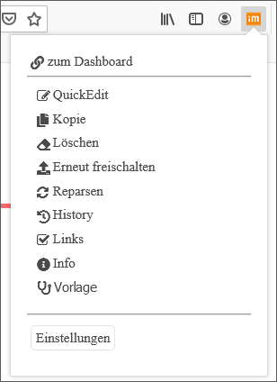
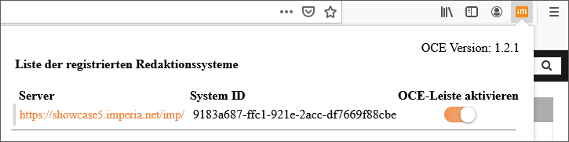
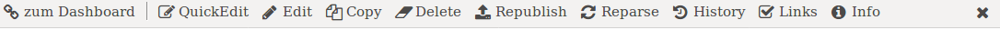
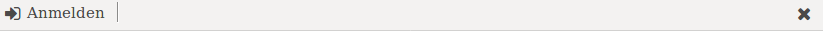

# OCE-Erweiterung

**Die OCE-Erweiterung ist das *imperia* CMS OneClickEdit Add-on für Browser.**

Die Erweiterung ist kompatibel mit *imperia* 9 und *10* und *11*.

Das Bookmarklet steht weiterhin als Alternative für alle Browser zur Verfügung.

Lesen Sie auch das Kapitel [OCE](https://portal.pirobase-imperia.com/pb/imperia-cms-dokumentation/user-de-11/user.documents/#one-click-edit) in der Benutzerdokumentation, wo Sie detaillierte Beschreibungen über die Installation und Nutzung der OCE-Erweiterung finden.

## Bestandteile der OCE-Erweiterung

Die Installation der OCE-Erweiterung enthält folgende Bestandteile:

* Die bereits bekannte Toolbar mit den auch bisher verfügbaren Funktionen wie QuickEdit, Löschen, Bearbeiten etc.

* Der neue  Live-/DEV-Popup-Button:
 In der rechten Ecke Ihres Browser finden Sie nun den Button `ìm` :  Wenn Sie eingeloggt sind (d.h. der Button ist anklickbar), öffnet dieser Button ein Pop-up mit verschiedenen Informationen, je nachdem, ob Sie sich im Live- oder DEV-System befinden. Falls Sie nicht berechtigt sind, das Dokument zu bearbeiten, d.h. die OCE-Toolbar zu nutzen, ist der `im`-Button ausgegraut:  

	* Live:  Wenn Sie im Live-System auf den Button `im` klicken, erscheint eine Liste mit den verfügbaren OCE-Funktionen. Auch finden Sie am Ende der Liste den Button *Einstellungen*, worüber Sie die OCE-Toolbar de-/aktivieren können. 

	* DEV:  Wenn Sie im DEV-System auf den Button `im` klicken, erscheint eine Liste mit den registrierten *imperia*-Systemen. Der graue Balken zeigt das aktuelle System an. 
		 Dort können Sie ebenfalls die OCE-Toolbar de-/aktivieren, indem Sie am Ende der Zeile des gewünschten Systems den Schieber nutzen.

## Anzeige der Toolbar

Die Toolbar wird standardmäßig aktiviert und wird am oberen Rand der Webseite abgebildet:

Auf der linken Seite finden Sie den Link, der Sie *zum Dashboard* führt, sofern Sie eingeloggt sind.
  Wenn Sie ausgeloggt sind, führt Sie der Link zur Login-Seite des zugeordneten *imperia* CMS:  

Auf der rechten Seite finden Sie den Button <i class="fa fa-close"></i> zum Ausblenden der Toolbar.
