Im Archiv werden alle Änderungen abgelegt, die ein Benutzer an einem Dokument vorgenommen hat. So ist es möglich, jeden Bearbeitungsstand eines Dokuments wiederherzustellen, den ein Benutzer auf dem Weg durch den Workflow gespeichert hat. 

Jede Dokumentversion hat einen Zeitstempel und kann jederzeit von einem berechtigten Benutzer wiederhergestellt werden. Sie können [Änderungen auch nachverfolgen](user.archive.md#anderungen-nachverfolgen).

Die Struktur des Archivs entspricht der als Baum dargestellten Rubrikenstruktur. Auch Media-Assets werden archiviert und können hierüber oder direkt im [MAM](user.mam.md) aufgerufen werden. 

Ändert ein Benutzer ein Dokument und speichert dieses, dann wird diese Version des Dokuments im zugehörigen Dokumenten-Ast des Archivs abgelegt. Wird dieses Dokument zehn Mal editiert, erscheinen im Archiv entsprechend zehn unterschiedliche Versionen, die alle wiederhergestellt werden können.

Dokumentversionen aus dem Archiv können wieder in den Workflow importiert oder gelöscht werden.

Wenn Sie ein Dokument löschen, werden gleichzeitig auch alle gespeicherten Versionen dieses Dokuments gelöscht. 

!!! warning "Warnung"
	Diesen Vorgang können Sie nicht rückgängig machen.

		

### Aufbau und Funktionsweise des Archiv-Browsers

* Öffnen Sie das Archiv über das Menü ***Dokumente > Archiv***.

* Klicken Sie alternativ im [**Dokumenten-Browser**](user.docbrowser.md)auf die die gewünschte Rubrik und führen Sie im Kontextmenü der Rubrik die Option ** Archiv** aus.

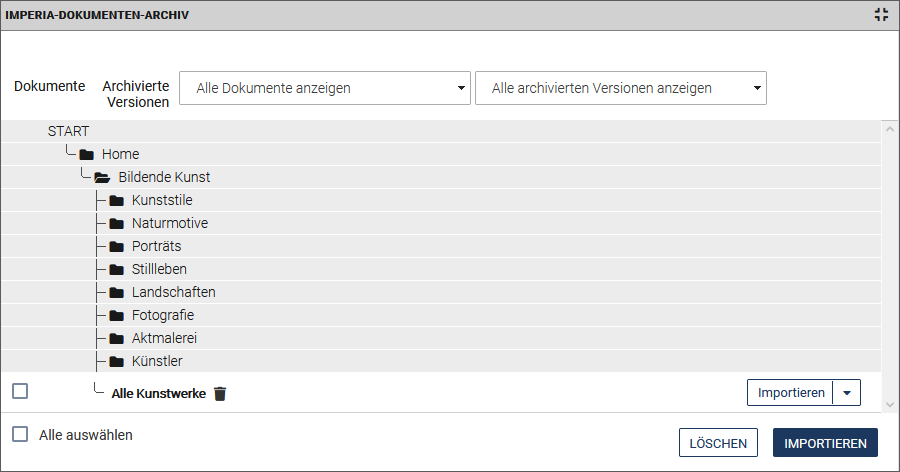

Im oberen Bereich können Sie die Anzeige der Archivversionen mit Hilfe von **Filtern** einschränken:

* ***Alle archivierten Versionen anzeigen***:   
Ist diese Einstellung gewählt, sehen Sie alle Versionen eines Dokuments, die beim Durchlaufen des Workflows entstehen, einschließlich der fertiggestellten (Status "beendet").  Bei Workflows mit vielen Arbeitsschritten und Dokumenten mit langer Lebensdauer können sich sehr viele Versionen ansammeln. Entsprechend lange kann es dauern, bis der Browser den Rubrikenbaum komplett aufgebaut hat.

* ***Beendete Archiv-Versionen anzeigen***:   
Wählen Sie diese Einstellung, wenn Sie nur die Versionen eines Dokuments sehen möchten, die den Workflow abschließend durchlaufen haben. Diese Versionen enthalten ein "(beendet)" am Ende der Zeile, siehe obige Abbildung. Diese Einstellung empfiehlt sich auch bei Dokumenten mit umfangreichen Workflows oder langer Lebensdauer.

* ***Aktuell veröffentlichte Dokumente anzeigen***:   
Wählen Sie diese Einstellung, wenn Sie die Liste der angezeigten Versionen zusätzlich auf diejenigen einschränken möchten, die aktuell auf einem Zielsystem online gestellt sind.

Der **Rubrikenbaum** wird ausgehend von der Wurzelrubrik abgebildet.  (Unter-)Rubriken oder enthaltene Dokumente lassen sich durch Anklicken von <i class="fa fa-folder"></i> öffnen.

Die in einer Rubrik enthaltenen **Dokumente** werden ebenfalls zeilenweise angezeigt.

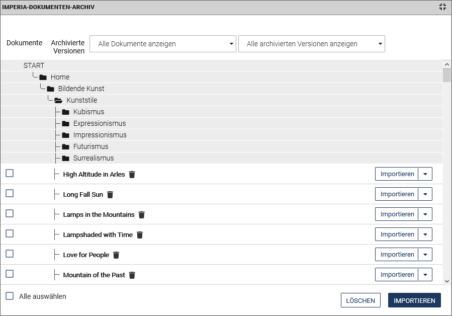

!!!note "Hinweis"
	Damit der Aufbau der Archivseite schnellstmöglich geschehen kann, zeigt der Archiv-Browser immer nur den Inhalt der Rubrik an, in der Sie sich gerade befinden, sowie die Knotenpunkte bzw. Rubriken, die diese mit höheren Ebenen des Rubrikenbaums verbinden. Klicken Sie auf **START**, werden Ihnen wieder alle Hauptrubriken angezeigt.
	

* Klicken Sie auf ein Dokument, um alle archivierten Versionen des Dokuments einzublenden.

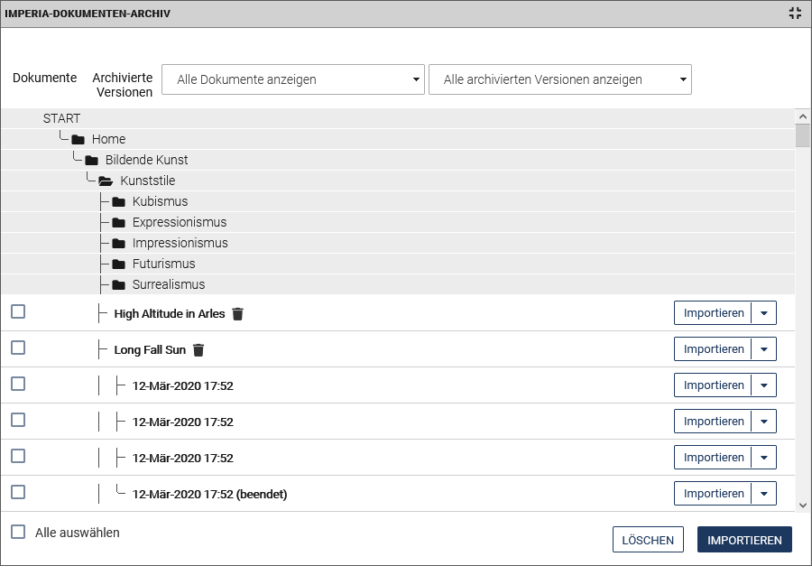

### Dokument/Version in der Vorschau ansehen

* Um das Dokument in der Dokumentenvorschau anzeigen zu lassen, klicken Sie auf ***Vorschau*** in der Dropdown-Box hinter dem Dokument.  
	*Es wird Ihnen in der Vorschau die zuletzt beendete Version dieses Dokuments angezeigt.*

	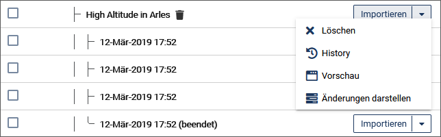

* Um eine bestimmte Version eines Dokuments in der Vorschau anzeigen zu lassen, klicken Sie auf ***Vorschau*** in der Dropdown-Box hinter der Version oder klicken Sie direkt auf die Version.

	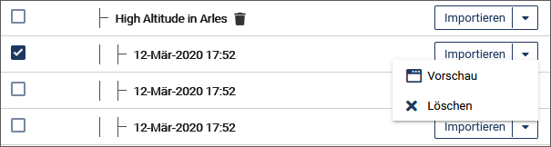
	
* Um ein bestimmtes Dokument oder eine bestimmte Version auszuwählen, klicken Sie in die Checkbox vor den entsprechenden Namen. Führen Sie anschließend optional eine der im Folgenden beschriebenen Aktionen aus. 

### Historie eines Dokuments ansehen
	
* Nutzen Sie die Option **History**, um die [Dokumenten-History](user.desktop.md#historie-eines-dokuments-bearbeiten) des Dokuments zu öffnen.

*Die History wird schreibgeschützt ausgelesen.*

* Mit **Archiv** kehren Sie wieder ins Archiv zurück.

### Version aus dem Archiv wiederherstellen

Alle Änderungen eines Dokuments, die durch einen Benutzer getätigt wurden, werden im Archiv gespeichert. 

Dokumente, die den Workflow durchlaufen haben, erkennen Sie am Status "(beendet)" hinter der entsprechenden Dokumentversion. Beendete Dokumente befinden sich entweder noch in der Veröffentlichungsliste auf dem Entwicklungssystem oder bereits auf einem Zielsystem, wenn Sie bereits veröffentlicht wurden.

Sie können jede Version des Dokuments importieren, um sie erneut zu bearbeiten und zu veröffentlichen .

!!!warning "Warnung"
		Die importierten Dokumente werden wieder an den Anfang des für sie vorgesehenen Workflows gesetzt und müssen den Workflow durchlaufen, bevor Sie wieder veröffentlicht werden können. Benutzen Sie diese Einstellung also mit Sorgfalt. 

!!!note "Hinweis"
	Wird ein Dokumenten-Ast zum Import ausgewählt, dann wird automatisch die jüngste bzw. die freigeschaltete Version importiert.

1. **Dokumente/Versionen für den Import auswählen**

* Um ein Dokument zu importieren, d.h. die zuletzt beendete Version dieses Dokuments, klicken Sie in der Dropdown-Box hinter dem Dokumenteneintrag auf **Importieren**.
* Um eine bestimmte Vorgängerversion eines Dokuments zu importieren, klicken Sie in der Zeile der gewünschten Version in der Dropdown-Box auf **Importieren**.
* Um mehrere Dokumente/Versionen gleichzeitig zu importieren, markieren Sie die Checkboxen vor den Dokumenten/Versionen. Klicken Sie anschließend auf den Button **Importieren** unter der Liste.
* Um alle Dokumente/Versionen gleichzeitig zu importieren, wählen Sie die Checkbox *Alle auswählen*. Klicken Sie anschließend auf den Button **Importieren** unter der Liste.
	
	!!! note "Hinweis"
			Mit der Option *Alle auswählen* landet gegebenenfalls eine große Anzahl an Dokumenten auf den Schreibtischen aller Benutzer.
			

2. **Dokumente/Versionen importieren**

 
Wenn mehrere Dokumente oder Versionen importiert werden, wird zunächst ein Statusreport mit einer Liste der zum Import anstehenden Dokumentversionen angezeigt.

* Bestätigen Sie den Vorgang mit **Importieren**.

*Neben jedem Eintrag ist im Statusreport nun ein **Bearbeiten**-Button zu finden.* 

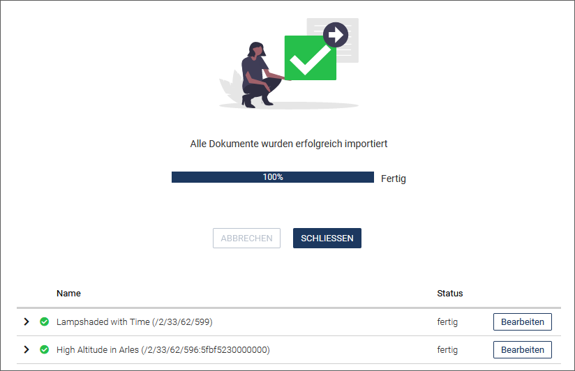

* Wählen Sie das gewünschte Dokument zum Bearbeiten aus und klicken Sie auf **Bearbeiten**.  *Sie gelangen zum ersten Workflow-Schritt.*

Wenn nur ein einzelnes Dokument importiert wird, gelangen Sie direkt zum ersten Workflow-Schritt und können das Dokument sofort bearbeiten.

###Aus dem Archiv löschen

!!! warning "Warnung"
		* Dokumente, die aus dem Archiv gelöscht wurden, sind unwiederbringlich verloren. Sobald Sie ein Dokument aus dem Archiv löschen, werden auch alle Versionen dieses Dokuments gelöscht.
		* Im Gegensatz zu vorherigen Versionen von *imperia* ist es seit Version 9 nun nicht mehr möglich, dass Dokumente auf dem Zielsystem zurückbleiben, für die es keine Version auf dem Entwicklungssystem gibt.

* Wenn Sie ein Dokument oder eine Dokumentversion aus dem Archiv löschen möchten, klicken Sie in der Dropdown-Box hinter dem Eintrag auf **Löschen**.
* Wenn Sie mehrere Dokumente oder Dokumentversionen komplett aus dem Archiv löschen möchten, aktivieren Sie die entsprechenden Checkboxen vor den jeweiligen Dokumenten und Versionen oder wählen Sie alternativ die Checkbox *Alle auswählen*. Klicken Sie anschließend auf **Löschen** unter der Liste.   *Es wird ein Statusreport angezeigt*.
* Bestätigen Sie dort den Löschvorgang mit **Löschen** oder kehren Sie mit **Abbrechen** zurück zum Archiv-Browser.
___
## Änderungen nachverfolgen

*imperia* bietet die Möglichkeit, Änderungen nachzuverfolgen, die an einem Dokument im Laufe seines Bestehens gemacht wurden. Hierzu können Sie zwei verschiedene Versionen eines Dokuments vergleichen. Neu hinzugefügte, geänderte oder gelöschte Texte oder Bilder werden farbig gekennzeichnet. Geänderte Bilder werden mit einem farbigen Rahmen dargestellt und mit einem Link versehen, der ein weiteres Fenster öffnet, in dem das alte und das neue Bild nebeneinander angezeigt werden.

Die Farben, die für die Darstellung der Änderungen verwendet werden, können systemweit oder über das verwendete Template definiert werden.

Die Änderungen an einem Dokument können über das Archiv, über eine eigene Spalte des Schreibtischs oder über das Menü des Genehmigen-Schritts im Workflow verfolgt werden.

### Änderungsverfolgung über das Archiv

1. ***Änderungen*-Dialog öffnen**

1. Öffnen Sie das Archiv über das Menü ***Dokumente > Archiv***.
2. Klicken Sie in der Dropdown-Box am Ende der Zeile des gewünschten Dokuments auf ***Änderungen darstellen***.

	

 Alle vorhandenen Versionen des entsprechenden Dokuments werden in einer Liste dargestellt. 
 Das ***Datum*** der letzten Bearbeitung wird auf auf der linken Seite angezeigt, der ***Status*** der jeweiligen Dokumentversion auf der rechten Seite.
 
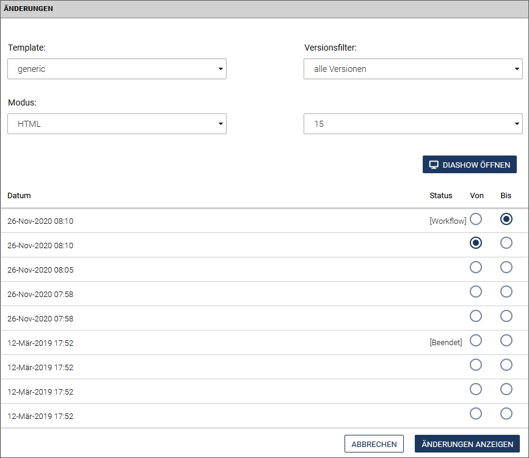

	
* Schränken Sie die Liste optional mit dem ***Versionsfilter*** auf Ihre eigenen Versionen oder auf die bereits beendeten Dokumente ein.
* Geben Sie ein, wie viele Versionen pro Seite angezeigt werde sollen.

2. **Versionen auswählen**

1. Wählen Sie zunächst im Feld ***Template*** oben links zwischen dem Template, mit dem das Dokument erzeugt wurde, und einer tabellarischen Ansicht. Die tabellarische Ansicht bietet die Möglichkeit, auch Änderungen in Meta-Variablen zu sehen, die keinen darstellbaren Inhalt haben und nicht lesbar im Dokument erscheinen. Hierzu zählt zum Beispiel die Meta-Variable `directory`, die das Zielverzeichnis des Dokuments enthält. In der tabellarischen Ansicht können Sie sich nur die Felder anzeigen lassen, die geändert wurden.
2. Legen Sie im Feld ***Modus*** fest, wie die Anzeige der Änderung gestaltet werden soll (*HTML/Quelltext*).
3. Wählen Sie dann mit Hilfe der Radio-Buttons ***Von*** und ***Bis*** die Versionen aus, deren Änderungen Sie anzeigen wollen.
4. Klicken Sie auf **Änderungen anzeigen**. 
<!-- *Die Änderungen werden beispielsweise wie folgt dargestellt*:  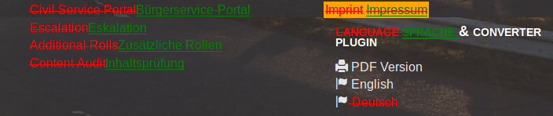   -->

Änderungen zwischen den ausgewählten Versionen sind in den Ansichten farbig gekennzeichnet: Neu hinzugekommener Inhalt ist grün und unterstrichen, gelöschter Inhalt rot und durchgestrichen. 
Diese Farben und Texteigenschaften lassen sich jedoch über ein spezielles Stylesheet oder über das Template verändern. 

<!--
3. **Diashow über Änderungen öffnen**

Möchten Sie eine Diashow über alle herausgefilterten Versionen starten, klicken Sie auf  **Diashow öffnen**

.   

Neben dem eben beschriebenen Dialog zur Anzeige der Änderungen in den Dokumenten wird zusätzlich ein Dialog zur Bedienung der Diashow geöffnet:

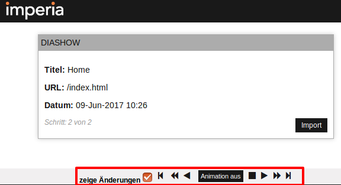
	
* Um die Änderungen anzuzeigen, aktivieren Sie die Checkbox ***zeige Änderungen***.
* Nutzen Sie die bekannten Steuerelemente um die Animationzu zu starten, vor- oder zurückzuspulen, sie zu pausieren oder zu stoppen.
* Klicken Sie auf **Import**, um die alten Versionen auch wieder einzuspielen. Sie gelangen in einen neuen Dialog, in dem Sie den endgültigen Import vorher bestätigen müssen. 
-->

### Änderungsverfolgung über den Schreibtisch

Befindet sich ein Dokument noch innerhalb des Workflows, kann man über den Schreibtisch sehen, welche Änderungen in den einzelnen Workflow-Schritten an diesem Dokument gemacht wurden.

Dabei kann eine beliebige vorherige Version mit dem aktuellen Stand oder einer anderen vorherigen Version verglichen werden. Unterschiede in diesen Versionen werden, wie oben beschrieben, in unterschiedlichen Farben dargestellt.

1. Öffnen Sie den Schreibtisch über das Menü ***Dokumente > Schreibtisch***.
2. Klicken Sie in der Spalte ***Mehr*** in der Dropdown-Box des Dokuments auf ***Änderungen***. 

	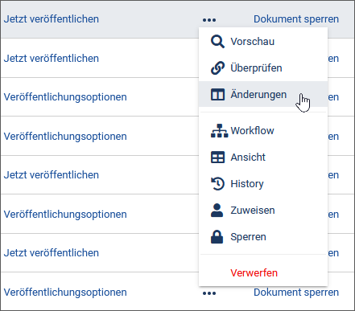

3. Gehen Sie weiter vor, wie unter [Änderungsverfolgung über das Archiv](user.archive.md#anderungsverfolgung-uber-das-archiv) beschrieben.

### Änderungen beim Genehmigen anzeigen

Änderungen einer Dokumentenversion, die genehmigt werden sollen, können im Vergleich zur letzten beendeten Version im *Genehmigen*-Workflow-Schritt angezeigt werden.

* Führen Sie im Genehmigen-Schritt die Option **Vorschau** aus.

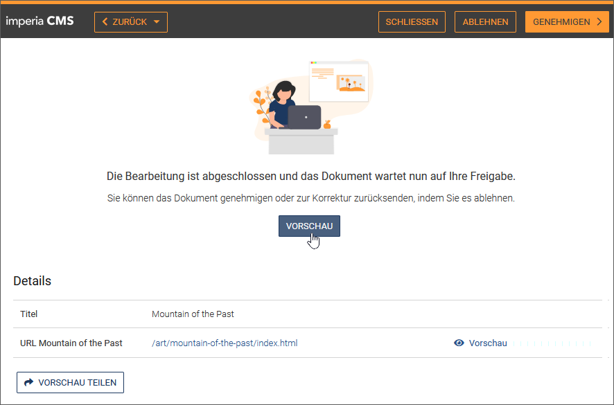

!!! note "Hinweis"
		Die Vorschau mit Änderungsverfolgung ist nur bei re-importierten Dokumenten verfügbar.
		
* Klicken Sie in der Funktionsleiste der Vorschau auf den Schalter **Änderungen verfolgen**. 

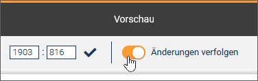

*Das Dokument wird nun mit den Änderungen angezeigt.*

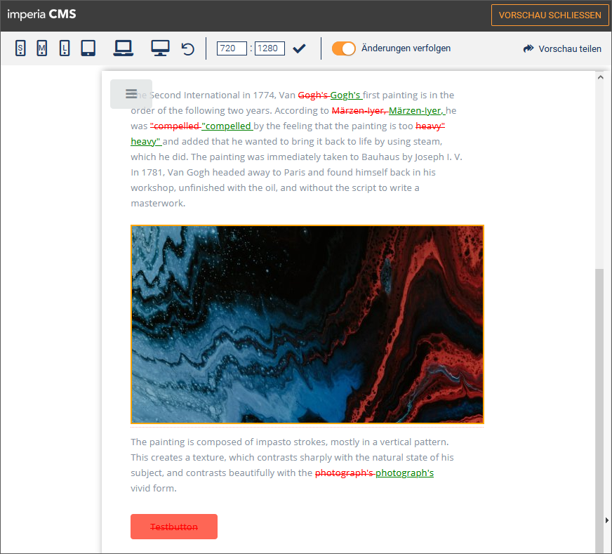

