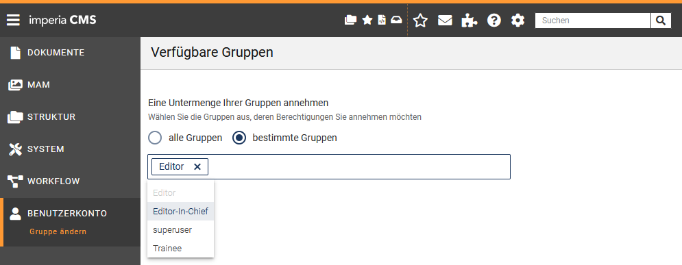

Dieses Kapitel beschreibt allgemein die Funktionsweise von *imperia* und gibt einen ersten Überblick über die Arbeit mit den zu *imperia* gehörenden Programm-Modulen. 

!!! tip "Tipp: UserEcho"
		Bevor es losgeht, würden wir Ihnen gerne unser neues Feedback-Tool UserEcho vorstellen. Diese Plattform können Sie unter [https://pirobaseimperia.userecho.com](http://pirobaseimperia.userecho.com) erreichen:

		* Dort können Sie selber Vorschläge für neue Features oder Verbesserungen einreichen.
		* Unter jedem Vorschlag können Sie auch Kommentare hinterlassen, sodass die Kunden untereinander die Relevanz und den Nutzen eines Features diskutieren können.
		* Wir hoffen auf eine rege Teilnahme, damit wir die Wünsche unserer Kunden besser verstehen können. Erste Vorschläge von uns und unserem Support-Center wurden bereits hinzugefügt.
___
## Wie funktioniert *imperia* ?

Bevor wir auf die Details von *imperia* eingehen, möchten wir Ihnen einen Überblick über die grundlegenden Konzepte von *imperia* geben. Dieses Kapitel wendet sich sowohl an Autoren als auch an Benutzer, die sich erstmalig mit *imperia* beschäftigen.

###Staging

"Staging" im Content-Management-System ermöglicht die Erstellung von Inhalten in verschiedenen Stufen.

*imperia* besteht aus dem *Entwicklungssystem* und mindestens einem *Zielsystem*.

**Entwicklungssystem**:  Auf dem Entwicklungssystem wird das Projekt gegliedert und der Content durch die Benutzer eingepflegt. Das Entwicklungssystem ist – meistens thematisch – in Rubriken unterteilt, in denen neue Dokumente erzeugt werden. Auf diese Weise wird schon bei der Erzeugung eines Dokuments eine Struktur des einzugebenden Inhalts erzeugt. Ob Sie in einer Rubrik überhaupt Dokumente erzeugen dürfen, hängt von den Rechten ab, die Sie im System haben und die von dazu berechtigten [Benutzern](#benutzer-und-gruppen) vergeben werden. 

**Zielsystem**:  Auf die Zielsysteme werden die [*imperia*-Dokumente](#dokumente) übertragen, wenn alle notwendigen Arbeitsschritte abgeschlossen worden sind. Diesen Vorgang nennt man *Freischalten*. Das Freischalten fertiggestellter Dokumente kann automatisch oder manuell erfolgen.  Automatische Freischaltvorgänge werden erst ausgeführt, wenn ein vorher festgelegter Zeitpunkt, das Freischaltdatum, erreicht worden ist.  Ein Beispiel für ein Zielsystem wäre ein Webserver mit Anbindung ans Internet, auf dem Ihre Website liegt und öffentlich erreichbar ist. Sie selbst können auch auf dem Zielsystem surfen und dort mit einem speziellen Modul, [One-Click-Edit](user.oneclickedit.md) (OCE), direkt Seiten ändern - wenn sie über die Rechte verfügen.  Es ist auch möglich, Ihren Content gleichzeitig für mehrere Zielsysteme und jeweils in einem anderen Format freizuschalten.

Das Prinzip, nach dem *imperia* funktioniert, ist einfach:

* Ihr Projekt ist in mehrere *Rubriken* unterteilt. Für jede Rubrik gibt es ein Rohgerüst, ein so genanntes Template, in dem das Layout der Dokumente in dieser Rubrik definiert ist. Bestimmte Bereiche dieser Templates sind editierbar und werden von den Benutzern beim Bearbeiten eines Dokuments mit Inhalt gefüllt.

* Die Arbeitsschritte, die ein Dokument von der Entstehung bis zum Freischalten durchläuft, werden in *imperia* als [Workflow](#workflows) bezeichnet. In einem Workflow ist auch die Reihenfolge der einzelnen Schritte festgelegt.  Beispiel: 
	
	1. Zuerst werden die Informationen zu einem Dokument, die Metadaten, eingegeben.
	2. Im nächsten Schritt trägt ein Benutzer den Content in die editierbaren Bereiche ein.
	3. Anschließend prüft ein anderer Benutzer das Dokument und schaltet es schließlich frei.

* Es kann darüber hinaus auch Workflow-Schritte geben, die keine Benutzereingabe erfordern, sondern automatisch ablaufen wie das Hinzuziehen von Daten aus einer zusätzlichen Datenquelle. In diesem Workflow können Sie an einer oder anmehreren Stellen ein Dokument bearbeiten.  Beispiel: Sie sind dafür zuständig, neue Dokumente zu erzeugen und tagesaktuelle Informationen einzugeben. Oder Ihre Aufgabe ist es, Dokumente von anderen Autoren nach juristischen Gesichtspunkten zu überprüfen. Oder Sie legen fest, welche Bilder zu welchen Texten gehören. Oder Sie sind derjenige, der entscheidet ob und wann ein Dokument freigeschaltet wird.

* Der Schlüssel hierzu ist Ihre aktuelle [Gruppe](#benutzer-und-gruppen). Von ihr hängen alle Ihre Rechte ab und damit auch die Möglichkeiten, die Sie mit *imperia* haben.
	* Sie können mehrere Gruppen haben und nach Bedarf von einer Gruppe in eine andere wechseln. Meist können Sie mit einer Gruppe nur in einzelnen Rubriken neue Dokumente erzeugen oder Dokumente bearbeiten.  Beispiel: Ein Sportredakteur soll keine Rezensionen für das neueste Theaterstück schreiben, sondern sich auf die Bundesliga konzentrieren. Wenn Sie aber neben der Sportredaktion auch in der Nachrichtenredaktion arbeiten, wechseln Sie einfach die Gruppe und schon können Sie Nachrichten erstellen.
	* Wenn Sie ein Dokument bearbeiten, ist es für andere Benutzer mit der gleichen Gruppe gesperrt und kann von diesen nicht ohne weiteres editiert werden. Diese Sperre kann ein anderer Benutzer zwar aufheben, muss dies jedoch kommentieren, was in der Dokumenten-History protokolliert wird. Wird das Dokument von beiden Benutzern gleichzeitig bearbeitet, erzeugt dies einen Konflikt, der behoben werden muss.

###Benutzer und Gruppen

Jeder, der mit *imperia* arbeiten will, muss zunächst ein Benutzerkonto haben, um sich im System anmelden zu können. Ein Benutzerkonto enthält unter anderem den Login-Namen und das Passwort und wird von einem Benutzer angelegt, der die entsprechende Berechtigung hierfür hat. Damit das System weiß, welche Aufgaben und Bereiche ein Benutzer ausführen beziehungsweise sehen darf, werden Benutzerkonten mindestens einer Gruppe zugeordnet.

Die aktuelle Gruppe verleiht einem Benutzer *Zugriffsrechte*, sowohl auf Rubriken, und damit auf bestimmte Dokumente, als auch auf *imperia*-Funktionen und damit auf den Handlungsspielraum des Benutzers im System, wie zum Beispiel neue Benutzer anlegen oder Systemdienste einrichten zu dürfen. Dadurch dass ein Benutzerkonto auch mehreren Gruppen zugeordnet sein kann, können Sie auch mehrere Aufgaben wahrnehmen oder unterschiedliche Bereiche des Systems sehen. Dazu müssen Sie lediglich eine andere Ihnen zugeordnete [Gruppe annehmen](#gruppe-annehmen). Lesen Sie zum Thema Benutzerrechte auch den Abschnitt [Zugriffsrechte in *imperia*](#zugriffsrechte-in-imperia).

Aufgrund dieses Gruppenkonzepts werden Sie selten oder nie ein Dokument von der Erzeugung bis zum Freischalten bearbeiten können. Meistens erscheint ein Dokument nur in einem Workflow-Schritt auf Ihrem Schreibtisch und verschwindet wieder, wenn Sie diesen Workflow-Schritt abgeschlossen haben. Ihre aktuelle Gruppe verleiht Ihnen in diesem Fall nicht das Recht, den nächsten Schritt zu erledigen.

###Dokumente

Wenn Sie auf den Menüpunkt *Neues Dokument erzeugen* klicken und anschließend eine Rubrik auswählen, wird nicht wirklich eine Datei in einem Verzeichnis, sondern lediglich eine Sammlung von *Schlüssel-Wert-Paaren* erzeugt.  Schon bei der Auswahl der Rubrik erhalten bereits die ersten Schlüssel in dieser Sammlung bestimmte Werte, zum Beispiel

* das Zielverzeichnis, in dem das fertige Dokument landen wird und
* der Dateiname dieses Dokuments, etc.

**Meta-Variable**: 
 Wenn Sie ein neues Dokument bearbeiten, also Text in Eingabefelder eintragen oder in der Mediendatenbank ein Bild auswählen, weisen Sie im Prinzip weiteren Schlüsseln einen oder auch mehrere Werte zu. Ein Schlüssel ist hierbei nichts anderes als der Name des Feldes, das Sie ausfüllen, der eingegebene Content stellt den Wert dar. Die Schlüssel werden in *imperia* Meta-Variablen genannt. *imperia*-Dokumente bestehen also aus vielen Meta-Variablen und deren Werten. 

In Meta-Variablen kann eine Vielzahl von Informationen gespeichert werden, die von Ihnen oder anderen Benutzern eingegeben wurden. Das können URLs zu Bildern aus der Mediendatenbank sein, Fließtext, den Sie eingegeben haben, Überschriften zu Artikeln oder Links zu anderen Dokumenten.

Es gibt Meta-Variablen, die nicht über ein Template editiert werden können, weil die darin enthaltenen Informationen nicht von jedem Benutzer verändert werden sollen. Hierzu gehört zum Beispiel der Pfad, unter dem das fertige Dokument auf dem Zielsystem gespeichert werden soll, oder das Template, mit dem es erstellt wurde, oder Angaben über das Datum, an dem es automatisch freigeschaltet werden soll. Solche Informationen sind zwar veränderbar, dies geschieht jedoch meist unbemerkt im Hintergrund.

*imperia* behandelt Dokumente also nicht als Dateien, sondern wie eine Sammlung von Inhalt oder Content, in der jeder Informations-Schnipsel zu einem bestimmten Schlüssel gehört und entsprechend gespeichert wird. Deswegen ist es sehr einfach, diesen Content auf viele mögliche Arten zu veröffentlichen: als HTML-Seite, als XML-Dokument, in eine Datenbank, auf mehrere Zielsysteme in unterschiedlichen Formaten etc.

###Metadateien

Metadateien sind eine spezielle Art von [Templates](#templates), mit deren Hilfe Informationen zu einem Dokument gesammelt werden können, bevor es editiert wird. Sie erzeugen die so genannte Metaseite und stellen oft den ersten Schritt in einem Workflow dar, das so genannte Meta-Edit. In diesem Schritt gibt der Benutzer beispielsweise das Template an, auf dem sein neues Dokument basieren soll. Es sind jedoch vielfältige Verwendungen für Metadateien möglich, die im [Programmierhandbuch](https://portal.pirobase-imperia.com/pb/imperia-cms-dokumentation-private/programmer-en-11/programming.introduction/#document-modes) beschrieben werden.

!!! tip "Tipp"
		Metadateien können aus historischen Gründen weiterhin verwendet werden; sie waren fester Bestandteil der ersten *imperia*-Versionen.  Mittlerweile können Sie auf die Verwendung von Metadateien ganz verzichten und die Meta-Informationen in einem separaten Template oder direkt auf dem Inhalts-Template selbst eingeben lassen.

###Templates

*imperia*-Templates sind Eingabemasken, in die der Benutzer Inhalt in die dafür vorgesehenen Eingabeelemente eingibt. Templates bilden das Rückgrat eines Projektes. Mit ihnen gibt ein Programmierer zum einen dem Benutzer eine leicht zu verstehende Möglichkeit, Inhalt einzugeben, zum anderen kann er schon im Template die weitere Verarbeitung des Inhalts vorbereiten.

Neben den aus Webformularen bekannten Bedienelementen wie Eingabefelder, Checkboxen, Drop-down-Menüs und Select-Boxen bieten *imperia*-Templates eine Vielzahl von *imperia*-spezifischen Bedienelementen wie [Flexmodule](user.documents.md#flexmodule), [*imperia*-Blöcke](user.documents.md#imperia-block), Word-Module etc.

Templates werden auch dazu genutzt, den eingegebenen Content unabhängig von dem Layout einer Website zu speichern.
 *imperia* trennt Inhalt und Layout. Der Inhalt wird - wie oben beschrieben - in den Schlüssel-Wert-Paaren des *imperia*-Dokuments gespeichert, das Layout wird über das Template definiert. Aus den Schlüssel-Wert-Paaren des *imperia*-Dokuments und den Layout-Informationen aus dem Template wird, sobald das *imperia*-Dokument den Workflow bis zu dessen Ende durchlaufen hat und freigeschaltet wird, eine HTML-Seite, ein XML-Dokument oder ein Datensatz in einer Datenbank erzeugt.

Templates können verschiedene Modi abbilden. Hierzu gehören der

* Edit-Modus
* Preview-Modus
* Save-Modus.

**Edit-Modus:**
 Ein Dokument befindet sich in diesem Modus, wenn Sie Content in Metafelder eintragen, d.h. die dafür vorgesehenen Elemente des Templates füllen. In diesem Modus ist das Dokument für alle anderen Benutzer gesperrt.

**Preview-Modus:**
 In diesem Modus befindet sich ein Dokument, wenn Sie es in einer Vorschau betrachten. Hierbei wird der aktuelle Stand des Dokuments berücksichtigt, es werden also alle Daten angezeigt, die bis zum aktuellen Zeitpunkt eingegeben wurden. Dieser Modus ist praktisch identisch mit dem Save-Modus.

**Save-Modus:**
 In diesem Modus werden Änderungen an einem Dokument gespeichert. Ein Dokument geht in den Save-Modus über, wenn Sie auf den Speichern-Button geklickt haben und den Edit-Modus verlassen.

Es gibt noch weitere Modi, die aber an dieser Stelle zu weit führen würden. Einzelheiten zu diesen Modi finden Sie im [Programmierhandbuch](https://portal.pirobase-imperia.com/pb/imperia-cms-dokumentation-private/programmer-en-11/programming.introduction/#document-modes).

###Workflows

Unter einem Workflow versteht man in *imperia* eine Reihe von Bearbeitungsschritten, die ein Dokument durchlaufen muss, bevor es das Entwicklungssystem verlassen und auf ein Zielsystem übertragen werden kann. Diese Reihenfolge können Sie in *imperia* für jede Rubrik festlegen. So durchläuft jedes Dokument automatisch den Workflow, der zum Zeitpunkt seiner Erstellung der Rubrik zugeordnet ist, in der es erstellt wird.

Jeder Workflow-Schritt wird durch ein Workflow-Plug-in abgebildet, die Abfolge der Plug-ins bildet den Workflow, den ein Dokument in *imperia* durchlaufen muss. Einige dieser Plug-ins benötigen eine Benutzereingabe und stellen eine entsprechende Eingabemaske zur Verfügung, andere wiederum sind völlig automatisch und laufen vom Benutzer unbemerkt ab.

!!! note "Hinweis"
		* Die Zuordnung des Workflows zu einem Dokument geschieht direkt bei der Erstellung des Dokuments. Dabei bekommt das Dokument ein Ticket, in dem die Workflow-Schritte gespeichert sind. Änderungen am Workflow, zum Beispiel das Hinzufügen oder Entfernen von Arbeitsschritten oder Änderungen an der Reihenfolge, werden nicht in dieses Ticket übernommen.
		* Die Abfolge der Arbeitsschritte für ein Dokument wird bei dessen Bearbeitung aus dem Ticket entnommen. Deshalb sind Änderungen an einem Workflow für Dokumente unwirksam, die diesen zum Zeitpunkt der Änderung bereits durchlaufen.

Um einen Workflow-Schritt ausführen zu können, sind bestimmte Rechte erforderlich, die über die [Gruppe](#benutzer-und-gruppen) verliehen werden. Können Sie diese Gruppe nicht annehmen, dann können Sie den anstehenden Schritt auch nicht ausführen, das Dokument erscheint daher nicht auf Ihrem [Schreibtisch](user.desktop.md). Schritte wie das Genehmigen von Änderungen oder das endgültige Freischalten bleiben somit Benutzern mit privilegierten Gruppen vorbehalten.

Nachdem ein Dokument in einer Rubrik erzeugt wurde, steht es am Anfang des Workflows. Ein *Standard*-Workflow, der in *imperia* bereits angelegt ist, besteht aus folgenden Schritten:

1. Metadaten eingeben
2. Dokument bearbeiten
3. Änderungen genehmigen

Werden die Änderungen nicht genehmigt, hat der Benutzer mit den Genehmigungsrechten die Möglichkeit, es auf einen vorhergehenden Schritt zurückzusetzen oder es in den Papierkorb zu werfen. Der Workflow spiegelt im Idealfall die Prozesskette eines Unternehmens wieder.
___
##Erste Schritte im System

*imperia* ist eine webbasierte Anwendung und wird in Ihrem Browser aufgerufen. Alle Handlungen, die Sie am oder im System vornehmen, geschehen in Ihrem Browser oder werden aus Ihrem Browser heraus gestartet. Dies bedeutet, dass Sie *imperia* grundsätzlich von jedem Arbeitsplatz und jedem Gerät aus benutzen können, auf dem ein Browser installiert ist. Mit den folgenden Browsern können Sie gut mit *imperia* arbeiten:

* Microsoft Internet Explorer ab Version 8 für Windows

* Mozilla / Firefox ab Version 3.0 auf Windows, Linux und Mac OS X

Alle Bedienelemente, Dialoge und Eingabefelder sowie deren Inhalte werden von *imperia* dynamisch erzeugt und im Browser des Benutzers als HTML-Seiten angezeigt.

Der Benutzer arbeitet mit *imperia* durch die Nutzung von Hyperlinks oder anderen bekannten Bedienelementen wie Markierungsfeldern, Checkboxen, Radio-Buttons, Eingabefeldern, Drop-Down-Feldern etc. Im Look-and-Feel entspricht *imperia* also einer Web-Anwendung, so dass Sie mit Grundkenntnissen in der Handhabung des Internets einen leichten Einstieg in die Arbeit mit *imperia* finden können.

Das tatsächliche Aussehen der *imperia*-Oberfläche hängt von den Benutzerrechten ab, die durch den *imperia*-Systemadministrator eingestellt werden, von den geöffneten Widgets sowie den eingestellten Lesezeichen.

Die Standardsprache des Systems ist Englisch. Wie Sie die Systemsprache ändern können, erfahren Sie unter [Systemsprache ändern](#systemsprache-andern).

###Aufbau der *imperia*-Oberfläche
Im Folgenden wird der allgemeine Aufbau der *imperia*-Oberfläche mit Kopfzeile, Menü und Bearbeitungsformularen beschrieben. Eine detaillierte Beschreibung der einzelnen Bearbeitungsformulare erfolgt jeweils in den Erläuterungen zu den einzelnen Anwendungsfällen.

**Kopfzeile:**
 Die Kopfzeile finden Sie am oberen Rand der *imperia*-Oberfläche.

Die Kopfzeile enthält im linken Bereich das Symbol <i class="fa fa-bars"></i> zum Ein- und Ausklappen des Menüs sowie das Produktlogo und die Versionsnummer.

Im rechten Bereich werden verschiedene Optionen sowie ein Sucheingabefeld für die [Suche nach Dokumenten](user.docsearch.md) angezeigt.

* <i class="fa fa-star-o"></i>: Nutzen Sie diese Option, um für Seiten oder häufig genutzte Menüpunkte und Dialogfenster ein [Lesezeichen](#mit-lesezeichen-arbeiten) zu definieren. 
* <i class="fa fa-envelope-o"></i>: Über das Briefsymbol wird das [interne Mailsystem](user.mailing.md) geöffnet. Wenn In Ihrem internen Mailsystem keine Nachrichten für Sie vorliegen, so wird dies mit dem weißen Briefsymbol <i class="fa fa-envelope-o"></i> dargestellt. Wenn eine neue Nachricht für Sie eingetroffen ist, wird dies durch ein *oranges* Briefsymbol dargestellt.
* <i class="fa fa-puzzle-piece"></i>: Diese Option führt Sie auf die Add-on-Seite.
* <i class="fa fa-cog"></i>: Diese Option enthält ein Untermenü mit verschiedenen, kontextbezogenen Einstellungen und Funktionen sowie der Option ***Abmelden***.
	* <i class="fa fa-user"></i> **[Benutzername]**: Hier wird der aktuelle Benutzername angezeigt. Ein Klick auf den Benutzernamen öffnet die [Benutzereinstellungen](#benutzereinstellungen-anpassen).
	* <i class="fa fa-group"></i> ***Verfügbare Gruppen***: Diese Option öffnet die Seite [Gruppe annehmen](#gruppe-annehmen).
	* <i class="fa fa-info-circle"></i>  ***Über Imperia***: Nutzen Sie diese Option, wenn Sie Informationen zu *imperia* (Version, Lizenznehmer, Lizenzdaten) erhalten möchten.

**Menü:**
 Unterhalb des Logos links in der Kopfzeile finden Sie das Menü. 

Das Menü ist das zentrale Bedienelement, über das Sie in eigenen Untermenüs alle *imperia*-Funktionen aufrufen können, zu denen Sie aufgrund Ihrer Gruppe berechtigt sind. Diese Navigationsmöglichkeit steht Ihnen bis auf wenige Ausnahmen jederzeit zur Verfügung. Funktionen, die Sie nicht ausführen dürfen, werden automatisch ausgeblendet.

Wenn Sie mit der Maus über das Menü-Symbol fahren, werden die Untermenüs ausgeklappt:

 Für jedes Untermenü öffnet sich eine Seite, in der Sie die entsprechende Funktion ausführen können.  

**Bearbeitungsformulare:**
 Der Klick auf ein Untermenü führt Sie zu dem dazugehörigen Bearbeitungsformular, in dem Sie alle für das Ausführen der Funktion benötigten Optionen und Auswahlelemente finden. 
Erfordert es die ausgewählte Funktion, wird rechts ein Detailbereich mit weiteren Informationen und Eingabefeldern geöffnet.

* Nutzen Sie des Pfeilsymbol zwischen den Bereichen, um den Detailbereich auszublenden. Mit einem weiteren Klick auf das Pfeilsymbol, das sich nun am rechten Rand des Bearbeitungsformulars befindet, wird der Detailbereich wieder eingeblendet.

!!! tip "Tipp"
		In den Bearbeitungsformularen kann neben der Option **Speichern** auch eine Tastaturkombination aus CTRL + S genutzt werden, um die Eingaben zu sichern.

###Mit Lesezeichen arbeiten  

Häufig benötigte Funktionen können Sie im Lesezeichenmenü ablegen. Die Lesezeichen werden anschließend auf der rechten Seite der Kopfzeile abgebildet.  Die Lesezeichen erscheinen mit den entsprechenden Icons aus dem Menü, siehe oben.  Über diese Icons haben Sie schnellen Zugriff auf alle Funktionen Ihrer Arbeit, das gilt vor allem für die Funktionen, die in den Untermenüpunkten erreichbar sind.

Die Einstellungen für Lesezeichen sind benutzerabhängig. Sie können sich also Ihr ganz persönliches Menü zusammenstellen, das beispielsweise so aussehen könnte:

Der Bereich ist leer, wenn Sie noch keine Lesezeichen definiert haben.

**Lesezeichen hinzufügen oder entfernen**

1. Führen Sie die gewünschte Funktion aus. 
 *Das entsprechende Bearbeitungsformular öffnet sich.*
2. Klicken Sie rechts in der Kopfzeile auf <i class="fa fa-star-o"></i>.
 *Die Seite ist nun als Lesezeichen in der Kopfzeile hinzugefügt.*
3. Um die Seite aus der Kopfzeile zu *entfernen*, klicken Sie erneut auf das nun ausgefüllte <i class="fa fa-star-o"></i>, siehe Abbildung oben.
 *Das Lesezeichen ist nun aus der Kopfzeile entfernt.*

!!! tip "Tipp"
		Einen Überblick über Ihre gesetzten Lesezeichen erhalten Sie unter dem Menüpunkt  <i class="fa fa-user"></i> *Benutzerkonto* -&gt; *Lesezeichen bearbeiten*. Dort können Sie auch *mehrere* Lesezeichen schnell und einfach entfernen, indem Sie auf **Löschen** in der entsprechenden Zeile klicken, siehe Abbildung:
		 
		

___
## Benutzereinstellungen anpassen

Bestimmte Einstellungen können Sie individuell ändern und speichern. Hierzu gehören zum Beispiel Ihr Passwort, die Sprache der Benutzeroberfläche sowie die optionalen Angaben der Adresse und der E-Mail-Adresse.
 Den Namen und das Login kann nur der *imperia*-Administrator (Superuser) ändern. Er legt alle Benutzerkonten an und bestimmt deren (Erst-)Passwörter. Wenn Sie sich zum ersten Mal an das System anmelden, sollten Sie daher Ihr [Passwort ändern](#passwort-andern).

Wenn Sie Ihre Benutzereinstellungen ändern möchten, wählen Sie <i class="fa fa-user"></i> ***Benutzerkonto*** -&gt; <i class="fa fa-user"></i> ***Profil***.

1. Nehmen Sie die gewünschten Änderungen vor.
2. Sichern Sie Ihre Angaben, indem Sie auf **Speichern** klicken.
3. Mit **Abbrechen** wird das Bearbeitungsformular geschlossen, ohne die Änderungen zu speichern.

Neben dem Vor- und Nachnamen können folgende Benutzereinstellungen angepasst werden:

### Passwort ändern

1. Wählen Sie <i class="fa fa-user"></i> ***Benutzerkonto*** -&gt; <i class="fa fa-user"></i> ***Profil***.
2. Klicken Sie auf den Link ***Passwort ändern***.  
3. Tragen Sie in das dafür vorgesehene Eingabefeld Ihr altes Passwort ein.
4. Tragen Sie Ihr neues Passwort ein und wiederholen Sie es in den entsprechenden Eingabefeldern.
6. Bestätigen Sie Ihre Änderungen mit **Speichern** .

Bei der nächsten Anmeldung können Sie nun Ihr neues Passwort benutzen.

Sollten Sie Ihr Passwort einmal vergessen, kann der *imperia*-Administrator Ihnen ein neues zuweisen.

### Systemsprache ändern

Die Standard-Systemsprache von *imperia* ist Englisch. Das bedeutet, dass sämtliche *imperia*-Menüs und Systemmeldungen in Englisch angezeigt werden.

Der *imperia*-Administrator kann allerdings die Standard-Systemsprache ändern; einzelne Benutzer können sich aber auch individuell eine von diesem Standard abweichende Systemsprache auswählen:

1. Wählen Sie <i class="fa fa-user"></i> ***Benutzerkonto*** -&gt; <i class="fa fa-user"></i> ***Profil***.
2. Wählen Sie im Drop-Down-Menü ***Sprache*** die gewünschte Sprache aus.
3. Bestätigen Sie Ihre Änderungen mit **Speichern** .

*Die gewünschte Sprache wird direkt angewendet*.

### Benutzerdateien löschen

Sie können alle in ihrem Profil gespeicherten Einstellungen und Dateien wieder löschen.

!!!note "Hinweis"
		Beim Löschen von Benutzerdateien werden Ihre persönlichen Einstellungen im MAM / Dashboard / Schreibtisch / ... wieder zurückgesetzt. <comment: aus https://jira.pirobase.de/jira/browse/IMPSUP-3143 -- "doku_done" - Info ok>

1. Wählen Sie  <i class="fa fa-user"></i> ***Benutzerkonto*** -&gt; ***Gespeicherte Einstellungen***.
2. Klicken Sie am Ende der entsprechenden Zeile auf **Löschen**.

*Die Dateien sind aus dem System gelöscht.*

### Look and Feel einrichten

Im Menüpunkt ***Look and Feel*** nehmen Sie neben den gestalterischen Einstellungen Ihres *imperia*-Systems auch andere systemweite Einstellungen vor.
 Unter anderem stellen Sie im Abschnitt ***Schreibtisch*** den Filter *Meine Dokumente* für den Schreibtisch ein.

!!!note "Hinweis"
		* Die hier von Ihnen vorgenommenen Einstellungen werden nur in Ihrer Ansicht übernommen und nicht bei anderen Benutzer angewandt.
		* Der Systemadministrator (*Superuser*) hat allerdings das Vorrecht die Systemansicht für alle Benutzer zu ändern.

1. Wählen Sie <i class="fa fa-user"></i> ***Benutzerkonto*** -&gt; </i> ***Look and Feel***.
2. Stellen Sie das gewünschte Verhalten ein.
3. Sichern Sie Ihre Einstelungen mit **Speichern**.

Folgende Optionen zur Einstellung Ihres *imperia*-Systems werden Ihnen angeboten:

* ***Farbschema***: Wählen Sie Ihr individuelles Farbschema, falls Sie das vom Systemadministrator festgelegte nicht übernehmen möchten.  

	
	

* ***Menü***: Stellen Sie ein, ob das Hauptmenü ein- oder ausgeklappt ist und ab wann es automatisch geöffnet oder geschlossen wird.

	!!!tip "Tipp"
			Wenn Sie die Maus über das Menü bewegen, erscheinen Mouse-Overs mit der Beschreibung der einzelnen Menüeinträge. Dies ist vor allem nützich, wenn das Menü eingeklappt ist.

* ***Schreibtisch***: Wählen Sie für den [Schreibtisch](user.desktop.md) aus, welche Dokumente in den Filter *Meine Dokumente* aufgenommen werden sollen, indem Sie die Checkboxen vor den gewünschten Optionen aktivieren.

		
	
___
## Zugriffsrechte in *imperia*

Alle Zugriffsrechte innerhalb von *imperia* hängen von den [Gruppen](#benutzer-und-gruppen) ab, die ein Benutzer hat. Über die Gruppe wird folgendes definiert:

* die Workflow-Schritte, die ein Benutzer bearbeiten darf,
* die Rubriken, die ein Benutzer sehen darf und damit auch die Dokumente, die er bearbeiten darf,
* die Menüs und Module, die einem Benutzer zur Verfügung stehen,
* die Gruppen, die ein Benutzer annehmen darf.

Damit ein Benutzer ein Dokument sehen kann, muss er eine [Gruppe annehmen](#gruppe-annehmen), die die Zugriffsrechte auf den entsprechenden Workflow-Schritt und auf die Rubrik hat.

Der Zugriff auf Dokumente wird durch die Zugriffsrechte auf die entsprechende Rubrik gesteuert. Ein Benutzer sieht auf dem Schreibtisch alle Dokumente der Rubriken, auf die er aufgrund seiner Gruppen zugreifen kann und deren aktuellen Workflow-Schritt er ausführen darf.
___
## Gruppe annehmen

Beim Anlegen Ihres Benutzerkontos hat der Systemadministrator festgelegt, welche Gruppen Sie annehmen können, und damit auch welche *imperia*-Funktionen Sie nutzen und in welchen Rubriken Sie arbeiten können.  Während der Arbeit mit *imperia* können Sie diese Gruppen wechseln, um Aufgaben, die für Ihre aktuelle Gruppe nicht vorgesehen sind, ausführen zu können. Es besteht hierbei auch die Möglichkeit, gleichzeitig mehrere Gruppen anzunehmen.

1. Wählen Sie <i class="fa fa-user"></i> ***Benutzerkonto*** -&gt; <i class="fa fa-group"></i> ***Gruppe ändern***.  Wählen Sie alternativ in der Kopfzeile <i class="fa fa-gear"></i> ***Einstellungen*** -&gt; <i class="fa fa-group"></i> ***Verfügbare Gruppen***.
2. Wählen Sie entweder die Option ***alle Gruppen*** oder ***bestimmte Gruppen*** aus, die Sie annehmen möchten.

	

3. Klicken Sie zur Auswahl einzelner Gruppen in das Eingabefeld und anschließend auf die gewünschte Gruppe. Mit einem Klick auf das Kreuzsymbol wird eine Gruppe wieder aus der Auswahl entfernt.
4. Klicken Sie auf **Speichern**, um die Auswahl zu bestätigen.

*Ihr Benutzerprofil ist nun in der ausgewählten Gruppe in imperia aktiv. Sie können nun alle Funktionen ausführen, für die Ihre Gruppen berechtigt sind.*

___
## Der interne Editor

Mit Hilfe des internen Editors können Templates, Metafiles, Flexmodule etc. direkt in *imperia* editiert werden. Sie rufen den internen Editor auf, wenn Sie in einer Übersichtsliste von Dateien auf den Button **Bearbeiten** klicken. Daraufhin öffnet sich der Editor im Detailbereich des Benutzerformulars:

Der interne Editor besteht aus dem Arbeitsbereich zum Anzeigen des zu bearbeitenden Quelltextes und Optionen zum Speichern der Änderungen und zum Schließen des internen Editors.

Hier steht die Suchen-Funktion des Browsers zur Verfügung. Diese Funktion wird unter Windows® mit dem Tastaturkürzel **Strg+F** und unter UNIX® meist mit dem Tastaturkürzel **Alt+F** gestartet.

Sie können die Maße der Arbeitsfläche verändern, indem Sie in die untere, rechte Ecke klicken und die Fläche in die gewünschte Größe verschieben.

**Optionen:** 
Sie können den Editor auf verschiedene Arten verlassen:

* **Speichern und Schließen**: Führen Sie diese Option aus, um die Änderungen zu speichern und den internen Editor zu schließen.
* **Speichern**: Führen Sie diese Option aus, um Ihre Änderungen zu speichern, ohne dabei das Fenster zu schließen.
* **Abbrechen**: Klicken Sie auf diese Option, wenn Sie den internen Editor verlassen möchten, ohne die Änderungen zu speichern. Nicht gespeicherte Änderungen gehen dabei verloren.

___

## Add-ons

In *imperia* erhalten Sie in einem Überblick über die in Ihrem System installierten und (de)aktivierten Add-ons sowie Informationen zu anderen Systeminformationen wie beispielsweise die aktuelle *imperia*-Version: 

1. Wählen Sie in der Kopfzeile rechts <i class="fa fa-cog"></i> *Einstellungen*.
2. Klicken Sie im Untermenü auf <i class="fa fa-info-circle"></i> *Über Imperia*.

* Um die wichtigsten verfügbaren Add-ons in Ihrer *imperia*-Oberfläche aufzulisten wählen Sie in der Kopfzeile <i class="fa fa-puzzle-piece"></i> *Add-ons*. <comment: haben die unterschiedlichen farben eine bedeutung ?>
<comment Satz erstmal raus, bis addon-doku online ist und dann verlinken!: Im Add-ons-Handbuch erläutern wir unser Konzept der Add-ons.>

