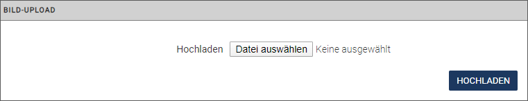
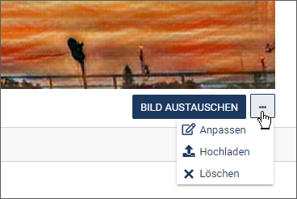
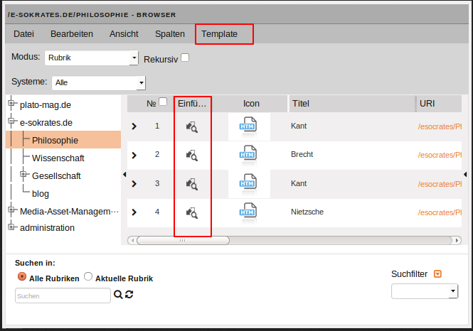
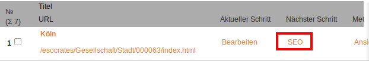
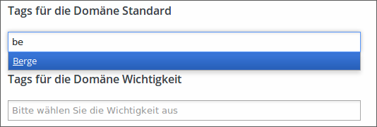

In diesem Workflow-Schritt erstellen Sie den Inhalt ihres Dokuments.
 
Die konkrete Eingabeansicht kann variabel an die Benutzeranforderungen angepasst werden und somit einfacher oder komplexer aufgebaut sein. Aus diesem Grund sind die im Folgenden beschriebenen Abläufe beispielhaft zu verstehen. In Ihrem System können die Abläufe und das Design demnach davon abweichen.

Die zentralen Vorlagen für die Eingabe von Inhalten sind die **Templates**: Sie enthalten häufig das Layout der fertigen Dokumente und geben die Bereiche vor, die vom Benutzer bearbeitet werden.

## Beispielhafter Aufbau eines Dokuments

In unserem Beispiel ist das Dokument in drei Ebenen aufgebaut:

* In der ersten Ebene wird mit Hilfe von Slotmodulen das Layout des Dokuments in Form von Spalten vorgegeben. Diese Ebene bildet den strukturellen Rahmen für die Inhaltsmodule. Slotmodule erkennen Sie an dem dunkelgrauen Rahmen und der stets sichtbaren Modulleiste rechts.

* Auf einer zweiten Ebene finden sich mit den Flexmodulen die eigentlichen Inhaltsmodule wie Überschriften, Textabsätze, Listen, Bilder, Videos, etc., die beliebig oft und in beliebiger Reihenfolge kombinierbar sind.

* Die dritte Ebene enthält so genannte Blockmodule, die für wiederholbare Inhaltsmodule genutzt werden können. Blockmodule können zum Beispiel zur Erzeugung von Bildergalerien oder Listen verwendet werden. Dabei werden die Bild- oder Listenelemente einfach dupliziert.  
Blockmodule sind vordefiniert und werden auf dieselbe Weise wie Flexmodule eingefügt und sind wie diese durch einen hellgrauen Header gekennzeichnet.

Beispiel für den Aufbau eines Dokuments:

## Aufbau des Formulars zur Inhaltserstellung

**Werkzeugleiste:** 
Im Workflow-Schritt "Inhalt erstellen" gibt es eine zusätzliche Werkzeugleiste, deren Optionen sich nur auf diesen Bearbeitungsschritt beziehen:

<!--
**Inhaltsansicht/Strukturansicht:** Wenn Sie sich einen besseren Überblick über den Aufbau Ihres Dokuments verschaffen möchten, wechseln Sie von der Inhaltsansicht in die Strukturansicht. Hier werden Struktur- und Inhaltselemente ohne die enthaltenen Inhalte angezeigt. Lediglich Header und Rahmen der Elemente sind sichtbar.
Diese Sicht ist beispielsweise sinnvoll, wenn Elemente neu positioniert werden sollen.

-->

**Sprachauswahl:** Wählen Sie bei mehrsprachigen Dokumenten hier eine Sprachversion des Dokuments aus. Die anschließend vorgenommenen Änderungen beziehen sich auf diese Sprachversion.

**Sprachoptionen:** Mit dieser Option können Sie Inhalte aus anderen Sprachversionen kopieren.

**Vorschau:** Diese Option öffnet ein zusätzliches Fenster mit der Ausgabeansicht.

**Speichern:** Führen Sie diese Option aus, wenn Sie den aktuellen Bearbeitungsstand sichern möchten.

**Modulleiste:** 
An jedem Struktur- und Inhaltselement befindet sich eine eigene Modulleiste mit Optionen für das ausgewählte Modul.
Um eine bessere Übersicht zu gewährleisten, erscheint die Modulleiste für die Flex- und Blockmodulen erst, wenn Sie mit der Maus über den Modul-Header fahren.

Für Slotmodule, die das Layout und damit den Rahmen für die Inhaltsmodule bilden, ist die Modulleiste dagegen immer sichtbar:

**Module minimieren:**

Sie können für ein Modul den Inhaltsbereich ausblenden, so dass nur noch der Modul-Header zu sehen ist.

* Klicken Sie auf den Doppelpfeil vor dem Modultitel, um den Inhaltsbereich zu verstecken.

* Klicken Sie erneut auf den nun waagrechten Pfeil, um den Inhaltsbereich wieder einzublenden. 

## Inhaltsmodule in ein Dokument einfügen und bearbeiten

Für das Erstellen eines Dokuments kann ein Benutzer auf zahlreiche Inhaltsmodule zugreifen.

Dabei hängt es von der Konfiguration des Templates ab, das dem Dokument zugrunde liegt, welche Module und auf welchen Ebenen diese eingefügt werden können.

Sie haben zwei Möglichkeiten, ein neues Inhaltsmodul einzufügen: Über die Toolbar eines bereits vorhandenen Inhaltsmodul und über die im Leerzustand eines Dokuments vom Template zur Verfügung gestellten Platzhalter.

* Klicken Sie in der Toolbar auf das Plussymbol ***Modul hinzufügen***.

* Legen Sie fest, ob Sie das neue Modul vor oder hinter das aktuelle Modul einfügen möchten.

 

*Auf dem vordersten Tab des Dialogs werden Ihnen alle in der Flexmodulverwaltung festgelegten Module angeboten.*

*Die Option **Aus der Zwischenablage einfügen** bietet die Möglichkeit, zuvor kopierte oder ausgeschnittene Module mitsamt Inhalt einzufügen.*

*Zur leichteren Auswahl können auf verschiedenen Reitern wie ***Einfach***, ***Liste*** und ***Spalten*** die verfügbaren Flexmodule nach Typen gefiltert angezeigt werden.*

* Blättern Sie in der Moduleliste weiter, indem Sie auf die Seitenangabe unten klicken.

* Wählen Sie das gewünschte Modul aus, indem Sie es anklicken.

*Das Modul wird in das Dokument eingefügt.*

Der andere Weg führt über die im Template vorgesehenen Platzhalter: 

* Führen Sie in einem leeren Dokument die Option **BLOCK HINZUFÜGEN** oder **FLEX HINZUFÜGEN** aus. 

## Inhaltsmodul positionieren

Verschieben Sie optional ein Inhaltsmodul an eine andere Position.

* Nutzen Sie hierzu die Pfeilsymbole in der Modulleiste.

* Sie können Inhaltsmodule auch einfach per *Drag & Drop* verschieben.

!!! note "Hinweis"
		Grundsätzlich bleiben beim Verschieben von Inhaltsmodulen bereits eingegebene Inhalte erhalten.

## Inhaltsmodul duplizieren

* Duplizieren Sie ein Inhaltsmodul, indem Sie auf das Symbol für zusätzliche Optionen in der Modulleiste und anschließend auf **Duplizieren** klicken. 

*Das Inhaltsmodul wird mit dem eingegebenen Inhalt kopiert und unterhalb des Originals eingefügt.*

* Stellen Sie die benötigten Parameter für das gewählte Modul ein.

## Inhaltsmodul verschieben

* Verschieben Sie ein Inhaltsmodul, indem Sie auf das Symbol für zusätzliche Optionen in der Modulleiste und anschließend auf **Ausschneiden** klicken. 

*Das Inhaltsmodul befindet sich nun in der Zwischenablage.*

* Setzen Sie den Mauszeiger an die Stelle, an die das Element verschoben werden soll und wählen Sie in den zusätzlichen Optionen **Einfügen**.

*Das Inhaltsmodul wird mit dem eingegebenen Inhalt ausgeschnitten und an der gewünschten Position eingefügt.*  
*Im Gegensatz zum Verschieben von Elementen mit Hilfe der Positionspfeile (Inhaltsmodul positionieren) können Sie mit den Optionen **Ausschneiden** und **Einfügen** Elemente auch modulübergreifend verschieben.*

## Inhaltsmodul kopieren

* Kopieren Sie ein Inhaltsmodul, indem Sie auf das Symbol für zusätzliche Optionen in der Modulleiste und anschließend auf **Kopieren** klicken.
 
*Das Inhaltsmodul befindet sich nun in der Zwischenablage.*

* Setzen Sie den Mauszeiger an die Stelle, an die das Element kopiert werden soll und wählen Sie in den zusätzlichen Optionen **Einfügen**.

*Das Inhaltsmodul wird mit dem eingegebenen Inhalt kopiert und an der gewünschten Position eingefügt.*

## Liste erstellen

Die Liste in unserem Beispiel wird mit Hilfe des Flexmoduls „Liste“ und mit Blockmodulen für die Listeneinträge erstellt.

* Klicken Sie in der Toolbar auf das Plussymbol ***Modul hinzufügen*** und legen Sie fest, ob Sie die Liste vor oder hinter das aktuelle Modul einfügen möchten.

* Klicken Sie „Liste“ als das Modul an, das Sie hinzufügen möchten.
*Das Flexmodul „Liste“ wird in das Dokument eingefügt.*

* Befüllen Sie nun die vorkonfigurierten Listenelemente mit Inhalt oder fügen Sie weitere Listenelemente hinzu, indem Sie auf **BLOCK HINZUFÜGEN** unter den Listenelementen klicken.

*Das Listenelement wird hinzugefügt.*

## Bild einfügen

Sie haben zwei Möglichkeiten, ein Bild in ein Dokument einzufügen:

* Aus dem Media Asset Management durch Klick auf **BILD HINZUFÜGEN**.

* Als einfachen Bild-Upload durch Klick auf **Bildoptionen/Hochladen**.

Beide Varianten sind im Template über den Aufruf des Media-Asset-Managements verfügbar.  Der Entwickler des Templates kann das entsprechende Bedienelement allerdings so konfigurieren, dass nur eine der beiden Möglichkeiten zur Auswahl steht.

!!! note "Hinweis"
		Platzhalterbilder können vom Template-Entwickler konfiguriert werden und können in der Darstellung abweichen.

** Bild aus dem Media-Asset-Management einfügen**

* Um ein Bild aus dem Media-Asset-Management (MAM) in das Dokument einzufügen, klicken Sie auf **BILD HINZUFÜGEN** unter dem Bild. Wenn Sie ein vorhandenes Bild lediglich ersetzen möchten, klicken Sie auf **AUSTAUSCHEN** an gleicher Stelle.  

*Das MAM wird in einem neuen Fenster geöffnet.*

* Wechseln Sie gegebenenfalls in das Verzeichnis mit dem gewünschten Bild.

* Doppelklicken Sie auf das Thumbnail des gewünschten Assets, um die derzeitig als Standard bestimmte Variante direkt ins Dokument zu importieren.  Lesen Sie im Kapitel *Medien verwalten* den Abschnitt [Asset-Standardvariante bestimmen](user.mam.md#asset-standardvariante-bestimmen), wenn Sie wissen möchten, wie Sie eine Variante eines Assets als Standard festlegen können.

** Bild über den Bild-Upload einfügen**

Mit Hilfe des Bild-Uploads können Sie Bilder auf Ihrem Rechner in ein Dokument einfügen, die nicht im Media-Asset-Management abgelegt sind. *imperia* überträgt diese Bilder beim Publizieren des Dokuments zusammen mit der HTML-Datei auf das Zielsystem.

!!! warning "Wichtig"
		Das Bild ist dabei nur mit dem entsprechenden Dokument verbunden und wird auch nachträglich nicht im MAM abgelegt. D.h. das Entfernen des Dokuments im System löscht auch das Bild unwiderruflich.

* Klicken Sie auf das Symbol für zusätzliche Optionen unter dem Bild und anschließend auf **Hochladen**.

* Klicken Sie auf **Datei auswählen**, um die gewünschte Datei auf Ihrem Rechner zu suchen. Sind bereits ein oder mehrere Bilder mittels Bild-Upload in das Dokument eingebunden worden, erscheinen diese in der Liste ***Verfügbare Dateien***:

.

Statt ein neues Bild einzubinden, können Sie eines der bereits vorhandenen Bilder auswählen:
	* Mit <i class="fa fa-exchange"></i> binden Sie diese ins Dokument ein. 
	* Mit <i class="fa fa-close"></i> können Sie ein Bild aus der Liste entfernen.	
* Klicken Sie nach Auswahl des Bilds auf **Hochladen**. 
* Ändern Sie in dem sich öffnenden Dialog gegebenenfalls den Dateinamen des Bilds.

!!! note "Hinweis"
		Eventuell ist der Bild-Upload so konfiguriert, dass die Möglichkeit zur Änderung des Dateinamens deaktiviert ist. Der entsprechende Dialog erscheint dann trotzdem, damit Sie den Dateinamen kontrollieren können.
		
* Klicken Sie auf **OK**, um das Bild ins Dokument einzufügen und das Dialogfenster zu schließen.

*Das Bild erscheint anschließend anstelle des Platzhalters im Dokument.*

Sollte bereits eine Datei dieses Namens in das Dokument eingebunden sein, erscheint folgende Meldung: 

* Klicken Sie auf **OK**, um das vorhandene Bild zu überschreiben und den Dialog zu schließen.
* Klicken Sie auf ***Zurück***, um das Bild beizubehalten. In diesem Fall können Sie zur Dateiauswahl zurückkehren, um ein anderes Bild auszuwählen.

**Bild entfernen**

* Entfernen Sie ein eingefügtes Bild, indem Sie auf das Symbol für zusätzliche Optionen unter dem Bild und anschließend auf **Löschen** klicken. 

**Bild konfigurieren**

* Bearbeiten Sie ein eingefügtes Bild, indem Sie auf das Symbol für zusätzliche Optionen unter dem Bild und anschließend auf **Anpassen** klicken. 

*Der Dialog *Asset-Aktionen* öffnet sich, in dem Sie die gewünschte Aktion auswählen können.*  
Lesen Sie dazu [Bilder bearbeiten](user.mam.md#bilder-bearbeiten) im Kapitel [Medien verwalten](user.mam.md)

___
## Texte bearbeiten mit dem iWE2

Der *imperia*-WYSIWYG-Editor (iWE2) ermöglicht komfortables Bearbeiten von Texten in einem Template. Sie können in einer WYSIWYG-Ansicht schnell und einfach Text formatieren, Bilder einbinden und Verlinkungen mit anderen Dokumenten setzen. Die Bedienung orientiert sich an gängiger Textverarbeitungs-Software, sodass ein intuitiver Einstieg ohne große Umgewöhnung möglich ist. HTML-Kenntnisse sind nicht notwendig, Sie können bei Bedarf jedoch den HTML-Quellcode direkt bearbeiten.

Technische Grundlage ist der Texteditor “CKEditor” (ckeditor.com).
 Dieses Kapitel beschreibt die *imperia*-spezifischen Funktionen. Eine detaillierte Beschreibung des “CKEditor” finden Sie im [Benutzerhandbuch](http://docs.cksource.com/CKEditor_3.x/Users_Guide) des ckeditors(Stand der Quellenangabe: Mai 2017).

Die Benutzeroberfläche ist an gebräuchliche Textverarbeitungs-Software angelehnt.

Alle Funktionen lassen sich durch Klick auf einen der Buttons aus den Symbolleisten ausführen.

!!! note "Hinweis" 
		Welche der hier gezeigten Buttons tatsächlich verfügbar sind, hängt von der Konfiguration des iWE-Editors im jeweiligen Template bzw. der zugehörigen Konfigurationsdatei ab. 

Die Symbolleisten können in folgende Kategorien unterteilt werden:

* **Steuerfunktionen**: Hierzu gehören die Funktionen *Rückgängig* und *Wiederherstellen*, *Suchen und Ersetzen*, und *Einfügen aus der Zwischenablage*.
* **Strukturfunktionen**: Diese beinhalten beispielsweise das Erstellen von Listen sowie Zitate oder Blockelemente.
* **Funktionen für Textformatierungen**: Fett, Kursivschrift, Einrückungen und Textausrichtung.
* **Funktionen für Farben**: Mit diesen Funktionen können Sie die Text- und Hintergrundfarbe festlegen.
* **Funktionen zum Einfügen von Objekten und Texten**: Neben dem Einfügen von Assets, Sonderzeichen und Tabellen umfasst diese Funktionsgruppe auch das Einfügen von unformatiertem Text oder formatiertem Text aus Word®-Dokumenten über die Zwischenablage, siehe Abschnitt [Assets einfügen](user.documents.md#assets-einfugen) bzw. [Tabellen einfügen](user.documents.md#tabellen-einfugen).
* **Funktion zum Einfügen von Links**: Mit dem iWE2 lassen sich Links innerhalb eines Dokuments zu anderen (*imperia*-internen) Dokumenten oder (externen) Websites erstellen sowie Links auf *imperia*-Assets und Mailto-Links generieren.
* **Formularfunktionen**: Mit den Formularfunktionen fügen Sie Formulare und Formularelemente in Ihr Dokument ein.

### Assets einfügen

1. Setzen Sie den Cursor an die gewünschte Stelle.
2. Klicken Sie auf , um ein Bild aus dem Media-Asset-Management einzufügen. 

	

3. Wählen Sie das Asset aus.
4. Wechseln Sie auf den **Reiter** ***Bildinfo***, um das Asset aus dem MAM auszuwählen.
5. Klicken Sie auf den Button **Browse MAM** (MAM durchsuchen).
6. Führen Sie einen Doppelklick auf ein Thumbnail aus, um die Standardvariante des Assets in das Dokument zu importieren.
7. Klicken Sie auf das Symbol in der Spalte ***Auswahl***, um eine der verfügbaren Varianten eines Assets für den Import auszuwählen. *Das Asset und die dazugehörige URL werden automatisch hinzugefügt. Sie können die URL auch manuell eingeben.*
8. Im Vorschaufenster können Sie das eingefügte Asset nun sehen und weitere Optionen anpassen.
	* Tragen Sie optional einen ***Alternativen Text*** ein. Wenn Sie ein Asset ausgewählt haben, ist dieses Feld automatisch mit dem Titel vorbelegt, unter dem es im MAM geführt wird.
	* Tragen Sie optional unter ***Breite/Höhe*** die gewünschten Abmessungen ein, in denen das Asset im Dokument erscheinen soll.  Wenn Sie nur eine Seitenlänge angeben, errechnet das   System die andere Seitenlänge ausgehend vom Seitenverhältnis des ursprünglichen Assets.
 
 	!!! note "Hinweis"
			Tragen Sie die Größenangaben *vor* der Auswahl des Assets ein. Das System generiert dann automatisch eine neue Variante des ausgewählten Assets mit den gewünschten Abmessungen. Auf diese Weise erzielen Sie die bestmögliche Darstellungsqualität.  Eine nachträgliche Bildbearbeitung ist in *imperia* auch gegeben, siehe **[Bilder bearbeiten](user.mam.md#bilder-bearbeiten)**.

				
	* Tragen Sie optional unter ***Rahmen*** einen Wert ein (z.B. 5px), um das eingefügte Asset mit einem Rahmen zu versehen.
	* Tragen Sie optional unter ***H-Abstand/V-Abstand*** die gewünschten Werte ein (z.B. 5px), um das Asset mit einem Abstand zum umgebenden Element einzufügen.
	* Bestimmen Sie optional unter ***Textfluss*** die Ausrichtung des Assets.

		*In der Vorschau wird das zu importierenden Asset angezeigt.*

9. Wechseln Sie auf den **Reiter** ***Caption***, um eine Beschriftung festzulegen.

	!!! note "Hinweis"
			Stellen Sie sicher, dass Sie bei Bildunterschriften die Checkbox *Bild mit Bildunterschrift* aktivieren. Andernfalls wird die eingetragene Beschriftung nicht angezeigt. <comment: in imperia heisst es "Bild mit Überschrift"?>

			
	* Aktivieren Sie die Checkbox ***Bild mit Bildunterschrift***.
	* Ändern Sie gegebenenfalls die Ausrichtung der eingegebenen Beschriftung.

	
10. Wechseln Sie auf den **Reiter** ***Link***, um das ausgewählte Asset gegebenenfalls zu verlinken.

	* Tragen Sie unter ***URL*** die Ziel-URL für den zu erstellenden Link ein und wählen Sie den Linktyp.

11. Wechseln Sie auf den **Reiter** ***Erweitert***, um zusätzliche Einstellungen vorzunehmen. 
	* Hier können Sie zum Beispiel das Asset mit Style-Klassen versehen oder erweiterte Eigenschaften wie ein Sprachkürzel und eine Beschreibung angeben.

### Tabellen einfügen

Mit dieser Funktion können Sie im iWE2 HTML-Tabellen anlegen.

1. Klicken Sie auf , um eine Tabelle einzufügen.

	 
2. Geben Sie  die gewünschten Eigenschaften der zu erstellenden Tabelle ein. Dies beinhaltet u.a. die Größe der Tabelle, die Anzahl der Zeilen und Spalten, die Dicke des Rahmens, der Zeilenabstand, die Ausrichtung und die Beschriftungen.

### Buttons einfügen

Im iWE2 haben Sie die Möglichkeit, einen Button hinzuzufügen und diesem ein Asset aus dem MAM zuzuweisen. Die verfügbaren Optionen sind (abgesehen vom Reiter *Link*) dieselben wie unter [Assets einfügen](user.documents.md#assets-einfugen) beschrieben.

## Linktool

Das Linktool dient dazu, Inhalte aus dem Quelldokument an verschiedene Zielpositionen des Zieldokuments zu kopieren. Das Linktool wird im Zieldokument geöffnet.

* Das *Quelldokument* ist das Dokument, aus dem Inhalt kopiert werden soll. 
* Das *Zieldokument* ist das Dokument, das den kopierten Inhalt danach aufnimmt.

Inhalt, der mit Hilfe des Linktools in das Zieldokument kopiert wird, wird nicht automatisch aktualisiert, falls sich der Inhalt im Quelldokument ändert. In einem solchen Fall ist man gezwungen, das Zieldokument erneut zu bearbeiten oder mit dynamischen Inhalten zu arbeiten (SiteActive).

!!! note "Hinweis"
		* Abhängig von der Konfiguration des Linktools und der Gestaltung des Zieldokuments können Bedienungsfunktionen unterschiedlich ausgeprägt sein. Wenden Sie sich bei Fragen an den Programmierer des Templates.
		* Je nachdem, welche Filter und Einschränkungen von Ihrem Template-Entwickler eingestellt wurden, können Sie nur Teile des Rubrikenbaums sehen.

Das Linktool öffnet wahlweise das MAM oder den Dokumenten-Browser, in Abhängigkeit von dem, was im entsprechenden Template spezifiziert ist. 

Fügen Sie Inhalte mit dem Linktool ein:

1. Klicken Sie auf  (Dokumenten-Browser) oder alternativ auf  (MAM).
2. Das Linktool wird jeweils in einem eigenen Dialog geöffnet. Gehen Sie je nach Konfiguration wie folgt vor:

	| Dokumenten-Browser | MAM |
	|---|---|
	|||
	|Klicken Sie in der Spalte *Einfügen* auf , um das gewünschte Asset einzufügen.  Klicken Sie alternativ auf die URI des gewünschten Dokuments oder Assets, das Sie verlinken wollen, um es im Ziel-Dokument einzubinden.|Doppelklicken Sie auf ein Thumbnail, um die Standard-Variante eines Assets in das Dokument zu importieren.|
	|Darüber hinaus gibt es im Linktool den zusätzlichen Menüpunkt *Template*, der genutzt wird, um einen Link in Ihrem Zieldokument *zurückzusetzen*.||

    Sie können immer nur ein Item auf einmal einfügen. 
    Sie können im Linktool auch die Volltext-Suche und Filter dazu nutzen, Dokumente und Assets zu suchen.
    Weitere Informationen zu diesen Optionen finden Sie im Kapitel [Im Media-Asset-Management suchen](user.mam.md#im-media-asset-management-suchen).
    
## Suchmaschinenoptimierung

Das SEO-Workflow-Plug-in ist ein Workflow-Schritt, der Ihnen hilft, Ihre Webseite für Suchmaschinen wie Google oder Startpage zu optimieren. Es validiert Ihre Seite anhand einer Checkliste und bietet Ihnen Vorschläge zur Verbesserung an. <comment Kriterien aus Vorgang dokumentieren oder besser verweisen? https://jira.pirobase.de/jira/browse/ICMS-86>

Wenn Ihr Workflow das SEO-Workflow-Plug-in beinhaltet, erscheint es auf dem [Schreibtisch](user.desktop.md) in der Spalte ***Nächster Schritt*** (in der Regel nach dem Schritt ***Bearbeiten***):

1. **Schlüsselwörter eintragen**

1. Tragen Sie im ersten SEO-Schritt eines oder mehrere Schlüsselwörter als Grundlage für den SEO-Check ein.
2. Wählen Sie zudem eines Ihrer Zielsysteme auswählen, um Informationen über den Status der robot.txt file zu importieren.
3. Klicken Sie auf ***Aktivieren*** um den Check zu starten.

2. **Vorschau wird erzeugt**

Im nächsten SEO-Schritt wird Ihnen eine *Vorschau* des Dokumenteneintrags angezeigt, wie er als Ergebnis in einer Suchmaschine aussehen könnte.  
Dabei werden verschiedene Teile des Dokuments nach den definierten Schlüsselwörtern untersucht.  
Für alle Instanzen eines Schlüsselworts der jeweiligen Stelle wird der entsprechende Zähler um 1 hochgezählt. Dementsprechend erhalten Sie ein "Keine", wenn kein Schlüsselwort gefunden wurde.

3. **Dokument wird validiert**

Die letzte Auswahl validiert Ihr Dokument und das Zielsystem auf Basis der SEO-Checkliste. Rote Einträge weisen auf ernsthafte Verstöße gegen die SEO-Richtlinien hin. Gelbe Einträge sind Warnungen. Grüne Einträge geben an, dass dieser Aspekt mit den SEO-Richtlinien übereinstimmt.

Anhand der Checkliste sehen Sie, welche Punkte erfüllt wurden und welche noch zu verbessern sind.

4. **SEO-Workflow-Schritt beenden**

* Beenden Sie den SEO-Workflow, indem Sie auf **Speichern** klicken. Sie gelangen anschließend zum nächsten Schritt. 
* Mit einem Klick auf **Ablehnen** gelangen Sie zum vorherigen Workflow-Schritt(in der Regel der Editier-Schritt).
* Mit einem Klick auf ***Abbruch*** gelangen Sie zum Schreibtisch, ohne die Änderungen gespeichert zu haben.	

___
## Tags hinzufügen
Mit Hilfe von Tags lassen sich in einer Website thematische Übersichtsseiten generieren, von denen aus Website-Besucher zu inhaltlich verwandten Seiten springen können.
Tags werden im Bearbeiten-Schritt oder in einem eigens konfigurierten Workflow-Schritt hinzugefügt. Dabei können Sie Tags wahlweise frei hinzufügen oder aus einer definierten Liste auswählen.

!!! note "Hinweis"
		Beim "freien" Hinzufügen der Tags wird die Tag-Liste von allen Redakteuren gemeinsam durch das Hinzufügen erweitert.
		Die "definierte" Tag-Liste wird durch einen Administrator fest vorgegeben.
		Die Unterscheidung der beiden Möglichkeiten wird technisch in jeder einzelnen Tag-Processing Instruction vorgegeben.

Tags können für bestimmte Domänen vergeben werden. Domänen sind hierbei als übergeordnete thematische Bereiche zu verstehen, für die Tags zugewiesen werden können. 
So könnten Sie einem Dokument beispielsweise ausgesuchte Autoren als Tags für die Domäne *Autor* oder bestimmte Prioritäten als Tags für die Domäne *Wichtigkeit* zuweisen.

* Geben Sie in das Eingabefeld der gewünschten Domäne den Tag-Begriff ein. Während der Eingabe wird die Tag-Liste nach dem Begriff durchsucht und entsprechend gefiltert.

Gibt es den eingegebenen Begriff in der Tag-Liste noch nicht, können Sie ihn der Liste hinzufügen.

* Gehen Sie zunächst mit Hilfe der ESC-Taste aus der Liste heraus oder klicken Sie an eine Stelle außerhalb der Liste. 
* Geben Sie den gewünschten Tag-Begriff in das Eingabefeld ein und klicken Sie auf ENTER.

!!! note "Hinweis"
		Das Tag wird erst zu der Tag-Liste hinzugefügt wenn Sie **Speichern** ausgeführt haben.		

* Mit Hilfe des Kreuz-Symbols hinter dem Namen können Sie ein Tag auch wieder aus dem Eingabefeld entfernen. 

!!! note "Hinweis"
		Um die Tag-Zuweisung aus dem Dokument zu entfernen, müssen Sie **Speichern** ausführen.

*Die zugewiesenen Tags werden nun in der Seite dargestellt.*

Sie können Tags auch nutzen, um Ihren Schreibtisch nach inhaltlichen Themen zu filtern. Lesen Sie hierzu auch den Abschnitt [Schreibtisch-Filter](user.desktop.md#schreibtisch-filter) im Kapitel [Arbeiten mit dem Schreibtisch](user.desktop.md).
