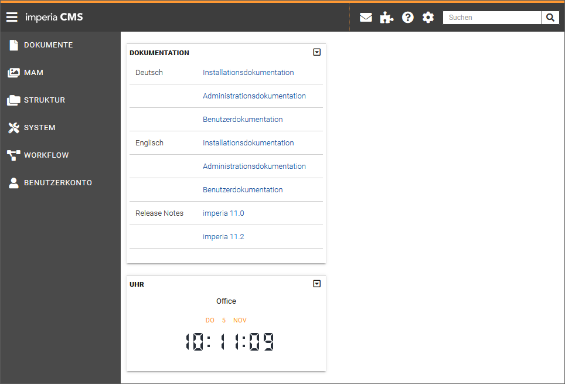
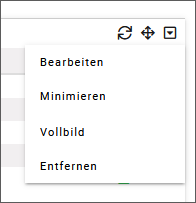
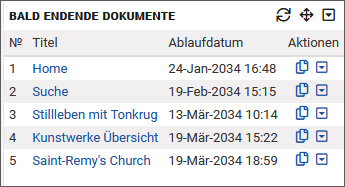
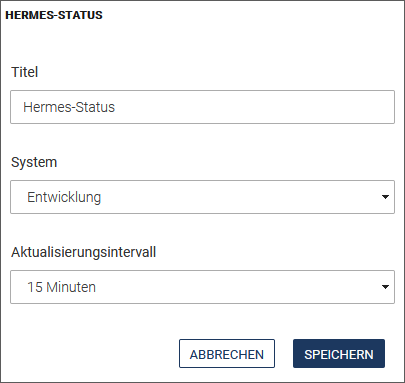
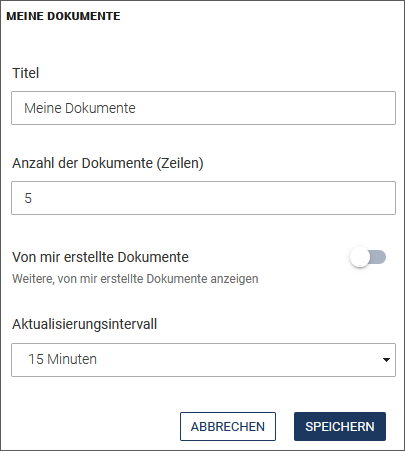

Nach der Anmeldung an *imperia* öffnet sich die Startseite des *imperia*-Dashboards.

Das Dashboard besteht aus einzelnen funktionalen Komponenten, den so genannten Widgets, und kann frei nach Ihren Bedürfnissen und Wünschen gestaltet werden. Widgets enthalten beispielsweise Übersichten über bevorstehende Ereignisse wie *freizuschaltende* oder *bald endende* Dokumente, zeigen allgemeine Informationen an oder listen Shortcuts zu Menüpunkten. 

Sie können auch mehr als ein Dashboard für sich anzulegen, so dass Sie die Arbeitsumgebung optimal an Ihre verschiedensten Ansprüche anpassen können.
 
*imperia*-Administratoren (Benutzer der Gruppe "Superuser") können darüber hinaus Standard-Dashboards erstellen und einer bestimmte Gruppe zuweisen.

### Dashboard erstellen

1. Klicken Sie in der Kopfzeile auf <i class="fa fa-gear""></i> ***Einstellungen***.
2. Wählen Sie im Drop-Down-Menü <i class="fa fa-pencil-square-o"> </i> ***Dashboards bearbeiten***.
3. Klicken Sie im Dialogfenster *Dashboards bearbeiten* auf **Neues Dashboard erstellen**.

	

4. Geben Sie den Namen des Dashboards ein. 
5. Wählen Sie das Layout aus. Hier wird zwischen zwei Varianten unterschieden (welche Dashboard-Templates zur Auswahl stehen, hängt von Ihren Benutzerrechten ab):

	* ***Vordefiniertes Dashboard***: Wählen Sie diese Variante, wenn Sie ein Dashboard mit bereits eingefügten Widgets anlegen möchten.
	* ***Leeres Dashboard mit vorgegebenem Layout***: Wählen Sie diese Variante, wenn Sie ein Dashboard mit leerem Layout anlegen möchten. In dieses können Sie später die gewünschten Widgets einfügen, wie unter [Widgets hinzufügen](user.dashboard.md#widgets-hinzufugen) beschrieben.
	
	
 
6. Sichern Sie Ihre Angaben, indem Sie auf **Speichern** klicken.

*Das Dashboard wird direkt in Ihrem aktuellen System übernommen. Damit wird auch das aktuelle Browser-Fenster, in dem sich Ihr *imperia*-System befindet, automatisch umbenannt und kann als neues Lesezeichen gesetzt werden.*

Sie können jetzt dem erstellten Dashboard Gruppen zuweisen. Lesen Sie dazu unten weiter.

### Dashboard bearbeiten

Diese Funktion wird vor allem genutzt, um Dashboards nur bestimmten Gruppen zuzuweisen.

1. Um ein vorhandenes Dashboard zu bearbeiten, klicken Sie in der Kopfzeile erneut auf <i class="fa fa-gear""></i>***Einstellungen***.
2. Wählen Sie im Drop-down-Menü die Option <i class="fa fa-pencil-square-o"> </i> ***Dashboards bearbeiten***.
3. Öffnen Sie in der Dashboard-Liste das gewünschte Dashboard, indem Sie auf **Bearbeiten** klicken.  *Das aktuell benutzte Dashboard ist grau hinterlegt.*

	

4. Klicken Sie auf den Abschnitt ***Gruppenzuweisung***.
5. Wählen Sie die gewünschten Gruppen aus, für die das Dashboard bereitgestellt werden soll.

	

6. Nehmen Sie gegebenenfalls weitere Änderungen vor. Sie können in diesem Dialog auch den Dashboard-Namen oder das Layout ändern. 
7. Sichern Sie Ihre Angaben, indem Sie auf **Speichern** klicken.

### Dashboard löschen

1. Um ein vorhandes Dashboard zu löschen, klicken Sie in der Kopfzeile auf <i class="fa fa-gear""></i> ***Einstellungen***.
2. Wählen Sie im Drop-down-Menü die Option <i class="fa fa-pencil-square-o"></i> ***Dashboards bearbeiten***.
3. Klicken Sie in dem sich öffnenden Dialog auf **Löschen** neben dem gewünschten Dashboard.

	

4. Bestätigen Sie die erscheinende Sicherheitsmeldung mit **OK**.

*Das ausgewählte Dashboard wird mit allen konfigurierten Widgets unwiderruflich gelöscht.*

### Widgets hinzufügen

1. Um einem bestehenden Dashboard ein Widget hinzuzufügen, klicken Sie in der Kopfzeile auf <i class="fa fa-gear""></i> ***Einstellungen***.
2. Wählen Sie im Drop-down-Menü die Option ***Widget hinzufügen***.

	

	*Eine Liste mit allen zur Verfügung stehenden Widgets wird geöffnet. Eine genaue Beschreibung zu den einzelnen Widgets finden Sie unter* [Verfügbare Widgets](user.dashboard.md#verfugbare-widgets).
	
	
	

3. Klicken Sie auf ein Widget. 

*Dieses wird an erster Stelle der ersten Spalte des gewählten Dashboards (je nach gewähltem [Layout](user.dashboard.md#dashboard-erstellen)) hinzugefügt.* 

Sie können an dieser Stelle beliebig viele Widgets hinzufügen und später verschieben.

### Widgets verschieben

Sie können die Widgets nachträglich an die gewünschte Stelle verschieben, indem Sie in die Menüleiste des Widgets klicken und bei gedrückter Maustaste das Widget an die neue Position ziehen.

!!! tip "Tipp"
	Neben dem ausgewählten Spaltenlayout steht über jeder Spaltenkonfiguration immer eine Zeile zur Verfügung, die sich über die gesamte Dashboardbreite erstreckt. In dieser Zeile können Widgets untergebracht werden, die mehr Platz benötigen:
	
	

### Funktionsweise von Widgets

Die im Folgenden beschriebenen Funktionen finden Sie in der Menüleiste des Widgets.

	

#### Widget vom Dashboard entfernen

Mit Hilfe der Funktion *Entfernen* können Sie ein Widget aus dem Dashboard löschen:

1. Klicken Sie in der Menüleiste des Widgets auf <i class="fa fa-caret-square-o-down"></i>.
2. Klicken Sie auf ***Entfernen***.

#### Widget-Inhalt aktualisieren

Einige Widgets, deren Inhalt sich häufiger ändern kann, bieten die Option ***Aktualisieren*** <i class="fa fa-refresh"></i>, um den Inhalt bei Bedarf neu zu laden.

!!! tip "Tipp"
	Bei diesen Widgets ist es oft auch möglich, in den Einstellungen ein automatisches Aktualisierungsintervall festzulegen, z.B. im Widget [Wiedervorlage](user.dashboard.md#wiedervorlage).

#### Widget konfigurieren

Nutzen Sie die Funktion *Bearbeiten*, um das Widget zu konfigurieren.

1. Klicken Sie in der Menüleiste des Widgets auf <i class="fa fa-caret-square-o-down"></i>.
2. Klicken Sie im Drop-Down-Menü auf ***Bearbeiten***. Je nach Widget erscheinen unterschiedliche Felder für die Einstellungen des Widgets.
3. Sichern Sie Ihre Änderungen, indem Sie auf **Speichern** klicken.

#### Widget minimieren und wiederherstellen

Mit der Funktion *Minimieren* klappen Sie das Fenster des Widgets ein, so dass nur noch die Menüleiste angezeigt wird.

Die Funktion *Wiederherstellen* klappt das Fenster des Widgets wieder auf.

1. Klicken Sie  in der Menüleiste des Widgets auf <i class="fa fa-caret-square-o-down"></i>.  
2. Klicken Sie im Drop-Down-Menü auf ***Minimieren*** bzw. ***Wiederherstellen***.

#### Widget im Vollbild-Modus darstellen

Wählt man die "Vollbild"-Darstellung eines Widgets, so wird es als einziges Widget im gesamten Bereich des Dashboards angezeigt.
 In dieser Darstellung können Sie das Widget neu konfigurieren.  Zudem kann man für die Seite im Vollbild-Modus (im Browser) ein Lesezeichen setzen, um diese später direkt abrufen zu können.

Die Vollbild-Konfiguration des Widgets wird in den Benutzerdaten gespeichert und beim nächsten Umschalten in den Vollbildmodus für dieses Widget wiederverwendet.
Da die Konfiguration für den Vollbild-Modus unabhängig von der Konfiguration des Widgets im Dashboard ist, wirken sich diese Einstellungen nicht auf die (normale) Dashboard-Ansicht des Widgets aus.

1. Klicken Sie  in der Menüleiste des Widgets auf <i class="fa fa-caret-square-o-down"></i>.
2. Klicken Sie im Drop-Down-Menü auf ***Vollbild***.
3. Um den Vollbild-Modus zu verlassen, klicken Sie erneut auf <i class="fa fa-caret-square-o-down"></i> und anschließend auf ***Schließen***.

___
## Verfügbare Widgets

Die im Folgenden beschriebenen Widgets können Sie zu einem Dashboard hinzufügen.

### Bald endende Dokumente

In diesem Widget wird die Liste der bald endenden Dokumente angezeigt. Die Liste ist so sortiert, dass die Dokumente, die als nächstes ablaufen, zuoberst angezeigt werden.

**Konfiguration**

Klicken Sie in der Menüleiste des Widgets auf <i class="fa fa-caret-square-o-down"></i> und anschließend auf ***Bearbeiten***, um die Konfiguration für das Widget zu öffnen.

* Im Feld ***Titel*** können Sie das Widget umbenennen. Der Name wird anschließend in der Menüleiste des Widgets angezeigt.
* Im Feld ***Anzahl der Dokumente (Zeilen)*** können Sie die Anzahl der im Widget angezeigten Dokumente einstellen.  Entsprechen mehr Dokumente den oben genannten Kriterien, so wird dies im Widget mit der Option ***Mehr(+n)*** angezeigt. Klicken Sie auf diesen Link um alle Dokumente einzublenden.
* Im Feld ***Anzeige*** wählen Sie die Art der Informationen bzw. Funktionen, die jeweils im Dokument abgerufen werden können.
* Im Feld ***Aktualisierungsintervall*** steuern Sie, ob und nach welcher Zeit das Widget automatisch neu geladen werden soll.
* Bestätigen Sie Ihre Änderungen, indem Sie auf **Speichern** klicken.

### Anstehende Veröffentlichungen

In diesem Widget wird die Liste der Dokumente, die automatisch veröffentlicht werden, angezeigt. Die Liste ist so sortiert, dass die Dokumente, die als nächstes veröffentlicht werden, zuoberst angezeigt werden.

**Konfiguration**

Klicken Sie in der Menüleiste des Widgets auf <i class="fa fa-caret-square-o-down"></i> und anschließend auf ***Bearbeiten***, um die Konfiguration für das Widget zu öffnen.

* Im Feld ***Titel*** können Sie das Widget umbenennen. Der Name wird anschließend in der Menüleiste des Widgets angezeigt.
* Im Feld ***Anzahl der Dokumente (Zeilen)*** können Sie die Anzahl der im Widget angezeigten Dokumente einstellen.  Entsprechen mehr Dokumente den oben genannten Kriterien, so wird dies im Widget mit der Option ***Mehr(+n)*** angezeigt. Klicken Sie auf diesen Link um alle Dokumente einzublenden.
* Sie können ebenfalls nur Dokumente anzeigen lassen, die von Ihnen erstellt wurden, indem Sie den Schalter ***Nur selbst erstellte Dokumente anzeigen*** einschalten.
* Im Feld ***Aktualisierungsintervall*** steuern Sie, ob und nach welcher Zeit das Widget automatisch neu geladen werden soll.
* Bestätigen Sie Ihre Änderungen, indem Sie auf **Speichern** klicken.

### Hermes-Status

In diesem Widget wird der Betriebsstatus von site\_hermes.pl angezeigt.

* ***Typ*** gibt an, für welche Art von System Hermes momentan arbeitet.
* ***System-ID*** ist der Indikator für ein bestimmtes System.
* ***URL*** zeigt den Pfad an, unter dem das System erreichbar ist.
* ***Site-Verzeichnis*** gibt an, in welchem Verzeichnis das System installiert ist.
* ***Document-Root*** ist das Wurzelverzeichnis für die Dokumente.
* ***Hermes-Status*** aktiviert die Überwachung durch Hermes. Als Standard ist diese Einstellung für Ihr System aktiviert. Weitere Informationen hierzu finden Sie auch im Kapitel [Zielsysteme](https://portal.pirobase-imperia.com/pb/imperia-cms-dokumentation/admin-de-11/admin.zielsysteme/#neues-zielsystem-anlegen) im Admin-Handbuch. Ist das Feld ***Hermes-Status*** nicht zu sehen, müssen Sie die Überwachung für den Hermes-Service im jeweiligen Zielsystem aktivieren:

	1. Öffnen Sie das Menü ***System***-&gt;***Zielsysteme***.
	2. Klicken Sie auf das gewünschte Zielsystem.
	3. Aktivieren Sie in den erscheinenden Einstellungen die Checkbox ***Hermes überwachen***.
	4. Bestätigen Sie Ihre Änderungen, indem Sie auf **Speichern** klicken.
	

Sie können mehrere Hermes-Status-Widgets für Ihre verschiedenen Zielsysteme einfügen. Fügen Sie hierzu erneut das Widget hinzu und wählen Sie anschließend das gewünschte Zielsystem aus.

**Konfiguration**

Klicken Sie in der Menüleiste des Widgets auf <i class="fa fa-caret-square-o-down"></i> und anschließend auf ***Bearbeiten***, um die Konfiguration für das Widget zu öffnen.

* Im Feld ***Titel*** kann das Widget umbenannt werden. Der Name wird in der Menüleiste abgebildet.
* Im Feld ***System*** wählen Sie, für welches Zielsystem der Hermes-Status angezeigt werden soll.
* Im Feld ***Aktualisierungsintervall*** steuern Sie, ob und nach welcher Zeit das Widget automatisch neu geladen werden soll.
* Bestätigen Sie die Änderungen mit **Speichern**.

### Imperia Release News 

In diesem Widget werden Nachrichten über das aktuell installierte Release abgebildet.

Dieses Widhet bietet keine weiteren Konfigurationsmöglichkeiten.

### Imperia News 

In diesem Widget werden aktuelle News rund um *imperia* abgebildet. Über die hinterlegten Links gelangen Sie auf die Webseite.

Dieses Widget bietet keine weiteren Konfigurationsmöglichkeiten.

### Logdatei

In diesem Widget werden die letzten *n* Zeilen einer Logdatei angezeigt.

**Konfiguration**

Klicken Sie in der Menüleiste des Widgets auf <i class="fa fa-caret-square-o-down"></i> und anschließend auf ***Bearbeiten***, um die Konfiguration für das Widget zu öffnen.

* Im Drop-down-Menü ***Dateiname*** können Sie auswählen, welche Log-Dateien angezeigt werden sollen (access.log/hermes.log/error.log).
* Im Feld ***Zeilen im [Vollbild](user.dashboard.md#widget-im-vollbild-modus-darstellen)-Modus*** wird die Anzahl der Zeilen im Vollbildmodus eingestellt. Der Default-Wert ist 10. 
* Im Feld ***Zeilen*** wird die Anzahl der Zeilen im Widget eingestellt. Der Default-Wert ist 10.
* Im Feld ***Font-Größe*** können Sie neben dem numerischen Wert auch die Maßeinheit mit angeben. Z.B. 10pt oder 0,9em. Standardwert ist `10px`.
* Im Feld ***Aktualisierungsintervall*** steuern Sie, ob und nach welcher Zeit das Widget automatisch neu geladen werden soll.
* Bestätigen Sie Ihre Änderungen, indem Sie auf **Speichern** klicken.

### Meine Dokumente

Im Widget ***Meine Dokumente*** werden Dokumente angezeigt, die Sie als Autor selbst bearbeitet haben und auf die Sie als Autor auch Schreibrechte haben.

Darüber hinaus sind in dieser Liste die Dokumente enthalten, die automatisiert (z.B. durch den Systemdienst) importiert wurden, um einen Import, eine Eskalation oder eine Wiedervorlage durchzuführen.

Die Liste ist so sortiert, dass die zuletzt bearbeiteten Dokumente zuoberst angezeigt werden.

**Konfiguration**

Klicken Sie in der Menüleiste des Widgets auf <i class="fa fa-caret-square-o-down"></i> und anschließend auf ***Bearbeiten***, um die Konfiguration für das Widget zu öffnen.

* Im Feld ***Titel*** können Sie das Widget umbenennen. Der Name wird anschließend in der Menüleiste des Widgets angezeigt.
* Im Feld ***Anzahl der Dokumente (Zeilen)*** können Sie die Anzahl der im Widget angezeigten Dokumente einstellen.  Entsprechen mehr Dokumente den oben genannten Kriterien, so wird dies im Widget mit der Option ***Mehr(+n)*** angezeigt. Klicken Sie auf diesen Link um alle Dokumente einzublenden.
* Sie können weitere Dokumente anzeigen lassen, die von Ihnen erstellt wurden, indem Sie den Schalter ***Von mir erstellte Dokumente*** einschalten.
* Im Feld ***Aktualisierungsintervall*** steuern Sie, ob und nach welcher Zeit das Widget automatisch neu geladen werden soll.
* Bestätigen Sie Ihre Änderungen, indem Sie auf **Speichern** klicken.

### Menü

Dieses Widget stellt die Untermenüs eines der *imperia*-Menüs dar.

**Konfiguration**

Klicken Sie in der Menüleiste des Widgets auf <i class="fa fa-caret-square-o-down"></i> und anschließend auf ***Bearbeiten***, um die Konfiguration für das Widget zu öffnen.

* Im Feld ***Titel*** können Sie das Widget umbenennen. Der Name wird anschließend in der Menüleiste des Widgets angezeigt.
* Im Feld ***Hauptmenü*** geben Sie das Menü an, für das die Untermenüs angezeigt werden soll (Hauptmenü/Dokumente/MAM/Struktur/System/Workflow/Benutzerkonto/Extras).
* Wenn Sie den Schalter ***Element ohne Link verstecken*** einschalten, erscheinen nur Menüpunkte, die einen direkten Link enthalten. 
* Bestätigen Sie Ihre Änderungen, indem Sie auf **Speichern** klicken.

### Notiz

Dieses Widget stellt einen Notizzettel dar, auf dem Sie kleine Notizen vermerken können.

Dieses Widget bietet außer dem Titel und der Anzahl an Zeilen keine weiteren Konfigurationsmöglichkeiten.

###Statisches HTML

In diesem Widget können Sie HTML abbilden.

**Konfiguration**

Klicken Sie in der Menüleiste des Widgets auf <i class="fa fa-caret-square-o-down"></i> und anschließend auf ***Bearbeiten***, um die Konfiguration für das Widget zu öffnen.

* Im Feld ***Titel*** können Sie das Widget umbenennen. Der Name wird anschließend in der Menüleiste des Widgets angezeigt.
* Im Feld ***Inhalt*** tragen Sie beliebigen Inhalt in HTML ein.
* Im Feld ***Fußzeile*** können Sie Inhalt eintragen, der unterhalb des Inhalts erscheint.
* Bestätigen Sie die Änderungen mit **Speichern**.

### Uhr

In diesem Widget können Sie eine oder mehrere Uhren anzeigen. 

**Konfiguration**

Klicken Sie in der Menüleiste des Widgets auf <i class="fa fa-caret-square-o-down"></i> und anschließend auf ***Bearbeiten***, um die Konfiguration für das Widget zu öffnen.

* Im Feld ***Widgettitel*** können Sie das Widget umbenennen. Der Name wird anschließend in der Menüleiste des Widgets angezeigt.
* Klicken Sie auf **Uhr hinzufügen**, wenn Sie innerhalb desselben Widgets eine neue Uhr hinzufügen möchten.
	
	* Im Feld ***Name*** tragen Sie den Namen der Uhr ein.
	* Im Feld ***Lokale Zeit*** wählen Sie das Offset zu GMT aus.
	* Im Feld ***Typ*** wählen Sie aus, ob die Uhr analog oder digital dargestellt wird.

* Bestätigen Sie Ihre Änderungen, indem Sie auf **Speichern** klicken.

### Wiedervorlage

Dieses Widget enthält eine Liste der Dokumente, die demnächst zur Wiedervorlage anstehen. Die Liste ist so sortiert, dass die Dokumente zuoberst angezeigt werden, die als nächstes vorgelegt werden.

**Konfiguration**

* Im Feld ***Titel*** können Sie das Widget umbenennen. Der Name wird anschließend in der Menüleiste des Widgets angezeigt.
* Im Feld ***Anzahl der Dokumente (Zeilen)*** können Sie die Anzahl der im Widget angezeigten Dokumente einstellen.  Entsprechen mehr Dokumente den oben genannten Kriterien, so wird dies im Widget mit der Option ***Mehr(+n)*** angezeigt. Klicken Sie auf diesen Link um alle Dokumente einzublenden.
* Im Feld ***Aktualisierungsintervall*** steuert man, ob und nach welcher Zeit das Widget automatisch neu geladen werden soll.
* Bestätigen Sie Ihre Änderungen, indem Sie auf **Speichern** klicken

### Zuletzt veröffentlichte Dokumente

Dieses Widget zeigt die Dokumente, die zuletzt veröffentlicht wurden.

**Konfiguration**

* Im Feld ***Titel*** können Sie das Widget umbenennen. Der Name wird anschließend in der Menüleiste des Widgets angezeigt.
* Im Feld ***Anzahl der Dokumente (Zeilen)*** können Sie die Anzahl der im Widget angezeigten Dokumente einstellen.  Entsprechen mehr Dokumente den oben genannten Kriterien, so wird dies im Widget mit der Option ***Mehr(+n)*** angezeigt. Klicken Sie auf diesen Link um alle Dokumente einzublenden.
* Im Feld ***Zielsystem auswählen*** können Sie wählen, von welchem Zielsystem Dokumente angezeigt werden sollen.
* Im Feld ***Dokumente auflisten nach*** können Sie die Art der Auflistung der Dokumente auswählen (Rubrik/URI).
* Im Feld ***Nur Dokumente dieser Kategorie anzeigen*** können Sie das Verzeichnis einschränken.
* Im Feld ***Aktualisierungsintervall*** steuert man, ob und nach welcher Zeit das Widget automatisch neu geladen werden soll.
* Bestätigen Sie Ihre Änderungen, indem Sie auf **Speichern** klicken.
