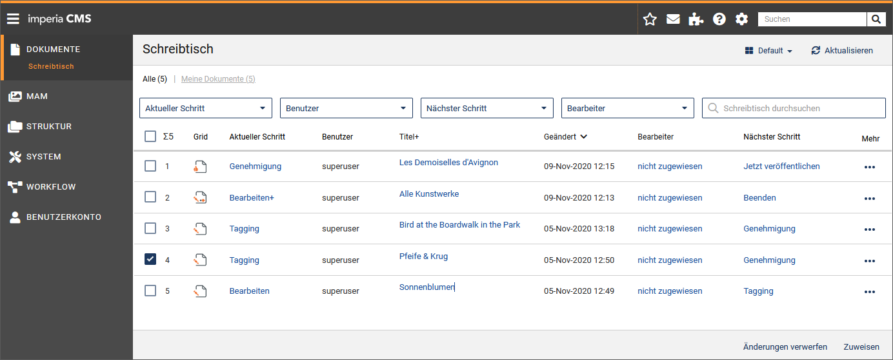
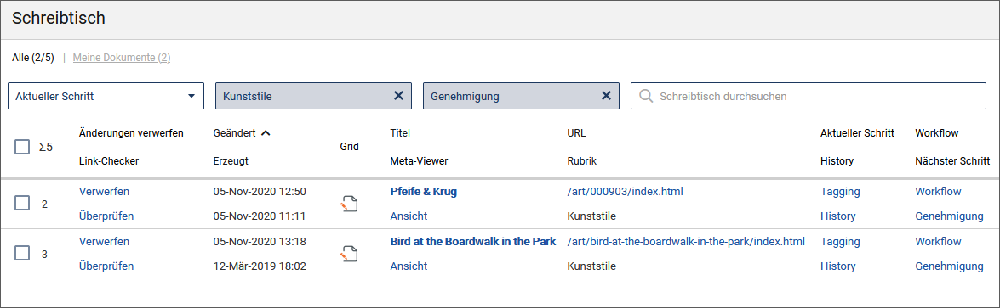
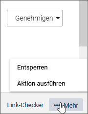
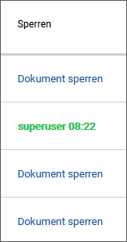
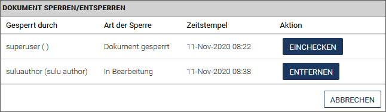
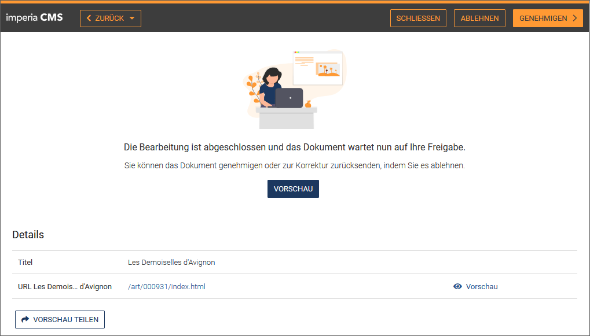

Der Schreibtisch ist ein zentrales Bedienungselement von *imperia*.  Er stellt in einer Tabellenansicht alle Aufgaben bezüglich der Dokumente dar, die Sie aktuell bearbeiten müssen, und bietet Ihnen die für die Bearbeitung benötigten Funktionen. 

Auf dem Schreibtisch "landen" nur die Dokumente, die Sie aufgrund Ihrer aktuellen Gruppe sehen und bearbeiten dürfen. Von hier aus werden - abhängig von den Rechten Ihrer aktuellen Gruppe - alle Vorgänge gestartet, die zum definierten Workflow gehören:

* aktuellen Workflow-Schritt für ein Dokument ausführen
* aktuellen Workflow-Schritt für ein Dokument beenden
* Dokument sperren (aus- oder einchecken)
* Dokument (vom Schreibtisch) löschen
* History eines Dokumentes einsehen und ergänzen
* Links checken
* Metainformationen ergänzen

##Aufbau und Funktionsweise des Schreibtischs
Alle zu einem Dokument vorhandenen Informationen und Funktionen werden in Spalten dargestellt, wobei jedes Dokument in einer eigenen Tabellenzeile erscheint.
Welche Informationen dargestellt werden und in welcher Form dies geschieht, hängt von der Schreibtisch-Ansicht ab. 
Sie haben die Möglichkeit, eigene [Schreibtisch-Ansichten zu erstellen](user.desktop.md#schreibtisch-ansicht-erstellen). Dabei werden verschiedene Ansichten angelegt, die möglicherweise völlig unterschiedliche Informationen über die gleichen Dokumente anzeigen.  
Sie können zwischen den verschiedenen [Schreibtisch-Ansichten wechseln](user.desktop.md#schreibtisch-ansicht-wechseln).
 *imperia*-Systemadministratoren können Schreibtisch-Ansichten erstellen und allen Benutzern zur Verfügung stellen.
___
### Schreibtisch-Ansichten

*imperia* wird mit vier Standard-Ansichten ausgeliefert, die jeweils unterschiedliche Ansichten auf die zu bearbeitenden Dokumente bieten. 

Zusätzlich können Sie Ihren Schreibtisch individuell auf Ihre Bedürfnisse anpassen und diese Einstellungen in unterschiedlichen Ansichten speichern. Die Konfiguration des Schreibtischs kann seit *imperia* 9 einfach per *Drag&Drop* erfolgen.

Die verschiedenen Ansichten enthalten unterschiedliche Spalten mit den jeweils für Ihre Workflow-Aufgabe benötigten Funktionen. Die in der aktuellen Ansicht enthaltenen Spalten erscheinen in der Kopfzeile des Schreibtischs. Um eine möglichst kompakte Darstellung des Schreibtischs zu erhalten, können in einer Spalte der Kopfzeile mehrere Spaltenüberschriften untereinander dargestellt werden.

### Schreibtisch-Spalten

Die folgenden Spalten können Sie dem Schreibisch hinzufügen:

|Spaltenname|Bedeutung|
|--|--|
|**Titel+**|Enthält die wichtigsten Schreibtischaktionen an einer Stelle (in Form eines Links). Die verfügbaren Aktionen erscheinen, sobald Sie die Maus über den Titel bewegen.  Diese Spalte ist sinnvoll, wenn Sie einen Schreibtisch mit nur wenigen Spalten gestalten wollen ohne auf diese Aktionen verzichten zu müssen.|
|**Mehr**|Enthält (im Gegensatz zu Titel+) die weniger wichtigen Schreibtischaktionen in einer Drop-down-Liste. Diese Spalte ist sinnvoll, wenn Sie einen Schreibtisch mit nur wenigen Spalten gestalten wollen, aber trotzdem nicht auf diese Aktionen verzichten wollen.
|Ablauf-Datum|Zeigt das Ablauf-Datum des Dokuments.|
|Aktueller Schritt|Enthält einen Link, um den aktuellen Workflow-Schritt auszuführen.|
|Benutzer|Zeigt den Namen des Benutzers, der das Dokument erzeugt hat.|
|Benutzer-ID|Zeigt die Benutzer-ID des Benutzers, der das Dokument zurzeit bearbeitet.|
|Bottom|Enthält einen Link, der Sie zum unteren Rand der Schreibtisch-Seite führt (siehe auch Spalte *Nach oben*).|
|Dateiname|Enthält den Dateinamen, den das fertige Dokument erhalten wird.|
|Debugger|Öffnet das Debugger-Tool, um das Rendering des Dokumentes Schritt für Schritt in der Template-Kette auszuführen.|
|Erzeugt|Enthält das Datum, an dem das Dokument erzeugt wurde.|
|Freischalt-Datum|Enthält das Datum, an dem das Dokument automatisch freigeschaltet wird.|
|Geändert|Enthält das Datum, an dem ein Dokument zuletzt geändert wurde.|
|Grid|Zeigt das Icon des aktuellen Workflow-Schrittes an. Mit Klick auf das Icon führen Sie wie in der Funktion "Aktueller Schritt" den aktuellen Workflow-Schritt aus. Dieses Icon ist identisch mit dem Icon des Plug-ins im [Grid](https://portal.pirobase-imperia.com/pb/imperia-cms-dokumentation/admin-de-11/admin.workflows/#das-grid) (Modul zum Erzeugen und Pflegen von Workflows).|
|History|Enthält einen Button zum Öffnen der Dokument-History.|
|*imperia*|Enthält eine Grafik mit einem Link zur Homepage von *imperia*.|
|Letzter Editor|Enthält den Namen des Benutzers, der das Dokument zuletzt editiert hat.|
|Link-Checker|Enthält einen Link für den Link-Checker, der alle Links in einem Dokument überprüft.|
|Löschen|Enthält einen Link, um das entsprechende Dokument vom Schreibtisch zu löschen und damit aus dem Workflow zu entfernen. Auf etwaige Versionen des Dokumentes im Archiv oder auf dem Zielsystem wird dabei kein Einfluss ausgeübt.|
|Löschen (+Änderungen)|Enthält einen Link, um das entsprechende Dokument vom Schreibtisch zu löschen und damit aus dem Workflow zu entfernen. Auf etwaige Versionen des Dokumentes im Archiv oder auf dem Zielsystem wird dabei kein Einfluss ausgeübt.|
|Mehrfachaktion|Enthält die verfügbaren Aktionen wenn der aktuellen Workflow-Schritt mehrere Ausgänge (z.B. Genehmigen) hat.|
|Metadatei|Zeigt den Namen der verwendeten Meta-Datei an.|
|Meta-Viewer|Enthält einen Link, der den Meta-Viewer öffnet (siehe [Meta-Viewer](user.desktop.md#meta-viewer)).|
|Nächster Schritt|Enthält einen Button, um das Dokument in den nächsten Workflow-Schritt zu überführen.|
|NodeID|Enthält die interne NodeID des Dokuments.|
|Rubrik|Enthält den Namen der Rubrik, zu der das Dokument gehört.|
|Rubriken-Beschreibung|Zeigt die Beschreibung der Rubrik, die das Feld *Beschreibung* der Rubriken-Verwaltung enthält.|
|Server Version|Öffnet die Version des Dokuments in seinem aktuellen Zustand auf dem Server.|
|Sperren|Diese Spalte zeigt vorhandene Sperren, mit denen ein Dokument belegt ist. Zusätzlich enthält sie einen Link, um Sperren zu entfernen.|
|Template|Zeigt den Namen des für das jeweilige Dokument verwendeten Templates an.|
|Titel|Zeigt den Titel des Dokuments.|
|Top|Enthält einen Link, der Sie zum oberen Rand der Schreibtisch-Seite führt (siehe auch Spalte *Nach unten*).|
|UID|Enthält die Benutzer-ID des Benutzers, der das Dokument zuletzt editiert hat.|
|Unterschiede|Öffnet das Diff-Tool des Archivs um Unterschiede zwischen Dokumentversionen zu untersuchen.|
|URL|Enthält den Pfad eines Dokumentes|
|Verzeichnis|Enthält das Verzeichnis, in dem das Dokument abgelegt wird, ausgehend vom Document-Root.|
|Workflow|Enthält einen Button zum Öffnen des Workflow-Managers. Hier können bereits abgeschlossene Workflow-Schritte erneut ausgeführt werden.|
|Workflow-Schritt|Zeigt den Workflow-Schritt an, in dem sich das Dokument momentan befindet.|

### Schreibtisch-Ansicht wechseln

* Wählen Sie aus der Drop-down-Box rechts oben aus der Liste aller Ansichten die gewünschte Ansicht aus.

*Der Schreibtisch wird aktualisiert.* 

Beispiel für eine andere Ansicht:

### Schreibtisch-Ansicht erstellen

Wenn Sie eine neue Schreibtisch-Ansicht erstellen, geschieht dies auf Basis einer bereits bestehenden Ansicht, die Sie anschließend neu konfigurieren können. 

1. Öffnen Sie über ***Dokumente -&gt; Schreibtisch*** den Schreibtisch. 
2. Klicken Sie auf die Option ***Ansichten verwalten*** im Dropdown-Menü ***Meine Ansicht***.
3. Klicken Sie in der Liste der verfügbaren Ansichten auf die gewünschte Ansicht.
4. Führen Sie die Option **Neue Ansicht** aus, um die neue Ansicht zu gestalten.

	
	
	
	Unter *Aktuelle Ansicht* wird die von Ihnen als Vorlage ausgewählte Ansicht angezeigt.
	
	
	
	
	
5. Tragen Sie unter ***Bezeichnung*** einen eindeutigen Namen ein.
6. Wählen Sie in der Drop-Down-Box ***Neue Spalte hinzufügen*** die gewünschten Spalten aus und klicken Sie jeweils auf **Hinzufügen**.
7. Ordnen Sie die Spalten so an, wie sie später auf dem Schreibtisch erscheinen sollen. Nutzen Sie die grauen Pfeile, um die Zellen an die gewünschte Position zu verschieben. Alternativ können Sie die Zellen per *Drag&Drop* verschieben, indem Sie die Spalte einfach auf einem Pfeil einer anderen Zelle fallen lassen.
8. Definieren Sie optional unter ***Eigenes CSS*** Ihre eigenen CSS-Regeln.
9. Setzen Sie im Bereich ***Filter-Einstellungen*** Filter für den Schreibtisch, so dass nur Dokumente angezeigt werden, die den eingestellten Bedingungen entsprechen:  

	
	
	Allerdings ist dies keine Notwendigkeit, da die [Schreibtisch-Filter](user.desktop.md#schreibtisch-filter) in jeder Schreibtisch-Ansicht zur Verfügung stehen.
	Falls Sie die Filter hier bereits voreinstellen möchten, wählen Sie die Spalte, nach der gefiltert werden soll und tragen Sie im darunterstehenden Feld das Filterkriterium ein. Sie können mehrere Filter durch ein logisches `UND` oder `ODER` verknüpfen.  Auch kann ein Filter negiert werden, um auf den Filter passende Dokumente auszublenden.

10. Klicken Sie auf **Speichern**, um die neue Ansicht mit Ihren Einstellungen zu speichern.

*Die Schreibtisch-Ansicht steht Ihnen direkt zur Verfügung.*

**Schreibtisch-Ansicht bearbeiten**

Sie können alle Ansichten nachträglich bearbeiten, indem Sie die gewünschte Ansicht, wie unter [Schreibtisch-Ansicht erstellen](user.desktop.md#schreibtisch-ansicht-erstellen) beschrieben, öffnen und nach Ihren Wünschen anpassen. 

**Schreibtisch-Ansicht löschen**

Alle benutzerdefinierten Schreibtisch-Ansichten können auch wieder gelöscht werden.  Die im Standard vom System bereitgestellten Schreibtisch-Ansichten ("Classic", "Compact", "Default" und "Detail") können nicht gelöscht werden.

1. Öffnen Sie über ***Dokumente -&gt; Schreibtisch*** den Schreibtisch.
2. Klicken Sie auf die Option ***Ansichten verwalten***.
3. Klicken Sie neben der gewünschten (benutzerdefinierten) Ansicht im Dropdown-Menü der Ansicht auf **Löschen**.

	

*Die Ansicht wird entfernt.*

___
### Schreibtisch-Filter

Sie haben die Möglichkeit, die Menge der Informationen auf dem Schreibtisch einzuschränken, indem Sie die Dokumente nach vorgegebenen Kriterien filtern. Filter helfen Ihnen, den Überblick auf dem Schreibtisch zu bewahren. Sie sind Bestandteil einer jeden Schreibtisch-Ansicht und können in jeder Session individuell eingestellt werden.

	
Sie können die nachfolgend aufgeführten Filter kombinieren und sich so nur diejenigen Dokumente anzeigen lassen, die allen Kriterien genügen.

!!!note "Hinweis"
		Die Filterergebnisse werden alphabetisch sortiert.

* Wie unter [Schreibtisch-Ansicht erstellen](user.desktop.md#schreibtisch-ansicht-erstellen) bereits beschrieben, können Sie die Schreibtisch-*Ansichten* selbst "vorfiltern".

* In jeder Schreibtisch-Ansicht befinden sich oben links die Filter *Alle* und *Meine Dokumente* (in Form von Links).  Die Zahlen in Klammern zeigen, wie viele Dokumente insgesamt auf Ihrem Schreibtisch liegen bzw. wie viele Ihre eigenen Dokumente sind und die Anzahl der Dokumente, die den gewählten Filtern entsprechen.

* Das auf der rechten Seite befindliche Suchfeld *Schreibtisch durchsuchen* erscheint ebenfalls in jeder Ansicht. Hier können Sie nach einem selbst gewählten Begriff filtern.

* Nach Spalten filtern: Jeder Filter entspricht einer Spalte in Ihrer aktuell gewählten Schreibtisch-Ansicht.
Ein aktivierter Filter wird grau hervorgehoben.
Mit einem Klick auf <i class="fa fa-close"></i> *Schließen* im Auswahlfeld des Filters können Sie den Filter wieder aufheben.

***Aktueller Schritt***: Filtert nach dem gewählten Workflow-Schritt, in dem sich Ihre Dokumente aktuell befinden, im obigen Beispiel "Meta-Edit".  
***Rubrik***: Filtert nach der gewählten Rubrik, in der die Dokumente erstellt wurden. 
***Nächster Schritt***: Filtert nach dem nächstfälligen Workflow-Schritt.
	

### Dokumente sortieren

Sie haben die Möglichkeit, die angezeigten Dokumente nach dem Spalteninhalt zu sortieren. Wenn Sie mit der Maus über den Spaltentitel fahren, wird dieser zum Link und kann angeklickt werden. Spalten, nach denen nicht sortiert werden kann, haben keinen Link als Titel.

1. Klicken Sie auf den Spaltentitel.  *Die Dokumente werden aufsteigend nach dieser Spalte sortiert*.  Die Sortier-Richtung erkennen Sie an der Pfeilrichtung hinter dem Spaltentitel.
2. Klicken Sie auf dieses Icon um die Sortierrichtung umzukehren.

___
## Mit dem Schreibtisch arbeiten

Wenn Ihre Arbeit an einem Dokument innerhalb eines Workflow-Schrittes beendet ist, wird der Workflow-Schritt von Ihnen abgeschlossen. Das Dokument erscheint daraufhin auf dem Schreibtisch aller Benutzer, die das Dokument im nächsten Workflow-Schritt bearbeiten dürfen und über ihre Gruppe Zugriff auf die Rubrik, in der das Dokument erstellt wurde, haben.

Wenn Sie also einen Workflow-Schritt abschließen, kann das soeben bearbeitete Dokument von Ihrem Schreibtisch verschwinden, weil Ihre aktuelle Gruppe Ihnen nicht das Recht gibt, das Dokument im nächsten Workflow-Schritt zu bearbeiten.

Jedes neue Dokument erhält eine Kopie des Workflows. Änderungen des Workflows beeinflussen also ein bereits erzeugtes Dokument nicht. Wird ein Dokument jedoch aus dem Archiv importiert, erhält es den in diesem Moment gültigen Workflow und nicht den, mit dem es ursprünglich erzeugt wurde.

Im Folgenden werden die wichtigsten Funktionen beschrieben, die vom Schreibtisch aus ausgeführt werden können. Möglicherweise stehen Ihnen aufgrund Ihrer aktuellen Gruppen einige Funktionen nicht oder nur eingeschränkt zur Verfügung. Wenden Sie sich im Zweifel an Ihren Systemadministrator.

Jedes Dokument durchläuft nacheinander alle Workflow-Schritte, die bei der Erzeugung des Dokuments im Workflow vorgesehen waren. Ein Dokument, das auf Ihrem Schreibtisch angezeigt wird, befindet sich also in einem Workflow-Schritt, der von Ihnen durchgeführt werden muss.

### Anstehenden Workflow-Schritt ausführen

Diese Funktion steht Ihnen auch in der Spalte [Titel+](user.desktop.md#schreibtisch-ansicht) zur Verfügung.

1. Klicken Sie auf Ihrem Schreibtisch in der Spalte ***Aktueller Schritt*** auf den angezeigten Workflow-Schritt.  Es wird der aktuelle Workflow-Schritt eingeleitet. Bei interaktiven Workflow-Schritten öffnet sich die entsprechende Eingabemaske.
2. Führen Sie alle notwendigen Arbeiten aus und speichern Sie Ihre Änderungen.
 Abhängig vom aktuellen Workflow-Schritt wird anschließend der nächste Workflow-Schritt ausgeführt (z.B. bei Meta-Edit) oder Sie gelangen zurück auf den Schreibtisch.
4. Führen Sie den anstehenden Workflow-Schritt so oft durch, bis alle Arbeiten erledigt wurden.
5. Mit Abschließen eines Workflow-Schrittes geben Sie das Dokument für den nächsten Workflow-Schritt frei. Deshalb sollten Sie einen Workflow-Schritt erst dann abschließen, wenn alle Arbeiten erledigt wurden. Um den aktuellen Workflow-Schritt abzuschließen, klicken Sie auf Ihrem Schreibtisch bei Ihrem Dokument in der Spalte ***Nächster Schritt***.  

*Der aktuelle Workflow-Schritt wird abgeschlossen.* 
 Möglicherweise erscheint das Dokument nicht mehr auf Ihrem Schreibtisch, wenn Ihre aktuelle Gruppe Sie nicht dazu berechtigt. 
 Sie können jedoch einen bereits abgeschlossene Workflow-Schritt, zu dem Sie berechtigt sind, erneut ausführen.

### Abgeschlossenen Workflow-Schritt wiederholen
Die folgende Funktion steht Ihnen auch in der Spalte [Titel+](user.desktop.md#schreibtisch-ansichten) zur Verfügung.

Wenn Sie einen bereits abgeschlossenen Workflow-Schritt wiederholen, wird das Dokument an die Stelle dieses Workflow-Schritts zurückgesetzt und durchläuft alle folgenden Workflow-Schritte erneut.

1.Klicken Sie auf Ihrem Schreibtisch bei Ihrem Dokument in der Spalte *Workflow* auf den gleichnachmigen Link (ggf. müssen Sie diese [Spalte hinzufügen](user.desktop.md#schreibtisch-spalten)). 

*Der sich öffnende Workflow-Manager zeigt Informationen zum aktuellen Dokument*:

* ***Titel***: Hier erscheint der Titel des gewählten Dokuments.
* ***URL***: Wenn Sie auf die URL des gewählten Dokuments klicken, wird das Dokument in einem neuen Fenster angezeigt.
* ***Aktueller Workflow-Schritt***: Klicken Sie auf diesen Eintrag, wenn Sie den aktuellen Workflow-Schritt ausführen möchten.
* ***Nächster Schritt***: Klicken Sie auf diesen Eintrag, wenn Sie den aktuellen Workflow-Schritt abschließen möchten.
* ***Zurück zu vorhergehenden Workflow-Schritten***: Es werden alle Workflow-Schritte angezeigt, die bereits abgeschlossen sind, und die Sie per Klick aufrufen können.
* ***Dokumentenvorschau***: Wenn Sie auf die *Dokumentenvorschau* klicken wird die Vorschau des Dokuments im selben Fenster geöffnet.

### Dokument in der Vorschau ansehen

So wie Sie ein Dokument beim Bearbeiten in einer Vorschau anzeigen lassen können, haben Sie auch vom Schreibtisch ausgehend diese Möglichkeit:

1. Klicken Sie auf Ihrem Schreibtisch in der Spalte ***URL*** auf den angezeigten Pfad (ggf. müssen Sie diese [Spalte hinzufügen](user.desktop.md#schreibtisch-spalten)).
 *Das ausgewählte Dokument öffnet sich mit dem aktuellen Stand in einem neuen Tab in Ihrem Internet-Browser.* 
Eine Symbolleiste am oberen Rand bietet für den Vorschau-Modus Ihres Dokuments [verschiedenen Ausgabeformate ](user.documents.md#dokument-in-der-vorschau-ansehen) an.  
2. Schließen Sie den Browser-Tab, um die Anzeige des Dokuments zu beenden.

### Historie eines Dokuments bearbeiten

Alle Stationen des Dokuments, die dieses durchlaufen hat, sowie die Aktionen, die mit dem Dokument ausgeführt wurden, werden in der so genannten "History" des Dokuments festgehalten. 
Jeder Benutzer, der das Dokument bearbeitet, kann Einträge in der History anlegen oder bestehende Einträge bearbeiten, um anderen Benutzern Hinweise zu geben oder Kommentare zu hinterlassen.

1. Klicken Sie auf die Spalte ***History*** des gewünschten Dokuments (ggf. müssen Sie diese [Spalte hinzufügen](user.desktop.md#schreibtisch-spalten)).
 
*Die Dokumenten-History wird mit allen  bereits vorhandenen History-Einträgen geöffnet*:

	
	
	
	
	Ein bereits vorhandener History-Eintrag enthält folgende Informationen: 
	***Datum***: Das Datum, an dem der Eintrag gemacht wurde. 
	***Benutzer***: Der Name des Benutzers, von dem der Eintrag stammt. 
	***Text***: Der Text, den der Benutzer eingegeben hat. 

2. Fügen Sie optional im Eingabefeld ***History-Eintrag*** einen neuen Eintrag hinzu.
3. Wenn Sie diesen Eintrag an andere *imperia*-Benutzer senden möchten, aktivieren Sie die Checkbox ***Mail mit History-Eintrag an unten ausgewählte Benutzer senden*** und wählen Sie die gewünschten Empfänger aus.
4. Klicken Sie auf **Ok**, um den Eintrag zu speichern und ggf. die Mails zu versenden. Sie gelangen dann wieder auf den Schreibtisch.
5. Klicken Sie auf **Schreibtisch**, um die Dokumenten-History zu verlassen, ohne einen Eintrag zu speichern.

### Dokument löschen

!!! note "Hinweis"
		
	Bitte beachten Sie, dass zwei Funktionen zum Löschen eines Dokuments zur Verfügung stehen: *(Änderungen) Verwerfen* und **Alle* Änderungen verwerfen*.
	
	* ***(Änderungen) Verwerfen***: Das Dokument wird lediglich vom Schreibtisch gelöscht, d.h. der aktuelle Workflow-Schritt des Dokuments wird *verworfen*.  Bereits freigeschaltete und/oder archivierte Versionen des Dokuments bleiben erhalten.
	* ***Alle Änderungen verwerfen***: Alle Änderungen sowie die dazugehörigen Objekte eines Dokuments werden verworfen.

Damit ein Dokument gelöscht werden kann, muss Ihre aktuelle Gruppe Sie zu den beiden folgenden Aktionen berechtigen:

* Löschen im aktuellen Workflow-Schritt

* Löschen in der Rubrik

Die folgenden Schritte gelten auch für die Funktion *Alle Änderungen verwerfen*:

1. Wählen Sie die Dokumente aus, die Sie verwerfen möchten:
	* Klicken Sie in der Spalte ***Mehr*** auf das Kontextmenü.  Bewegen Sie alternativ die Maus über die Spalte ***Titel+*** des gewünschten Dokuments.  *Die Option ***Verwerfen*** wird angezeigt*.
	* Sie können mehr als ein Dokument auswählen, indem Sie die Checkbox(en) in der ersten Spalte &#8470; aktivieren und im nächstfolgenden Schritt auf ***Verwerfen*** klicken (die Option wird nur angezeigt, wenn die Spalte ***Änderungen verwerfen*** hinzugefügt wurde).
2. Klicken Sie auf ***Verwerfen***. Falls Sie mehrere Dokumente ausgewählt haben, klicken Sie auf **Änderungen verwerfen** am Ende des Desktops.
3. Der Dialog *[Dokumenten-History](user.desktop.md#historie-eines-dokuments-bearbeiten)* wird angezeigt, wo Sie optional einen History-Eintrag hinzufügen können.
4. Klicken Sie auf **OK**, um das Dokument zu verwerfen.

### Link-Checker

Der Link-Checker dient zur Überprüfung von internen sowie externen Links innerhalb eines Dokuments.
Der Link-Checker kann auf verschiedenen Wegen aufgerufen werden:

* in einer eigenen ***Link-Checker***-Spalte (diese Spalte muss gegebenenfalls der Ansicht erst hinzugefügt werden),
* im Untermenü der Spalte ***More*** (diese Spalte muss gegebenenfalls der Ansicht erst hinzugefügt werden),
* als Option **Dokumente überprüfen** im unteren Bereich des Schreibtischs - wenn zuvor mehrere Dokumente ausgewählt wurden. Hierzu muss zuvor die Spalte ***Link-Checker*** hinzugefügt werden.

* Klicken Sie auf ***Überprüfen*** in der Spalte ***Link-Checker***, um den Link-Checker zu initiieren. 

  

Es werden sowohl interne als auch externe Links überprüft:

* "Interne" Links verweisen auf andere Dokumente der Website sowie auf Medien wie Bilder, PDF-Dokumente, Audiodateien etc.
* "Externe" Links verweisen auf andere Websites (http://www.domain.top)

	!!!note "Hinweis"
			Externe Links können nur überprüft werden, wenn der Link-Checker in den **[Allgemeinen Einstellungen](https://portal.pirobase-imperia.com/pb/imperia-cms-dokumentation/admin-de-11/admin.administration/#link-checker)** aktiviert wurde.
				

* In der Status-Spalte erfahren Sie, ob der Link korrekt gesetzt wurde.
*  Rufen Sie die Vorschau des Dokuments bzw. der Seite auf, indem Sie auf den jeweiligen Pfad klicken.
*  Klicken Sie auf **Überprüfen**, um die Überprüfung für interne oder externe Links jeweils erneut zu starten.

### Mehrfachaktionen ausführen

Einige Workflow-Schritte, beispielsweise das Genehmigen oder Beenden eines Dokuments, lassen sich auch für mehrere Dokumente gleichzeitig ausführen. 

Hierzu müssen Sie die Schreibtischspalte ***Mehrfachaktion*** einblenden. Die Spalte ***Mehrfachaktion*** zeigt bei jedem Dokument den jeweils nächsten Workflow-Schritt an. 

1. Aktivieren Sie die Checkboxen vor den Dokumenten, für die Sie eine Mehrfachaktion ausführen wollen.

	

	Eine Besonderheit ist hierbei die Aktion ***Genehmigen***: Diese Dokumente sind mit einem Auswahlfeld versehen.
	Wählen Sie aus, ob Sie ein Dokument genehmigen oder ablehnen möchten und führen Sie dann die Mehrfachaktion aus. Genehmigte und abgelehnte Dokumente gelangen dann automatisch in den jeweils nächsten vorgesehenen Schritt in ihrem Workflow.

2. Klicken Sie unter ***... Mehr*** in der unteren Leiste des Schreibtischs auf die Option  ***Aktion ausführen***.

	

	!!! note "Hinweis"
			 Dieser Button ist nur sichtbar, wenn Sie die Spalte ***Mehrfachaktion*** auf Ihrem Schreibtisch einblenden.

3. Anschließend führt das System für die markierten Dokumente die jeweilige Aktion aus (z.B. Meta-Edit, Genehmigen, Beenden, Asset hochladen, Mehrsprachigkeit, etc.) und zeigt Ihnen einen Bericht dazu an.  Erfordert der nächste Workflow-Schritt eines Dokuments eine Benutzereingabe, haben Sie die Möglichkeit, diese direkt vom Report der Mehrfachaktion aus aufzurufen.

### Gesperrte Dokumente

*imperia* stellt sicher, dass immer nur ein Benutzer an einem Dokument arbeiten kann. Dadurch wird vermieden, dass die Änderungen eines Benutzers durch Änderungen eines anderen Benutzers überschrieben werden und damit verloren gehen. Hierzu wird eine Sperre verwendet, mit der ein Dokument automatisch versehen wird, wenn es von einem Benutzer bearbeitet wird.

Das gesperrte Dokument ist aber wertlos, wenn die darin enthaltenen Informationen überholt sind. Oder das gesperrte Dokument ist ein Schlüsseldokument für ein ansonsten fertiges Projekt. In diesem Fall würde eine nicht auflösbare Dokumenten-Sperre möglicherweise den Projekterfolg gefährden . Damit dieser Fall nicht eintritt, gibt es in *imperia* die Möglichkeit, [fremde Sperren aufzuheben](user.desktop.md#fremde-sperre-aufheben).

Der Status über die Sperre eines Dokuments wird auf den Schreibtischen aller berechtigter Benutzer in der Spalte *Sperren* angezeigt; ggf. müssen Sie die [Spalte hinzufügen](user.desktop.md#schreibtisch-spalten).
<comment: Reihenfolge nicht verstanden: wenn a) fremdes Dokument automatisch gesperrt durch imperia, dann b) entsperrt man dieses (fremde Sperre aufheben) c) bearbeitet das Dokument -- c1) wird hier dann wieder eine Sperre automatisch vorgenommen durch imperia? oder c2) muss das Dokument manuell gesperrt werden und c3) dann die eigene Sperre aufgehoben werden??>

#### *Dokument sperren/entsperren*

Sperren für Dokumente werden im Dialog *Dokument sperren/entsperren* eingerichtet und wieder aufgehoben:

1. **Dokument sperren**

1. Klicken Sie auf Ihrem Schreibtisch in der Spalte *Sperren* des gewünschten Dokuments auf den Link ***Dokument sperren***.
2. Klicken Sie auf **Dokument sperren**.

*Das Dokument ist nun gesperrt. Die Sperre wird bei allen berechtigten Benutzern angezeigt und enhält den Namen des Benutzers, der das Dokument gesperrt hat sowie den Zeitpunkt der Sperre:*  

2. **Eigenes Dokument entsperren**

1. Klicken Sie auf Ihrem Schreibtisch in der Spalte ***Sperren*** des gesperrten Dokuments auf den hinterlegten Link.  
  
Sie erhalten folgende Informationen:

	* ***Gesperrt durch***: In dieser Spalte werden die Benutzer eingetragen, die das Dokument gesperrt haben. Bei einer neuen Sperre bleibt diese Spalte leer.
	* ***Art der Sperre***: Hier wird die Art der Sperre eingetragen.
	* ***Zeitstempel***: Diese Spalte liest den Zeitpunkt der Sperrung aus.
	* ***Aktion***: Mögliche Aktion für das gesperrte Dokument.

2. Klicken Sie in der Spalte ***Aktion*** auf **Einchecken**, um das Dokument zu entsperren.

*Das Dokument ist entsperrt und kann von allen berechtigten Benutzern bearbeitet werden.*

#### *Konflikte lösen*

Ein Konflikt entsteht dann, wenn ein Benutzer die Sperre eines anderen Benutzer ignoriert. Es sollte jedoch davon abgesehen werden, Sperren zu ignorieren. In jedem Fall sollten die Gründe dafür dokumentiert werden.

Szenario 1: **Für Benutzer, die das gesperrte Dokument bearbeiten möchten**:

Wenn ein Benutzer ein Dokument bearbeiten möchte, das von einem anderen Benutzer gesperrt wurde, erhält er nachfolgenden Hinweis. Er kann dann sein weiteres Vorgehen aus einer Liste von Alternativen wählen:

Folgende Alternativen stehen zur Verfügung:

* ***Zur vorherigen Seite wechseln***: Wenn Sie diese Alternative auswählen, gelangen Sie zurück auf den Schreibtisch. Sie können dann ein anderes Dokument bearbeiten.

* ***Dokumenten-History anzeigen***: Hier können Sie in der Dokumenten-History nachschauen, wer das Dokument momentan bearbeitet und ob dieser Benutzer eine Bemerkung in der History hinterlassen hat.

* ***Entferne eine oder mehrere Sperren*** (wird protokolliert):  Hiermit heben Sie die Sperre auf und gelangen zum Dialog [Fremde Sperre aufheben](user.desktop.md#fremde-sperre-aufheben).

* ***Sperre ignorieren*** (wird protokolliert): Die Auswahl dieser Alternative produziert einen Konflikt. Die vorhandene Sperre wird aufgehoben und Sie können das Dokument bearbeiten. Gleichzeitig wird ein Eintrag der History des Dokuments hinzugefügt. Der Benutzer, der das Dokument gesperrt hat, erhält ebenfalls einen Hinweis, siehe unten.

Szenario 2: **Für Benutzer, deren Sperre ignoriert wurde**:

Sobald ein Benutzer Ihre Sperre ignoriert hat, erhalten Sie folgenden Hinweis, wenn Sie das von Ihnen gesperrte Dokument weiter bearbeiten möchten:

Dieser Dialog zeigt Ihnen, welcher Benutzer zu welchem Zeitpunkt Ihre Sperre ignoriert hat. Sie haben dann die Möglichkeit, im Abschnitt ***Was Sie jetzt tun können...*** aus verschiedenen Alternativen Ihr weiteres Vorgehen auszuwählen:

* **Dokumenten-History anzeigen**: Hier hat der Benutzer, der Ihre Sperre ignoriert hat, möglicherweise eine Begründung hinterlassen. In jedem Fall wird das Ignorieren der Sperre protokolliert.

* **Änderungen verwerfen und zum Schreibtisch zurückkehren**: Hier verwerfen Sie *Ihre* Änderungen und ermöglichen dem Benutzer, der Ihre Sperre ignoriert hat, seine Arbeit an dem Dokument zu beenden. Beendet dieser seine Arbeit am Dokument, wird es wieder freigegeben und Sie können sich seine Änderungen ansehen und gegebenenfalls Ihre Änderungen hinzufügen.

* **Konflikt ignorieren und fortfahren**: Diese Alternative verwirft die existierende Sperre des anderen Benutzers und Sie können das Dokument bearbeiten. Sobald der andere Benutzer seine Arbeit speichern möchte, wird ihm ebenfalls der Dialog *Schlechte Neuigkeiten* angezeigt. 

#### *Fremde Sperre aufheben*

Ein Benutzer, der versucht ein gesperrtes Dokument zu öffnen, erhält im Dialog *[Sperren-Konflikte](user.desktop.md#konflikte-losen)* einen Hinweis, welcher andere Benutzer das Dokument zurzeit bearbeitet. Er kann dann im Dialog *Was Sie jetzt tun können...* u.a. die Sperre aufheben (ignorieren):

!!!warning "Wichtig"
	 Das Entfernen von Sperren sollte nur in Ausnahmefällen durchgeführt werden.

1. Klicken Sie auf Ihrem Schreibtisch in der Spalte ***Sperren*** auf den Link, der rot markiert ist, z.B.:

	

	

	!!!note "Hinweis"
		Beachten Sie, dass auch mit Klick auf **Dokument sperren** ein Sperren-Konflikt entsteht!
			

2. Klicken Sie in der Spalte ***Aktion*** auf **Entfernen**. *Die fremde Sperre wird nun entfernt.*

Das Entfernen einer fremden Sperre ist damit abgeschlossen und Sie können das Dokument unter Ihrem Profil erneut [sperren](user.desktop.md#dokument-sperrenentsperren). Der Benutzer, der die Sperre errichtet hat, erhält einen Hinweis, wenn er das Dokument weiter bearbeitet, siehe Szenario 2 unter [Konflikte lösen](user.desktop.md#konflikte-losen).

### Dokumente zuweisen

Sie haben in *imperia* die Möglichkeit, Dokumente anderen Benutzern, die eine Leseberechtigung für das Dokument haben, zuzuweisen. Auch Sie selbst können das Dokument über eine Zuweisung "übernehmen". Dies können Sie über den Schreibtisch tun. Darüber hinaus kann die Zuweisung auch über ein Workflow-Plug-in automatisiert realisiert werden. Informationen zu letzerem Vorgehen finden Sie im  [Admin-Handbuch](https://portal.pirobase-imperia.com/pb/imperia-cms-dokumentation/admin-de-11/admin.workflow-plugins/#dokumentenauswahl).  Im Folgenden wird das Vorgehen über den Schreibtisch beschrieben:

1. Wählen Sie das gewünschte Dokument aus. Mehrere Dokumente können Sie auswählen, indem Sie die Checkboxen vor den Dokumenten aktivieren. 
2. Klicken Sie auf **Zuweisen** unter dem Schreibtisch oder in der Spalte ***Bearbeiter*** eines Dokuments auf den Namen bzw. auf die Option ***nicht zugewiesen*** (nach dieser Spalte können Sie auch [filtern](user.desktop.md#schreibtisch-filter)):  

	
	
	  

*Die Dokumente, die Sie zuweisen möchten, werden oben links ausgelesen.*

3. Wählen Sie im Drop-down-Menü ***Bearbeiter*** den Benutzer aus, dem Sie die Dokumente zuweisen möchten.	
4. Wenn Sie die Dokumente sich selbst zuweisen möchten, klicken Sie auf den Link ***Mir zuweisen***.
5. Geben Sie unter ***Neuer History-Eintrag*** optional einen Grund für die Zuweisung an.  Wenn Sie nur ein Dokument zuweisen, wird zusätzlich die vollständige History des Dokuments unterhalb ausgelesen.
6. Bestätigen Sie Ihre Angaben mit **Speichern**.

*Sobald Ihnen ein Dokument zugewiesen wurde, bekommen Sie eine Benachrichtigung über das [interne Mailsystem](user.mailing.md#benachrichtigung-dokument-zugewiesen).*

### Dokumente genehmigen

Innerhalb des Workflows, den ein Dokument durchläuft, kann es Workflow-Schritte geben, die den Bearbeitungsstand des Dokuments prüfen und genehmigen. Häufig wird dies als letzter Workflow-Schritt realisiert, bevor das Dokument endgültig den Workflow verlässt.  Zugriff auf diese Genehmigungsschritte haben nur bestimmte Gruppen wie zum Beispiel die Gruppe "Chefredakteur". 

Je nachdem, ob der verantwortliche Benutzer das Dokument genehmigt oder nicht, sieht der nachfolgende Weg des Dokuments durch den Workflow aus:

* Genehmigt der Benutzer das Dokument, gelangt es zum nächsten Workflow-Schritt. Dies kann zum Beispiel ein automatisches Freischalten sein.
* Genehmigt der Benutzer das Dokument nicht, gelangt es zurück in den Bearbeiten-Schritt des Workflows oder landet im Papierkorb. Welchen weiteren Weg das Dokument tatsächlich nimmt, wenn es nicht genehmigt wird, hängt davon ab, welche Workflow-Schritte für diesen Fall vorgesehen sind.

Sobald ein Dokument einen Genehmigungsschritt im Workflow erreicht und Sie als zuständiger Benutzer diesen Schritt bearbeiten, wird der folgende Dialog geöffnet:<comment: wie sieht das konkret aus?-erscheints aufm Schreibtisch oder evtl ein Pop-up?>

Wählen Sie aus, wie mit dem Dokument verfahren werden soll:

**Genehmigen**: Das Dokument wird genehmigt und erreicht den nächsten Workflow-Schritt, beispielsweise *Jetzt veröffentlichen*. Der nächste Workflow-Schritt kann je nach Workflow verschieden sein.

**Ablehnen**: Das Dokument erreicht den Workflow-Schritt, der für den Fall der Ablehnung im Workflow vorgesehen ist. Dies könnte je nach Workflow ein erneutes *Bearbeiten* sein. 

**Vorschau**: Eine Vorschau öffnet sich, die den aktuellen Stand des Dokuments anzeigt.

## Meta-Variablen eines Dokuments anzeigen
Der *Meta-Viewer* dient hauptsächlich zur Fehlersuche in der Entwicklungsphase eines Projekts. Mit dem Meta-Viewer können Sie uneingeschränkt alle bereits vorhandenen Metainformationen eines Dokuments anzeigen lassen.

!!!warning "Wichtig" 
	Wenn Sie die erforderlichen Rechte besitzen, können Sie die Metainformationen ggf. ändern und neue Metafelder und -feldwerte zu den bestehenden hinzufügen. Weitere Informationen hierzu finden Sie im [Admin-Handbuch](https://portal.pirobase-imperia.com/pb/imperia-cms-dokumentation/admin-de-11/admin.categories/#eigenschaft-meta-informationen).	

* Klicken Sie in der Spalte ***Meta-Viewer*** auf den Link ***Ansicht*** 
*Ein neuer Browser-Tab mit dem Meta-Viewer öffnet sich*

Die Tabelle enthält in alphabetischer Reihenfolge für jede Meta-Variable eine Zeile, die in der Spalte ***Metafeld*** den Namen der Meta-Variablen und in der Spalte ***Werte*** die Werte dieser Meta-Variablen enthält. Wenn Sie die Metainformationen bearbeiten dürfen, erscheinen die vorhandenen Werte in editierbaren Textfeldern.

