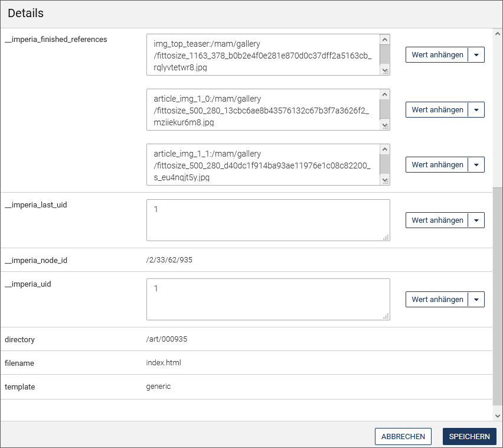
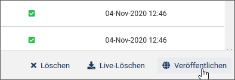
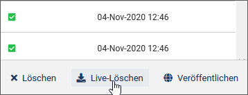

*imperia* bietet Ihnen mit dem Dokumenten-Browser eine übersichtliche Verwaltung aller Dokumente und Assets in einer Ordnerstruktur. Eine Ausnahme bilden gelöschte Dokumente, die im [Archiv](user.archive.md) zu finden sind.

___
## Aufbau und Funktionsweise des Dokumenten-Browsers

Im Dokumenten-Browser stehen Ihnen die gewohnten Funktionalitäten zur Verfügung, die Sie zum redaktionellen Arbeiten benötigen. Sie können von hier aus Dokumente erstellen, veröffentlichen, reparsen oder löschen.  Optional können Sie weitere Spalten in der Übersichtstabelle einblenden, wenn Sie weitere Informationen zum Workflow-Status des Dokuments einsehen möchten.

* Öffnen Sie über ***Dokumente -&gt; Dokumenten-Browser*** den Dokumenten-Browser.
 

Der Dokumenten-Browser weist im linken Bereich die Rubriken in Form eines hierarchischen Baums oder einer Verzeichnisliste auf. 
Im rechten Bereich finden Sie die Dokumentenliste der ausgewählten Rubrik in einer Tabelle, sowie einen Vorschaubereich, in dem zusätzliche Informationen zu dem Dokument angezeigt werden und Aktionen ausgeführt werden können:

Sowohl der Rubrikenbaum, als auch der Vorschaubereich können durch einen Klick auf das Pfeilsymbol der Trennlinie aus- und wieder eingeblendet werden.

Im oberen Bereich können Sie innerhalb der Suchfunktionen *Einfache Suche* und *Erweiterte Suche* ihre persönliche Suche konfigurieren und anschließend als Filter speichern, um auf einfachem Weg jederzeit die von Ihnen benötigten Dokumente und Assets zu finden.

___
## Arbeiten mit dem Rubrikenbaum

Rubriken bilden die inhaltliche Struktur Ihres Projekts, indem Sie Themen für die Dokumente vorgeben.

Sie können den Rubrikenbaum in verschiedenen Ansichten darstellen lassen:

* Aktivieren Sie oberhalb des Rubrikenbaums die Option ***Rubriken***, wenn Sie die Rubriken in einer Baumstruktur angeordnet haben möchten, oder die Option ***Verzeichnisse***, wenn sie in Form von Verzeichnissen als Liste erscheinen sollen.

* Aktivieren Sie die Checkbox ***Einschließlich Unterrubriken*** unter dem Rubrikenbaum, wenn Sie die Unterordner auch angezeigt bekommen möchten.

Mit Hilfe des Kontextmenüs einer Rubrik können Sie die Rubrikeigenschaften bearbeiten, in der Rubrik neue Dokumente anlegen oder neue Unterrubriken erstellen:

### Neues Dokument erstellen 

Mit dieser Option gelangen Sie direkt in den für die ausgewählte Rubrik hinterlegten Workflow. Stellen Sie  sicher, dass Sie sich in der richtigen Rubrik befinden. 

* Gehen Sie vor wie unter [*Dokument erstellen*](user.documents.md#dokument-erstellen) beschrieben.

### Rubrik anlegen 

Nutzen Sie diese Option, wenn Sie eine neue Unterrubrik zu der ausgewählten Rubrik erstellen möchten.

* Vergeben Sie einen ***Namen*** und eine ***Beschreibung*** für die neue Rubrik.
* Geben Sie unter ***Verzeichnis*** den Verzeichnispfad an, in dem die Dateien dieser Rubrik gespeichert werden sollen.
* Legen Sie unter ***Dateiname*** einen Standard-Dateinamen für die Dokumente fest, die in dieser Rubrik erstellt werden.

* Legen Sie fest, ob Sie ***Medien-Dateien*** für die Rubrik zulassen möchten, um diese anschließend in das Media-Asset-Management aufzunehmen.
* Mit dem Schalter ***Nur ein Dokument*** lassen Sie nur ein einziges Dokument in die Rubrik zu.
* Die Einstellung ***Nur Unterrubriken*** erlaubt bei Aktivierung nur Unterrubriken in der Rubrik, nicht aber Dokumente.

* Nehmen Sie Einstellungen für den Workflow vor. Wählen Sie den ***Workflow*** aus, den die Dokumente in dieser Rubrik durchlaufen sollen.
* Entscheiden Sie sich für eine ***Metadatei*** für den Schritt METAEDIT im gewählten Workflow.
* Wählen Sie unter ***Template*** für den EDIT-Schritt des Workflows eine Vorlage aus.

* Vergeben Sie ***Lese- und Schreibrechte*** für die Rubrik und die darin enthaltenen Dokumente. Klicken Sie in das Eingabefeld und wählen Sie aus der Dropdown-Liste der verfügbaren Gruppen die gewünschten Gruppen aus.
* Bestimmen Sie unter ***Dokumenten-Berechtigung bearbeiten***, wer Dokumente in der Rubrik erstellen, bearbeiten und löschen darf. Klicken Sie in das Eingabefeld und wählen Sie aus der Dropdown-Liste der verfügbaren Gruppen die gewünschten Gruppen aus.

* Sichern Sie Ihre Einstellungen, indem Sie auf **Speichern** klicken.
 

### Rubrik bearbeiten 

Die Eigenschaften der ausgewählten Rubrik können mit dieser Option bearbeitet werden. Neben Name, Beschreibung, Verzeichnispfad und Standard-Dateiname können Sie hier weitere Einstellungen vornehmen - vorausgesetzt, Sie haben die entsprechenden Rechte.

* Vergeben Sie Rubrikeigenschaften, wie unter [Rubrik anlegen](user.docbrowser.md#rubrik-anlegen) beschrieben.
* Vergeben Sie zusätzlich ***Metavariablen*** für die Rubrik, indem Sie auf den nachfolgenden Link ***Bearbeiten*** klicken. Tragen Sie in dem sich öffnenden Fenster die gewünschten Werte für die Variablen ein.
* Sichern Sie Ihre Einstellungen, indem Sie auf **Speichern** klicken.

### Archiv 

Mit dieser Option gelangen Sie direkt in das Archiv der ausgewählten Rubrik und können von dort ein Dokument auswählen und eine Vorgängerversion importieren.

###Rubrik löschen 

Nutzen Sie diese Option, um eine Rubrik zu löschen. Bestätigen Sie die Sicherheitsabfrage mit **OK**. Beachten Sie, dass Sie alle Archiveinträge und Dokumente auf dem Schreibtisch, die in dieser Rubrik liegen, zuvor gelöscht werden müssen.

___
## Dokumente finden

Um Dokumente oder Dateien zu finden, haben Sie die Wahl zwischen einer Standardsuche, die mit Hilfe von Filtern weiter eingeschränkt werden kann, und einer erweiterten Suche, mit der individuelle und komplexe Suchanfragen möglich sind.

### Standardsuche

Für eine schnelle Suchanfrage bietet der Dokumenten-Browser die einfache Freitextsuche an.

* Geben Sie in das Eingabefeld der Freitextsuche den gewünschten Suchbegriff ein und klicken Sie anschließend auf .

Die Standardsuche ermöglicht es Ihnen zusätzlich, über Dropdown-Felder eine Suchabfrage mit ausgewählten Filtern einzurichten und dadurch die Suche weiter einzuschränken.

* Klicken Sie auf die Option ***Filter setzen*** in der Suchleiste.

*Eine zusätzliche Leiste für die Filtersuche wird eingeblendet.*

* Geben Sie den gewünschten Suchbegriff in das Eingabefeld ein.
* Öffnen Sie über  die Liste der Suchfilter und wählen Sie per Checkbox die gewünschten Suchfelder aus, in denen nach dem Suchbegriff gesucht werden soll. 

	

*Die ausgewählten Filter werden anschließend als Dropdown-Felder angeboten, in denen Sie die Suche weiter einschränken können:*

* Um weitere Suchkriterien festzulegen, klicken Sie innerhalb eines Dropddown-Suchfelds je nach Typ des Filters die gewünschten Einträge an (Filter "Tagging" in der Abbildung oben) oder geben Sie einen Suchbegriff ein (Filter "Titel" in der Abbildung unten).

	

* Wenden Sie das Suchkriterium anschließend mit Klick auf **Aktivieren** an. 
* Mit **Leeren** setzen Sie den Filter jeweils wieder zurück.	

* Nutzen Sie innerhalb des Dropdown-Feldes den Schnellfilter, um die Anzahl der gelisteten Einträge zu reduzieren. Tippen Sie in das Eingabefeld oben den gewünschten Begriff ein. Die Liste reagiert bereits während des Eintippens und blendet die nicht passenden Einträge aus:

	

* Fügen Sie weitere Dropdown-Felder zur Suchanfrage hinzu, indem Sie auf  klicken.
* Entfernen Sie ein Dropdown-Feld aus der Filterleiste, indem Sie auf **x** hinter dem jeweiligen Filter klicken.

*Die Dokumententabelle zeigt nun die passenden Suchergebnisse an:*

* Um die Filterleiste wieder auszublenden, führen Sie ***Clear Filter*** aus.

### Erweiterte Suche

Die erweiterte Suche ermöglicht es Ihnen, individuellere und komplexere Suchabfragen zu stellen.

* Um in die erweiterte Suche zu wechseln, klicken Sie zunächst auf ***Filter***, um die Filterleiste einzublenden.
* Wählen Sie unter  das Untermenü ***Erweiterte Suche***.

* Mit  und dem Untermenü ***Standard-Modus*** wechseln Sie zurück in die Standard-Filtersuche. 

!!! note "Hinweis"
		Ein Umschalten mit der Übernahme der Suchkriterien ist nur von der einfachen Suche in die erweiterte Suche möglich, da im umgekehrten Fall die erweiterte Suche oft zu komplex ist, um als einfache Suche abgebildet zu werden.

Mit der erweiterten Suche können Sie strukturierte Suchanfragen nach Dokumenten durchführen. 
Bei der erweiterten Suche verwenden Sie für die Suchanfrage ein Feld, einen Operator und einen oder mehrere Werte:

### Filter speichern

* Nachdem Sie die Suchanfrage fertiggestellt haben, können Sie über  und das Untermenü ***Filter speichern*** Ihre Suchabfrage speichern, um sie zu einem anderen Zeitpunkt wiederzuverwenden.

	
	
* Geben Sie Ihrem neuen Filter einen Namen und klicken Sie auf **Speichern**.

	

### Gespeicherte Filter anwenden

* Wenden Sie bereits gespeicherte Filter an, indem Sie auf ***Filter*** und anschließend auf den Namen des gewünschten Filters klicken:

	

### Gespeicherte Filter löschen

* Wenn Sie einen Filter nicht mehr brauchen, können Sie diesen löschen.  Führen Sie hierzu ***Filter*** und dann ***Filter verwalten*** aus.

	

* Klicken Sie in der Übersicht der gespeicherten Filter auf **Löschen** hinter dem gewünschten Filter.

	

 
___
## Arbeiten mit Dokumenten

Die Dokumente, die in einer Rubrik enthalten sind, werden in einer Tabelle aufgelistet. Informationen zu jedem Dokument und mögliche Aktionen sind jeweils in Spalten hinterlegt.

* Wenn Sie eine Spalte in der Tabelle hinzufügen möchten, nutzen Sie die Option ***Ansicht*** und aktivieren Sie anschließend die Checkbox vor der gewünschten Spalte, um diese einzublenden. 

Auch die Handlungsoptionen in der Dropdown-Box der Spalte ***Aktionen*** für ein Dokument werden auf diese Weise aktiviert. Sollte also bei einer der folgenden Aktionen, die Aktion nicht sichtbar sein, müssen Sie zunächst über ***Ansicht*** den Eintrag einblenden, indem Sie die entsprechende Checkbox aktivieren. 

* Ändern Sie optional die Anordnung einzelner Spalten innerhalb der Tabelle, indem Sie diese per *Drag & Drop* verschieben. Alternativ können Sie die Anordnung der Spalten und der in ihnen angebotenen Auswahlfelder unter ***Ansicht / Anpassen*** ändern. Nutzen Sie auch hier *Drag & Drop*, um die Spalten oder Felder an die gewünschte Position zu ziehen.

**In Spalten angebotene Informationen:**

* [***Aktionen***](user.docbrowser.md#arbeiten-mit-dokumenten): In einer Drop-Down-Box werden die für das Dokument möglichen Handlungsoptionen angeboten.

* ***Icon***: Mit einem Klick auf das in der Spalte angezeigte Symbol öffnet sich das Dokument in einem Vorschaufenster.

* ***Titel***: Enthält den Namen des Dokuments.

* ***Dateiname***: Liest den Dateinamen des Dokuments aus. Wenn Sie den Pfad anklicken, öffnet sich das Dokument in der Vorschau.

* ***Verzeichnis***: Zeigt den Pfad im Asset Management an.

* ***Rubrik***: Ruft die Vorschau des Dokuments in einem separaten Fenster auf.

* ***Vorschau***: Calls the preview of the document in a separate window.

* ***URI***: Enthält den Pfad und Dateinamen des Dokuments. 

* ***Aktuell***: Ein Symbol (grünes Häkchen oder rotes Ausrufungszeichen) zeigt in dieser Spalte an, ob das Dokument auf dem Zielsystem mit dem auf dem Entwicklungssystem übereinstimmt. Mit einem Klick auf das Symbol erhalten Sie Informationen zum Publikationsstatus:
 
	

	Die erste Spalte enthält eine Liste aller Copy-Seiten des Dokuments. In den weiteren Spalten werden die verfügbaren Zielsysteme mit dem jeweiligen Status angezeigt:
	
	* ***Aktuell***: Die Dokumentenversionen auf dem Entwicklungssystem und auf dem Zielsystem stimmen überein.
	* ***Veraltet***: Die Dokumentenversion auf dem Zielsystem ist älter als die auf dem Entwicklungssystem.
	* ***N/A***: Es sind keine Informationen verfügbar.
	* ***Manuell gelöscht***: Das Dokument wurde manuell vom Zielsystem gelöscht.
	* ***Bedingung nicht erfüllt***: Dieser Status erscheint, wenn der Freischalttrigger für das entsprechende Zielsystem definiert ist, aber das Dokument (oder die Copy-Seite) nicht den Bedinungen entspricht und folglich nicht freigeschaltet wird.
	* ***Fehlt auf Develop***: Das Dokument wurde auf dem Entwicklungssystem gelöscht, ist jedoch noch auf dem Zielsystem vorhanden.
	

* ***Zuletzt beendet***: Zeitpunkt zu dem der Dokumenten-Workflow zuletzt beendet wurde.

* ***Veröffentlichungsdatum***: Das aktuelle Veröffentlichungsdatum.

* ***Ablaufdatum***: Zeitpunkt, zu dem die Gültigkeit des Dokuments erlischt.

* ***Wiedervorlagedatum***: Zeitpunkt, zu dem das Dokument erneut vorgelegt werden soll.

* ***Erzeugt von***: Ersteller des Dokuments.

* ***Letzter Editor***: Letzter Bearbeiter des Dokuments.

* ***Live-URI***: Diese Spalte enthält den Dokumentenpfad. Wenn Sie diesen anklicken, öffnet sich das Dokument im Vorschaumodus.

* ***Erstellungsdatum***: Zeitpunkt zu dem das Dokument erstellt wurde.

___

Für jedes Dokument können Sie in der gleichnamigen Spalte bestimmte Aktionen durchführen. 

* Wählen Sie in der Drop-Down-Box in der Spalte ***Aktionen*** die gewünschte Option aus.

!!! note "Hinweis"
		Fehlt eine der im Folgenden beschriebenen Aktionen, aktivieren Sie im Menü ***Ansicht*** die Checkbox vor dem Aktionsnamen.

### Informationen zu Dokument ansehen

Über die Aktion ***Info*** in der Drop-Down-Box der gleichnamigen Spalte erreichen Sie in einem eigenen Dialog auf einen Blick alle Informationen zu dem gewählten Dokument, die in den anderen Spalten enthalten sind. 

* Öffnen Sie in der Zeile des Dokuments in der Spalte ***Aktionen*** die Drop-Down-Liste mit den Handlungsoptionen für das Dokument. Führen Sie die Option **Info** aus.

* Klicken Sie auf **x**, um den Dialog wieder zu schließen.

### Dokument in der Vorschau ansehen

* Öffnen Sie in der Zeile des Dokuments in der Spalte ***Aktionen*** die Drop-Down-Liste mit den Handlungsoptionen für das Dokument. Führen Sie die Option **Vorschau** aus. 

*Zu dem gewählten Dokument wird in einem eigenen Fenster die Ausgabeansicht des Dokuments angezeigt.*

### Dokument reimportieren

Reimportierte Dokumente werden vom Zielsystem an den ersten Schritt des Original-Workflows gesetzt. Falls der Workflow in der Zwischenzeit verändert wurde, durchlaufen reimportierte Dokumente den neuen Workflow.

!!! note "Hinweis"
		Falls das importierte Dokument sich im Workflow befindet (und somit auch auf dem Schreibtisch liegt), ist diese Reimport-Option nicht möglich. Beim Versuch das Dokument zu reimportieren, erhalten Sie die Fehlermeldung "Im Workflow".
		
* Öffnen Sie in der Zeile des Dokuments in der Spalte ***Aktionen*** die Drop-Down-Liste mit den Handlungsoptionen für das Dokument. 
* Führen Sie die Option **Reimportieren** aus. 

*Der Reimport wird durchgeführt. Sie gelangen zum ersten Workflow-Schritt des Dokuments, z.B. Meta-Edit.*

### Dokument löschen
 
Sie können ein oder mehrere Dokumente vom Entwicklungssystem löschen.

!!! note "Hinweis"
		Zum Löschen eines Dokuments benötigen Sie sowohl die Schreib- als auch die Löschrechte für die entsprechende Kategorie.			

* Öffnen Sie in der Zeile des Dokuments in der Spalte ***Aktionen*** die Drop-Down-Liste mit den Handlungsoptionen für das Dokument. Führen Sie die Option **Löschen** aus.

* Um mehrere Dokumente zu löschen, aktivieren Sie die Checkboxen vor den Dokumenten, um diese auszuwählen, und wählen Sie **Löschen** in der Funktionsleiste unter der Tabelle.

* Wählen Sie, ob Sie die Dokumente aus dem Workflow oder aus dem Archiv löschen möchten.

* Bestätigen Sie die Auswahl mit **Löschen**.

*Wurde das Dokument erfolgreich gelöscht, erscheint ein Statusreport mit grünem Balken. Wurde das Dokument nicht gelöscht, erscheint ein roter Balken. Zu beiden Status erhalten Sie weitere Informationen.*

### Template-Reparser starten

* Öffnen Sie in der Zeile des Dokuments in der Spalte ***Aktionen*** die Drop-Down-Liste mit den Handlungsoptionen für das Dokument. Führen Sie die Option **Reparsen** aus.

*Der Statusbericht des Template-Reparsers wird geöffnet.*

### Dokumenteigenschaften ändern

Dokumenteigenschaften ändern Sie über die Metafelder, die sich in den Details des jeweiligen Dokuments befinden.

!!! note "Hinweis"
	       Der *imperia*-Administrator kann Metafelder zum Editieren freigeben oder sperren.

* Öffnen Sie in der Zeile des Dokuments in der Spalte ***Aktionen*** die Drop-Down-Liste mit den Handlungsoptionen für das Dokument. Führen Sie die Option **Metaviewer** aus.

Im Dialogfenster *Details* sehen Sie die Metainformationen des Dokuments:

* Tragen Sie die gewünschten Werte in den Eingabefeldern ein oder ändern Sie bestehende Werte.
* Fügen Sie ein weiteres Feld innerhalb des Metafelds hinzu, indem Sie auf **Wert anhängen** in der Dropdown-Box hinter einem Wert klicken.
* Löschen Sie gegebenenfalls ein Metafeld, indem Sie in der Dropdown-Box die Option **Metafeld löschen** ausführen.
* Verschieben Sie die Werte innerhalb eines Metafelds, indem Sie in der Dropdown-Box die Optionen **Nach oben**, **Nach untern** oder **Ans Ende** wählen.
* Legen Sie ein neues Metafeld für das Dokument an, indem Sie auf **Neues Metafeld** oben klicken. Geben Sie in dem sich öffnenden Dialog im Eingabefeld ***Metafeld*** den Namen und dann einen Wert ein. Klicken Sie anschließend auf **Erzeugen**, um das Metafeld hinzuzufügen.

	

* Sichern Sie Ihre Angaben, indem Sie auf **Speichern** klicken.

### Referenzen anzeigen

Sie können sich ansehen, ob das aktuelle Dokument in einem anderen Dokument referenziert wird.

* Öffnen Sie in der Zeile des Dokuments in der Spalte ***Aktionen*** die Drop-Down-Liste mit den Handlungsoptionen für das Dokument. Führen Sie die Option **Referenzen** aus.

	!!!note "Hinweis"	
			Beachten Sie, dass es sich bei diesen Referenzen nur um Referenzen in anderen Dokumenten handelt und nicht um Assets, auf die das aktuelle Dokument referenziert. Referenzierte Assets im Dokument können Sie in der Spalte *Info* im Punkt *Referenzen* einsehen. <comment: aus https://jira.pirobase.de/jira/browse/IMPSUP-3093>

### Änderungen anzeigen

Wählen Sie diese Option, um die Unterschiede zwischen der aktuellen Version des Dokuments und der zuletzt beendeten Version anzuzeigen. Die Funktion [***Änderungen verfolgen***](user.documents.md#dokument-in-der-vorschau-ansehen) ist Teil der Vorschau.

### Dokument (erneut) veröffentlichen

Mit dieser Aktion können Sie Dokumente und Assets veröffentlichen. Für Assets ist diese Option besonders relevant: Hierüber können Assets unabhängig von Dokumenten veröffentlicht werden. 

* Wählen Sie die gewünschten Dokumente aus, indem Sie die Checkboxen davor aktivieren.
* Führen Sie die Option **Veröffentlichen** unter der Dokumententabelle aus.

* Bestätigen Sie die erscheinende Sicherheitsabfrage mit **Veröffentlichen**.

Diese Funktion kann auch im [MAM](user.mam.md#asset-veroffentlichen) genutzt werden.

### Dokument auf dem Live-System löschen

Nutzen Sie diese Option, um ein Dokument von allen Live-Systemen zu entfernen. Das Dokument ist anschließend weiterhin im Dokumenten-Browser vorhanden. Wählen Sie diese Option also, wenn Sie ein Dokument nur temporär entfernen möchten.  

* Führen Sie für ein einzelnes Dokument die Option **Live-Löschen** in der Dropdown-Box der Spalte ***Aktionen*** aus.
* Wenn Sie mehrere Dokumente auf dem Live-System löschen möchten, wählen Sie die gewünschten Dokumente aus, indem Sie die Checkboxen davor aktivieren.
* Führen Sie die Option **Live-Löschen** unter der Dokumententabelle aus.

* Bestätigen Sie die erscheinende Sicherheitsabfrage mit **Live-Löschen**.

Wenn Sie ein Dokument auch vom Dev-System löschen möchten, nutzen Sie die Option [***Dokumente löschen***](user.docbrowser.md#dokument-loschen). In diesem Fall ist das Dokument nur noch im Archiv vorhanden.

### Historie eines Dokuments ansehen

Alle Stationen des Dokuments, die dieses durchlaufen hat, sowie die Aktionen, die mit dem Dokument ausgeführt wurden, werden in der so genannten "History" des Dokuments festgehalten. Jeder Benutzer, der das Dokument bearbeitet, kann Einträge in der History anlegen oder bestehende Einträge bearbeiten, um anderen Benutzern Hinweise zu geben oder Kommentare zu hinterlassen.

* Öffnen Sie in der Zeile des Dokuments in der Spalte ***Aktionen*** die Drop-Down-Liste mit den Handlungsoptionen für das Dokument. Führen Sie die Option **History** aus.

*Die History des Dokuments wird in einem eigenen Dialog schreibgeschützt angezeigt.*

