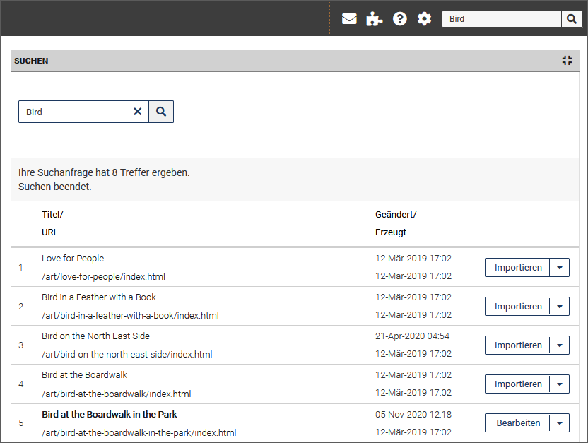
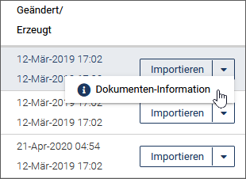
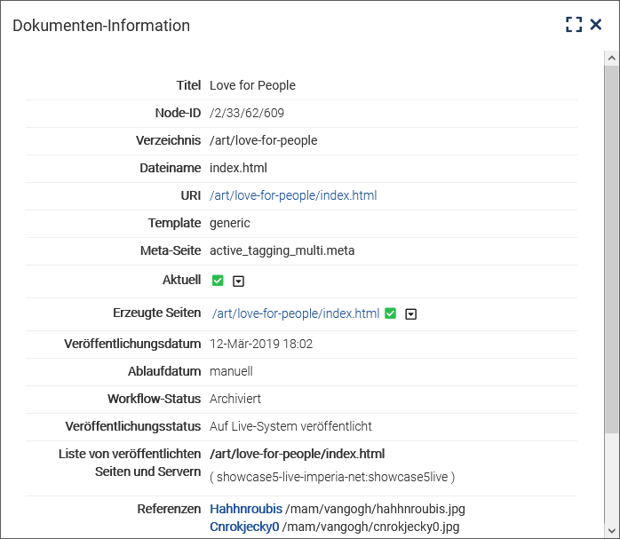

In der Kopfzeile von *imperia* befindet sich ein Eingabefeld für die interne Suche, mit der Sie die archivierten Dokumentversionen nach den eingegebenen Suchbegriffen durchsuchen können.

* Geben Sie einen oder mehrere Begriffe ein, nach denen gesucht werden soll.

 *Die Suchergebnisse werden in einer Tabelle  angezeigt:*

Zu jedem Treffer werden der Titel und die URL des entsprechenden Dokuments angezeigt.

* Klicken Sie auf die URL eines Treffers, um das Dokument in der Vorschau anzuzeigen.
* Verwenden Sie die Option **Bearbeiten** in der Dropdown-Box hinter einem Treffer, um zum aktuellen Workflow-Schritt des Dokuments zu gelangen.
* Mit Hilfe der Option **Importieren** gelangen Sie in die Dokumenten-History und können eine Vorgängerversion des Dokuments aus dem Archiv importieren. 
* Nutzen Sie die Option **Dokumenten-Information** in der Dropdown-Box hinter einem Treffer, um Informationen über das Dokument anzuzeigen.

	
	
	
	*Ein Dialog öffnet sich mit Informationen zu dem Dokument:*
	
	

