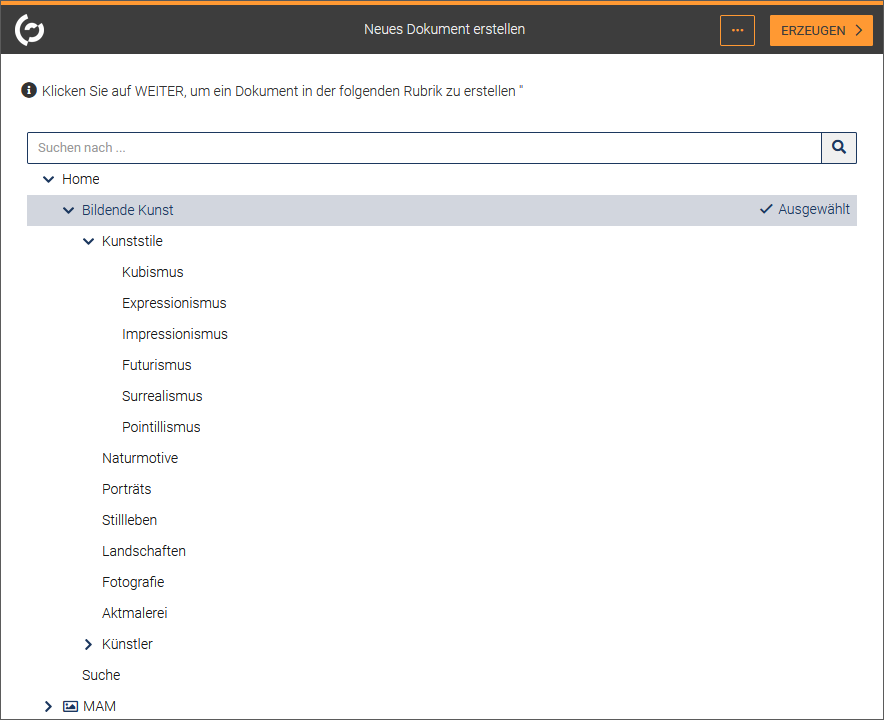
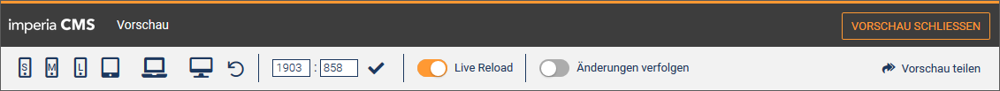
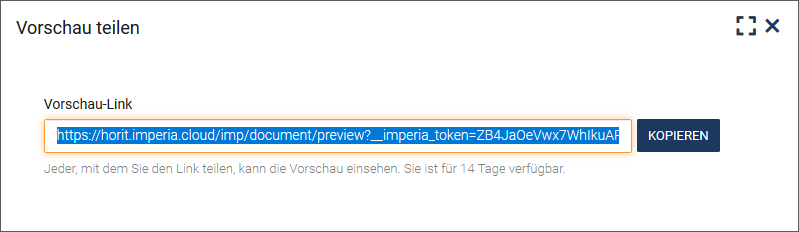

Die Arbeit mit *imperia* ist im wesentlichen abhängig vom verwendeten Workflow und den Rechten, die Sie durch Ihre aktuelle Gruppe innehaben. *imperia* verwaltet und kontrolliert anhand dieser Rahmenbedingungen den gesamten Produktionsablauf ("Workflow") von Inhalten, deren Übertragung auf die Zielsysteme bzw. deren Export in andere Formate.

Wurde ein Dokument einmal erzeugt, kann es den bei der Erzeugung zugewiesenen Workflow nicht mehr verlassen. Alle Workflow-Schritte, die für die Fertigstellung dieses Dokuments vorgesehen sind, werden automatisch auf Knopfdruck in der vorgesehenen Reihenfolge ausgeführt, sodass Sie sich auf die Erstellung des eigentlichen Inhalts konzentrieren können.
___

## Dokument erstellen

Mit dem Erstellen eines neuen Dokuments wird das Dokument initiiert und zeitgleich der konfigurierte Workflow gestartet.

Sie haben zwei Möglichkeiten, ein neues Dokument zu erstellen.

**1. Dokument erstellen via *Menü -&gt; Dokumente -&gt; Neues Dokument erstellen* **

Wählen Sie in einem ersten Schritt eine Rubrik aus, in der das neue Dokument angelegt werden soll. Diese Rubriken wurden von Ihrem Unternehmen oder Ihrer Organisation erstellt und korrespondieren häufig mit einem Bereich auf Ihrer Webseite. 

Die Rubriken sind in Form einer Baumstruktur aufgelistet:

* Navigieren Sie zu der gewünschten Rubrik. Nutzen Sie alternativ das Suchfeld.
* Klicken Sie auf die Rubrik.
* Klicken Sie auf **WEITER**, um das Dokument zu erzeugen. 

Das Dokument befindet sich nun im Workflow. Solange sich das Dokument im Workflow befindet, finden Sie es auch auf Ihrem [Schreibtisch](user.desktop.md).

**2. Dokument erstellen via *Menü -&gt; Dokumente -&gt; [Dokumenten-Browser](user.docbrowser.md)* **

* Klicken Sie auf die gewünschte Rubrik.
* Klicken Sie im Kontextmenü  ***Weitere Optionen*** der Rubrik auf  ***Neues Dokument erstellen***.

___
## Dokument bearbeiten

Nachdem ein Dokument erstellt oder importiert wurde, befindet es sich im Workflow. Dies bedeutet, dass in einer bestimmten Reihenfolge Aufgaben erfüllt werden müssen, bevor das Dokument fertiggestellt ist. 

Der Workflow unterteilt den Vorgang „Dokument erstellen“ in mehrere Teilaufgaben, die so genannten Workflow-Schritte: 

Weitere Workflow-Schritte können sein, ein Freischalt- oder Ablaufdatum festzulegen, an dem das Dokument automatisch veröffentlicht wird oder automatisch abgelaufen ist. Darüber hinaus könnte in einem Workflow-Schritt ein Wiederveröffentlichungsdatum benannt werden, an dem der Dokumenteninhalt erneut angepasst werden soll. Auch das Prüfen, ob das Dokument die Standards zur Suchmaschinenoptimierung (SEO) erfüllt, kann in einem Workflow-Schritt durchgeführt werden.

Während des gesamten Workflows wird eine Statusleiste angezeigt, die Sie durch den Workflow geleitet. Sie zeigt an, in welchem Workflow-Schritt Sie sich aktuell befinden und welcher Schritt der nächste ist.

!!! tip "Tipp"
		Navigieren Sie mit Hilfe der Tastatur zum nächsten Workflow-Schritt. Nutzen Sie die folgende Tastenkombination:  
		CTRL + RECHTS (Pfeil) (MS Windows) oder  
		CONTROL + RECHTS bzw. CONTROL + OPTION + RECHTS (Mac OS).

* Um zum nächsten Schritt zu gelangen, klicken Sie in der Statusleiste jeweils auf **WEITER**.
* Über das **Zurück**-Pfeilsymbol können Sie jederzeit zum vorherigen Schritt zurück springen ohne den Workflow verlassen zu müssen.

* Führen Sie **SCHLIESSEN** aus, wenn Sie die bisherigen Inhalte speichern möchten, das Dokument aber erst später weiter bearbeiten möchten.

* Wenn Sie die Bearbeitung des Dokuments abbrechen möchten, klicken Sie auf **VERWERFEN**. Sobald Sie einen Workflow-Schritt verwerfen, geht der in diesem Schritt eingegebene Inhalt verloren und das System gibt das Dokument wieder für andere Benutzer zur Bearbeitung frei.

	!!! warning "Hinweis"
			Ein Browser-Fenster zu schließen entspricht nicht dem Button **VERWERFEN**. Zwar wird auch die Bearbeitung abgebrochen, aber das System kann dies nicht registrieren, denn beim Schließen des Browser-Fensters übermittelt dieser keine Nachricht an den Webserver, auf dem *imperia* läuft.   Folglich bleibt das von Ihnen zuletzt bearbeitete Dokument weiterhin gesperrt. Mehr dazu unter [Gesperrte Dokumente](user.desktop.md#gesperrte-dokumente).

Nachdem das Dokument erstellt wurde, wird es automatisch zum ersten Workflow-Schritt weitergeleitet. 
Im Folgenden wird anhand des obigen Beispiel-Workflows beschrieben, in welchen Schritten ein Dokument mit *imperia* bearbeitet und veröffentlicht wird.

___
## 1. Schritt: Meta-Informationen

* Geben Sie in das dafür vorgesehene Eingabefeld den ***Dokumenten-Titel*** ein.
* Wählen Sie aus der Drop-Down-Box ein oder mehrere ***Tags*** aus oder fügen Sie Tags frei hinzu, indem Sie sie in das Eingabefeld eingeben. Mit Hilfe von [Tags](user.content.md#tags-hinzufugen) lassen sich in einer Website thematische Übersichtsseiten generieren, von denen aus Website-Besucher zu inhaltlich verwandten Seiten springen können.
* Legen Sie unter ***Veröffentlichungsdatum*** gegebenenfalls einen Veröffentlichungszeitpunkt für das Dokument fest. Nutzen Sie wahlweise die Drop-Down-Listen oder die Kalenderfunktion, um den Zeitpunkt auszuwählen.
* Auf die gleich Weise können Sie festlegen, ob das Dokument ein ***Ablaufdatum*** haben soll.
* Legen Sie fest, in welchen Sprachen sie das Dokument erzeugen möchten. Die grundsätzlich möglichen Sprachen werden über die zuvor ausgewählte Rubrik vorgegeben.
* Klicken Sie auf **WEITER**.

*Das Dokument wird zum nächsten Schritt weitergeleitet, in unserem Fall zum Schritt „Vorlage auswählen“*

___
## 2. Schritt: Vorlage auswählen

Bevor Sie den eigentlichen Inhalt Ihres Dokuments erstellen, können Sie für das Dokument eine Vorlage auswählen. [Vorlagen](user.presets.md) basieren auf Templates und werden zur automatischen Gestaltung von Seiten genutzt, die für ihren Inhalt ein bestimmtes Layout bekommen sollen. In diesem Workflow-Schritt werden Ihnen die Vorlagen vorgeschlagen, die der Rubrik des Dokuments zuvor zugewiesen wurden.

!!! warning "Hinweis"
		Die Auswahl der Vorlage kann in den anschließenden Schritten nicht angepasst werden.

* Klicken Sie in der gewünschten Dokumentvorlage die Option **Auswahl** an. 

*Die ausgewählte Vorlage erhält den Status „Ausgewählt“ und ist zusätzlich durch ein Häkchen gekennzeichnet.*

!!! warning "Hinweis"
		Wenn Sie das Dokument ohne Dokumentvorlage erstellen möchten, können Sie je nach Template-Konfiguration diesen Schritt auch überspringen.

* Klicken Sie auf **WEITER**.

*Das Dokument wird zum nächsten Schritt weitergeleitet, in unserem Fall zum Schritt „Inhalt erstellen“. Die zuvor ausgewählte Dokumentvorlage dient lediglich als Vorschlag und kann weiter angepasst werden.*

___
## 3. Schritt: Inhalt erstellen

In diesem Workflow-Schritt erstellen und gestalten Sie den Inhalt Ihres Dokuments. Lesen Sie zu Vorgehen und Möglichkeiten im Editiermodus das Kapitel [Dokumentinhalt erstellen](user.content.md).

* Klicken Sie nach der Erstellung des Inhalts auf WEITER.
*Das Dokument wird zum nächsten Schritt weitergeleitet, in unserem Fall zum Schritt „Tags definieren“.*

<!--
__
## 4. Schritt: Teaser bearbeiten

Mit einem Teaser können Sie die Neugier der Leser wecken. Er ist ein wichtiger Teil eines Dokuments, da sich oft an ihm entscheidet, ob die Leser weiterscrollen, wegklicken oder den Inhalt wirklich lesen. Mit Hilfe der Übersschrift und des Teaser-Textes erhält der Leser einen ersten Eindruck des Inhalts.

* Legen Sie ein ***Anzeigedatum*** für den Teaser fest. Nutzen Sie gegebenenfalls die Kalenderfunktion.
* Legen Sie eine ***Teaser-Überschrift*** fest.
* Geben Sie den eigentlichen ***Teaser-Text*** ein. Dieser sollte kurz und knapp formuliert sein und die Neugier der Leser wecken. Unterhalb des Eingabefelds wird die Anzahl der verbleibenden Zeichen eingeblendet.

Im rechten Bereich sehen Sie in der ***Teaservorschau***, wie der von Ihnen erstellte Teaser in der Ausgabe angezeigt wird.

In der Werkzeugleiste werden Ihnen Optionen angeboten, die sich auf diesen Bearbeitungsschritt beziehen:

***Sprachauswahl***: Wählen Sie bei mehrsprachigen Dokumenten hier eine Sprachversion des Dokuments aus. Die anschließend vorgenommenen Änderungen beziehen sich auf diese Sprachversion.

***Sprachoptionen***: Mit dieser Option können Sie Inhalte aus anderen Sprachversionen kopieren.

***Speichern***: Führen Sie diese Option aus, wenn Sie den aktuellen Bearbeitungsstand sichern möchten.

* Klicken Sie auf **WEITER**.
*Das Dokument wird zum nächsten Schritt weitergeleitet, in unserem Fall zum Schritt „Dokument genehmigen“.*

-->

___
## 4. Schritt: Tags definieren

Mit Hilfe von Tags lassen sich in einer Website thematische Übersichtsseiten generieren, von denen aus Website-Besucher zu inhaltlich verwandten Seiten springen können.

In diesem Workflow-Schritt können Sie dem Dokument Tags hinzufügen. Diese können frei gewählt oder einer definierten Liste entnommen werden. Lesen Sie zu Vorgehen und Möglichkeiten beim "Tagging" das Kapitel [Dokumentinhalt erstellen](user.content.md#tags-hinzufügen).

* Klicken Sie auf **WEITER**.
*Das Dokument wird zum nächsten Schritt weitergeleitet, in unserem Fall zum Schritt „Dokument genehmigen“.*
___
## 5. Schritt: Dokument genehmigen

Im nächsten Schritt werden Sie als **Redakteur** darüber informiert, dass das Dokument fertig bearbeitet ist und nun auf Genehmigung wartet. Der zugewiesene Workflow sieht vor, dass die von Ihnen erstellten Inhalte redaktionell von einem Chefredakteur abgenommen werden müssen.

Der **Chefredakteur** erhält entsprechend eine Benachrichtigung und findet das Dokument mit dieser Aufgabe auf seinem Schreibtisch. Nach Sichtung kann er das Dokument genehmigen oder an den im Workflow vorgesehenen Bearbeiter zur Korrektur zurückverweisen.

In der Statusleiste werden nun die beiden Optionen **ABLEHNEN** und **GENEHMIGEN** angeboten.

Unter ***Details*** kann der Chefredakteur sich die einzelnen Sprachvarianten des Dokuments in der [**Vorschau**](user.documents.md#dokument-in-der-vorschau-ansehen) ansehen oder die durchgeführten **Änderungen** für die verschiedenen Varianten nachverfolgen, um sich ein genaues Bild zu machen, bevor er das Dokument genehmigt.  Die hier angebotenen Optionen sind rechteabhängig und werden nicht für jede Rolle angeboten.

Lehnt der Chefredakteur das Dokument durch Klick auf **ABLEHNEN** ab, erscheint eine Meldung, dass es zurück in den Schritt "Inhalt bearbeiten" gelegt wird, damit der Redakteur die gewünschten Korrekturen vornehmen kann.

* Geben Sie als Chefredakteur einen Kommentar ein und klicken Sie auf **SENDEN**.

Dieser Kommentar kann anschließend über die Option **Ablehnungs-Kommentar** in der Statusleiste aufgerufen werden.

Der Redakteur wird benachrichtigt und findet das Dokument erneut auf seinem Schreibtisch.

Ist der Chefredakteur einverstanden mit dem Dokument, klickt er auf **GENEHMIGEN** in der Statusleiste.

Das Dokument ist nun bereit zur Veröffentlichung.

___
## 6. Schritt: Veröffentlichen

Wenn ein Dokument fertiggestellt ist und genehmigt wurde, verlässt es den Workflow und somit den Schreibtisch. Das Dokument steht jetzt zum Veröffentlichen auf ein Zielsystem bereit.  

!!! note "Hinweis"
		Um Dokumente zu publizieren benötigen Sie die *Schreib*rechte für die Rubrik, in der das Dokument erstellt wurde und mindestens *Lese*rechte für die Rubriken der verknüpften Dateien (normalerweise MAM-Objekte).

Wurde ein Veröffentlichungsdatum angegeben, wird dieses hier ausgelesen. Sie können das Datum und die Uhrzeit jedoch noch ändern.

* Klicken Sie auf **Datum bearbeiten**.

* Geben Sie das geplante Veröffentlichungsdatum ein oder nutzen Sie die Kalenderfunktion.
* Klicken Sie auf **SPEICHERN**. In diesem Fall wird das Dokument zum angegebenen Zeitpunkt veröffentlicht. 
* MIt **LEEREN** entfernen Sie das Datum aus dem Eingabefeld.
* Klicken Sie auf **JETZT FREISCHALTEN** in der Statusleiste, wenn Sie das Dokument zum jetzigen Zeitpunkt online stellen möchten.
* Sie können auch das Ablaufdatum noch einmal ändern. Klicken Sie hierzu unter **Status-Bericht** in der Zeile des Ablaufdatums auf **Datum bearbeiten** und legen Sie das gewünschte Ablaufdatum fest. Nutzen Sie auch hier gegebenenfalls die Kalenderfunktion.

*Das Dokument wird veröffentlicht. Sie erhalten eine entsprechende Meldung, wenn der Vorgang beendet ist.*

**Anstehende Veröffentlichungen**

Sie finden zusätzlich Sie alle zu veröffentlichenden Dokumente unter dem Menüpunkt ***Dokumente*** -&gt; ***Dokumente veröffentlichen*** in einer Liste.
Eine Ausnahme bilden Dokumente, deren Workflow das Plug-in *Auto-Publisher* enthält. Diese werden in der Regel sofort veröffentlicht und erscheinen nicht in der Freischaltliste. 

**Liste der anstehenden Veröffentlichungen anpassen**

* Im Bereich ***Die Anzahl der angezeigte Dokumente einschränken*** finden Sie Filteroptionen, mit deren Hilfe Sie die Anzahl der in der Liste angezeigten Dokumente begrenzen können. Um einen Filter wieder zurückzusetzen, klicken Sie auf <i class="fa fa-refresh"></i> neben dem Eingabefeld.
	* ***URI-Maske***: Nutzen Sie dieses Eingabefeld, um Dokumente nach ihrer URI zu filtern.  Wenn Sie zum Beispielnur Dokumente mit der Dateierweiterung `html` anzeigen möchten, tragen Sie `.html` in das Feld ein.  Klicken Sie auf **Filter**. Die Freischaltliste wird neu geladen und es werden nur Dokumente aufgelistet, die mit eingetragenen Kriterium übereinstimmen.
	* ***Rubriken***: Geben Sie in dieses Eingabefeld die Rubriken ein, deren Dokumente angezeigt werden sollen.  Um die ausgewählten Rubriken einzutragen stehen Ihnen zwei Optionen bereit.
		* Tragen Sie eine mit Semicolon abgetrennte Liste der Rubrik-Node-IDs (Beispiel: `/4; /4/16; /4/22`) ein. 
		* Nutzen Sie alternativ den Button **Rubrik wählen**: Dieser öffnet ein Popup-Fenster mit dem Rubrikenbaum, in dem Sie die Checkboxen vor den gewünschten Rubriken anklicken können. Bestätigen Sie Ihre Angaben mit **OK**.

* **Sortierung der Dokumente ändern**: Ändern Sie die Sortierung der Dokmentenliste, indem Sie auf eines der Kriterien (***Beendet, Freischaltdatum, Ablaufdatum***) klicken. Das gewählte Kriterium erhält einen Pfeil, dessen Richtung anzeigt, wie die Sortierreihenfolge ist.

* **Anzeigemodus der Liste ändern**: Legen in der Drop-Down-Box fest, in welchem Anzeigemodus die Dokumente gelistet werden sollen:
	* Wählen Sie ***Ein Eintrag pro imperia Dokument***, wenn die Dokumente nach ihrem "Master-Dokument" sortiert werden sollen, d.h. die Copy-Seiten werden zu dem entsprechenden Dokument angezeigt.
	* Wählen Sie ***Ein Eintrag pro Datei***, wenn jedes Dokument einzeln aufgelistet werden soll.

**Dokument veröffentlichen**

* Um ein einzelnes Dokument zu veröffentlichen, klicken Sie auf **Veröffentlichen** im Dropdown-Menü am Ende der Zeile des Dokuments.
* Um mehrere Dokumente zu veröffentlichen, aktivieren Sie die Checkboxen vor den gewünschten Dokumenten und klicken Sie auf **Veröffentlichen** unter der Liste.
* Um alle Dokumente zu veröffentlichen, aktivieren Sie Checkbox ***Alle Auswählen*** neben den Spaltentiteln und klicken Sie auf **Veröffentlichen** unter der Liste.

Sobald ein Dokument ausgewählt ist, stehen Ihnen am Ende der Zeile des Dokuments unter <i class="fa fa-caret-square-o-down"></i> zusätzlich die  Optionen ***Entfernen*** und **Neu erzeugen** zur Verfügung.

* Nutzen Sie ***Entfernen***, um das Dokument aus der Liste der anstehenden Veröffentlichungen zu löschen. 
* Nutzen Sie **Neu erzeugen**, um das Dokument neu zu generieren. Nehmen Sie im Dialog *Reparse-Einstellungen* die gewünschten Einstellungen vor:  
	
	

___
## Dokument in der Vorschau ansehen
Sie haben die Möglichkeit, wahlweise vom [Schreibtisch](user.desktop.md#dokumentenvorschau) oder vom [Archiv](user.archive.md) aus die Vorschau zu öffnen, indem Sie auf den Titel des Dokuments klicken.

Das ausgewählte Dokument öffnet sich in einem neuen Tab in Ihrem Internet-Browser. Eine Symbolleiste am oberen Rand bietet für den Vorschau-Modus Ihres Dokuments verschiedenen Ausgabeformate und weitere Optionen an:

* ***Smartphone***: Nutzen Sie diese Option, um Ihr Dokument so anzuzeigen, wie es auf einem Smartphone dargestellt wird. Die Werte für die Höhe und Breite werden in der Symbolleiste entsprechend angepasst.

* ***7''-Tablet***: Nutzen Sie diese Option, um Ihr Dokument so anzuzeigen, wie es auf einem 7-Zoll-großen Tablet-Display dargestellt wird. Die Werte für die Höhe und Breite werden in der Symbolleiste entsprechend angepasst.

* ***10''-Tablet***: Nutzen Sie diese Option, um Ihr Dokument so anzuzeigen, wie es auf einem 10-Zoll-großen Tablet-Display dargestellt wird. Die Werte für die Höhe und Breite werden in der Symbolleiste entsprechend angepasst.

* ***Computer***: Nutzen Sie diese Option, um Ihr Dokument so anzuzeigen, wie es auf einem Computer dargestellt wird. Diese Option ist standardmäßig aktiviert, wenn Sie den Vorschau-Modus öffnen. Während die Werte für Höhe und Breite für die mobile und die Tablet-Vorschau fix sind, sind sie für die Desktop-Option dynamisch und sind abhängig von der Auflösung des Bildschirms, auf dem Ihr Browser geöffnet ist.

* ***Orientierung umschalten***: Nutzen Sie diese Option, wenn Sie darstellen möchten, wie die Dokumentenansicht aussieht, wenn Sie das Mobilgerät oder Tablet zur Seite drehen. Diese Option funktioniert nicht für die Computervorschau. Aktivieren Sie die Checkbox *Orientierung umschalten*, wenn Sie die Orientierung dauerhaft in der gedrehten Position halten möchten.

* ***Eingabefelder für Breite und Höhe***: Hier können Sie die Höhe und Breite manuell ändern. Bestätigen Sie Ihre Angaben mit einem Klick auf das Häckchen.

* ***Live Reload***: Aktivieren Sie diese Option, wenn Sie möchten, dass die Vorschau automatisch neu geladen wird, wenn das Dokument im Bearbeitungsmodus geändert wurde.

* ***Änderungen verfolgen***: Nutzen Sie diese Option, um die Unterschiede zwischen der aktuellen Version des Dokuments und der zuletzt beendeten Version anzuzeigen. Bei Änderungen am Dokument wird es sofort neu geladen. Wird diese Funktion nicht aus dem Editmode aus aufgerufen, wird der Unterschied zwischen *last_version* und *last_finished_version* dargestellt.

Beispiel für die Anzeige im Tablet:

Beispiel für die Anzeige auf dem Smartphone:

**Vorschau teilen**

Sie können die Vorschau des Dokuments auch mit anderen teilen. Dies kann beispielsweise sinnvoll sein, wenn Kollegen oder ein Vorgesetzter sich die Website ansehen sollen, um das Layout oder den Inhalt zu überprüfen - ohne dafür einen eigenen *imperia* CMS Zugang haben zu müssen. Senden Sie den Kollegen einfach einen Vorschau-Link. Der Vorschau-Link ist 14 Tage gültig und die Vorschau aktualisiert sich auch bei allen späteren Änderungen im Dokument. 

* Klicken Sie auf **Vorschau teilen** in der Symbolleiste der Vorschau, um einen Link auf die Vorschau des Dokuments zu erzeugen.

*Ein Dialog öffnet sich mit dem generierten Vorschau-Link, den Sie nun für die Weiterverwendung kopieren können.*

* Klicken Sie auf **Kopieren**, um den Link in die Zwischenablage zu speichern.

Anschließend können Sie den Link beispielsweise in eine E-Mail einfügen und an den gewünschten Adressaten schicken.

