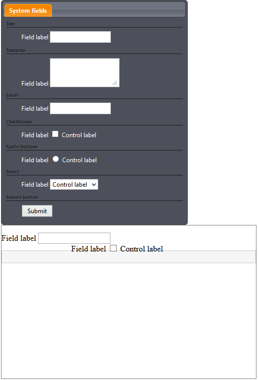

Der Formulareditor von *imperia* erlaubt die einfache Erstellung von HTML-Formularen durch *Drag&Drop*. 

!!! note "Hinweis"
	Bitte beachten Sie, dass der Formulargenerator ein optionales Feature ist, das separat lizenziert werden muss. Ihre Kontaktperson im *imperia*-Vertrieb stellt Ihnen gerne weitergehende Informationen zur Verfügung.

!!! note "Hinweis"
	Die verfügbaren Formularelemente können in Ihrer Installation von den hier abgebildeten abweichen, da sie vom Template-Programmierer frei definiert werden können.
	
Wie der Formeditor in einem Template eingebaut wird, ist im [Programmierhandbuch](https://portal.pirobase-imperia.com/pb/imperia-cms-dokumentation-private/programmer-en-11/programming.introduction/#document-modes) beschrieben.

## Aufbau und Funktionsweise des Formulareditors
Der Formulareditor besteht aus einem Elemente-Container mit allen verfügbaren Formularelementen und dem Formular-Bereich, in dem die Elemente per *Drag&Drop* eingefügt werden.

###Der Element-Container

Der Element-Container enthält alle zur Verfügung stehenden Formularelemente. Je nach Einbindung in das Template werden bei Ihnen unterschiedliche Formularelemente angeboten.
Die folgende Abbildung zeigt die gebräuchlichsten Formularelemente.

!!! note "Hinweis"
	Der Element-Container ist nur in der Editieransicht sichtbar. In allen anderen Ansichten (*Vorschau*, *Speichern*, usw.) wird der Container ausgeblendet, und nur noch der mit Elementen gefüllte Formularbereich wird angezeigt. 

!!!tip "Hinweis"
		Im Allgemeinen ist es nicht sinnvoll zwei Formulare in einem Editiermodus zu haben.
		 Allerdings können Sie Formulare simulieren, indem Sie ein Postconvert-Plug-in schreiben, das diese einfügt.  <comment aus https://jira.pirobase.de/jira/browse/IMPSUP-3221>
* Klicken Sie die Elemente an, die Sie in Ihrem Dokument verwenden wollen, und ziehen Sie diese per *Drag&Drop* in den Formularbereich.

Für die Positionierung des Containers gibt es drei Optionen:

**Feststehende Position:** Mit dieser Option ist der Container permanent sichtbar und befindet sich oberhalb des Formularbereichs.

**Pop-Up:** Mit dieser Option ist der Container unsichtbar, bis Sie mit der Maus in den Formularbereich klicken.

** Schieberegler:** Mit dieser Option wird der Container am rechten Rand der Seite platziert, lediglich der linke Teil ist sichtbar. Um ihn in voller Größe sichtbar zu machen, klicken Sie einfach auf den sichtbaren Teil.

!!! note "Hinweis"
		 Diese Option wird nicht von allen Browsern unterstützt.

### Der Formularbereich

Der Formularbereich ist der Bereich der Seite, in dem Sie die verfügbaren Elemente platzieren können. Es kann sich dabei um einen beliebigen HTML-Container handeln, je nachdem wie es vom Template-Programmierer festgelegt wurde.

## Verfügbare Elemente

Im Folgenden wird eine Standardauswahl an Formularelementen, die auch in den üblichen HTML-Formularen zu finden sind, beschrieben. Auf Ihrem System können kann die Anzahl der verfügbaren Elemente abweichen.

Jedes Formularelement hat eine Beschriftung und weitere Eigenschaften.

**Text:** Ein einzeiliges Texteingabefeld. Sie können die Attribute *Beschriftung, Platzhalter, Hilfstext, Name, Wert* und *ID* ändern. Darüber hinaus können Sie das Feld zu einem Pflichtfeld machen.

**Textarea:** Ein mehrzeiliges Texteingabefeld. Sie können die Attribute *Beschriftung, Platzhalter, Name, Wert* und *ID* ändern. Darüber hinaus können Sie das Feld zu einem Pflichtfeld machen.

**E-Mail: ** Ein einzeiliges Texteingabefeld für eine E-Mail-Adresse. Sie können die Attribute *Beschriftung, Platzhalter, Name, Wert* und *ID* ändern. Darüber hinaus können Sie das Feld zu einem Pflichtfeld machen.

**Checkbox:** Checkboxen erlauben die Auswahl einer oder mehrerer Optionen aus einer Liste. Sie können die Attribute *Beschriftung, Name, Wert* und *Elementbeschriftung* ändern. Darüber hinaus können Sie das Feld zu einem Pflichtfeld machen.

**Radiobutton:** Radiobuttons erlauben die Auswahl einer oder mehrerer Optionen aus einer Liste. Sie können die Attribute *Beschriftung, Name, Wert* und *Elementbeschriftung* ändern. Darüber hinaus können Sie das Feld zu einem Pflichtfeld machen.

**Auswählen:** Dieses Formularelement erlaubt die Auswahl einer oder mehrerer Optionen aus einer Liste. Sie können die Attribute *Beschriftung, Name, Wert* und *Zusatzbeschriftung* ändern. Darüber hinaus können Sie das Feld zu einem Pflichtfeld machen.

**Absenden:** Erzeugt eine Schaltfläche, mit der der Inhalt des Formulars an den Server geschickt wird. Sie können die Attribute *Name, Wert* und *ID* ändern.

## Arbeiten mit dem Formulareditor

### Formularelement hinzufügen

Klicken Sie das Formularelement im Element-Container an und ziehen Sie es per *Drag&Drop* in den Formularbereich. 
Sie können eine beliebige Anzahl Formularelemente einfügen.

### Formularelement entfernen

Klicken Sie das Formularelement im Formularbereich an und ziehen Sie es per *Drag&Drop* aus diesem heraus.

### Reihenfolge der Formularelemente ändern

Klicken Sie das zu verschiebende Formularelement mit der Maus aus und ziehen Sie es bei gedrückter Maustaste an die gewünschte Stelle.

### Formulareigenschaften ändern

Klicken Sie im Formularbereich auf ein eingefügtes Formularelement.

In der Kopfzeile des sich öffnenden Dialogs wird der Name des ausgewählten Formularelements ausgelesen.

* Um den Dialog zu verlassen, klicken Sie auf das Symbol <i class="fa fa-close"></i> in der Kopfzeile.

Unterhalb der Überschrift sehen Sie die Attribute, die Sie ändern können. 

* Geben Sie den Wert des Attributs in das Texteingabefeld neben dem jeweiligen Attributnamen ein. 

Das Attribut *ID* wird von *imperia* automatisch eingefügt, kann aber von Ihnen auch nachträglich geändert werden. 

* Sichern Sie Ihre Änderungen mit **Speichern**.

**Attribute**

Die im Folgenden beschriebenen Attribute können Sie für ein Formularelement anpassen.

**Beschriftung:** Dieses Attribut fügt dem Formularelement eine Beschriftung zu.

**Platzhalter:** Der Platzhalter kann zur Anzeige eines Hinweises für den erwarteten Inhalt des Formularelements verwendet werden. Dieser Hinweis wird nur angezeigt, wenn das Feld leer ist. Entsprechend verschwindet er wieder, sobald eine Eingabe erfolgt.

!!! note "Hinweis"
		 Diese Option wird nicht von allen Browsern unterstützt.

**Hilfetext:** Dieses Attribut ist nur für einzeilige Textfelder verfügbar. Es wird auf der rechten Seite des Eingabefeldes angezeigt und dient als Hinweis auf den erwarteten Inhalt des Textfeldes.

**Name:** Mit diesem Attribut geben Sie dem Element einen Namen.

!!! warning "Wichtig"
		 Dieses Attribut muss für Radiobuttons gesetzt sein. Wenn Sie keinen Namen vergeben, kann der Benutzer mehr als einen Radiobutton auswählen.

**Wert:** Dieses Attribut gibt den Inhalt des Formularelements vor. Es erfüllt also eine ähnliche Funktion wie ein Platzhalter, der Text verschwindet jedoch nicht automatisch bei Eingabe eines neuen Wertes.

!!!note "Hinweis"
	Für das Formularelement **Absenden** ändert das Attribut *Wert* die Beschriftung der Schaltfläche.

**ID:** Dieses Attribut gibt eine eindeutige ID für das Element an. *imperia* erzeugt automatisch eine ID. Diese kann aber bei Bedarf geändert werden.

**Elementbeschriftung:** Die Elementbeschriftung kann für *Radiobuttons* und *Checkboxen* gesetzt werden. Sie bestimmt den Text, der neben der Checkbox oder dem Radiobutton angezeigt wird.

**Pflichtfeld:** Mit dieser Option kann ein Formularelement zum Pflichtfeld gemacht werden. Pflichtfelder sind mit einem Stern neben der Beschriftung gekennzeichnet.

### Pflichtfelder definieren

Wenn Sie ein bestimmtes Eingabefeld zu einem Pflichtfeld machen wollen, aktivieren Sie die Checkbox ***Pflichtfeld*** unterhalb der Attribute.

### Neues Auswahlfeld einfügen

1. Um für einen *Radiobutton*, eine *Mehrfachauswahl* oder eine *Checkbox* weitere Auswahloptionen hinzuzufügen, klicken Sie das gewünschte Element an.
2. Im Dialog *Optionen* klicken Sie auf das Pluszeichen <i class="fa fa-plus"></i> neben dem Attribut ***Elementbeschriftung***. Mit jedem Klick auf <i class="fa fa-plus"></i> wird eine weitere Option unten angefügt. 
3. Geben Sie den Wert und die Elementbeschriftung an.
4. Sichern Sie Ihr Änderungen, indem Sie auf **Speichern** klicken.

###Auswahlfeld entfernen

1. Um ein Auswahlfeld wieder zu entfernen, klicken Sie das gewünschte Element an.
2. Im Dialog *Optionen* klicken Sie auf das X-Symbol neben dem Pluszeichen.  
*Das Auswahlfeld wird gelöscht*.
3. Sichern Sie Ihr Änderungen, indem Sie auf **Speichern** klicken.

