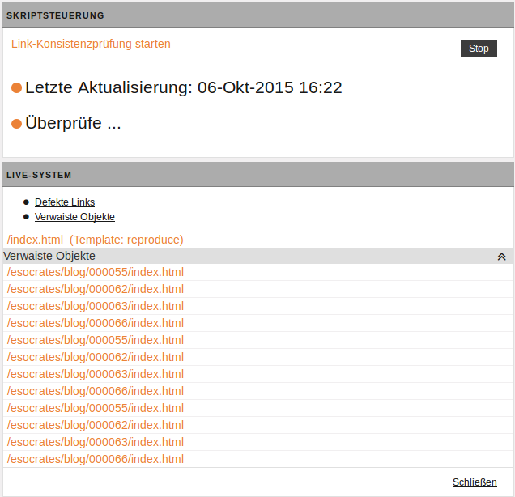
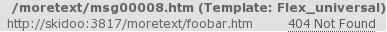

Im Gegensatz zum Link-Checker auf dem Schreibtisch, mit dem Sie immer nur die Verweise innerhalb eines einzelnen Dokuments prüfen können (siehe [Link-Checker](user.desktop.md#link-checker)), ermöglicht die Link-Konsistenzprüfung die Untersuchung aller existierenden HTML-Dateien auf mehreren Systemen.

!!! note "Hinweis"
	Dieser Vorgang kann bei größeren Projekten einige Zeit beanspruchen und erhebliche Last auf dem Server erzeugen. Daher können nur Benutzer mit Zugriff auf die Superuser-Gruppe die Link-Konsistenzprüfung starten.

Allen anderen Benutzern steht ein Report der letzten Prüfung zur Verfügung.

### Link-Konsistenz-Report auswerten

Wählen Sie ***Dokumente -&gt; Link-Konsistenzprüfung***.

Beachten Sie, dass das hier angezeigte Dialogfenster in der Superuser-Ansicht dargestellt ist. Da Sie als "einfacher" Benutzer den Report nicht starten oder stoppen dürfen, werden diese Optionen in Ihrer Ansicht auch nicht eingeblendet.

* Im Bereich ***Letzte Aktualisierung*** finden Sie die Angabe, wann die Link-Konsistenzprüfung zuletzt durchgeführt wurde. 

* Für jeden konfigurierten Server wird ein Report der Link-Konsistenzprüfung in einer eigenen (grauen) Box angezeigt. In einer Leiste wird der Name des jeweiligen Servers aufgeführt (in der Beispielabbildung "LIVE-SYSTEM"). Darunter befinden sich Verweise, mit denen Sie die einzelnen Sektionen eines Reports direkt aufrufen können. Folgende Sektionen sind verfügbar:

	* ***Defekte Links***: In dieser Sektion finden Sie Verweise, die nicht aufgelöst werden konnten, weil die Ziel-URL nicht erreichbar war.  Die folgende Abbildung zeigt ein Beispiel für einen Eintrag in dieser Sektion:  
	* ***Verwaiste Objekte***: Diese Sektion enthält alle Dateien, auf die von keiner anderen Datei verwiesen wird. Auch hier sind die einzelnen Einträge verlinkt.
	* ***Dummies***: In dieser Sektion finden Sie alle Dokumente mit Links, die eine Raute ('`#`') als Ziel haben. Verweise, die zusätzlich über einen Event-Handler eine JavaScript-Funktion aufrufen, sind hier nicht aufgeführt.

		!!! note "Hinweis"
				Links, die im `href`-Attribut einen Javascript-Aufruf enthalten (z.B. `javascript:myfunc()`), ignoriert die Link-Konsistenzprüfung.

### Link-Konsistenzprüfung starten

!!! note "Hinweis"
		Sie haben die Möglichkeit die Link-Konsistenzprüfung erneut auszuführen. 
		Beachten Sie auch, dass die Prüfung einige Zeit in Anspruch nimmt und zu einer hohen Serverlast führen kann.

		
1. Öffnen Sie ***Menü -&gt; Dokumente -&gt; Link-Konsistenzprüfung***. Wenn Sie für die Superuser-Gruppe zugriffsberechtigt sind, sehen Sie das Dialogfenster *Skriptsteuerung*.
2. Starten Sie mit einem Klick auf **Überprüfen** die Link-Konsistenzprüfung. 
3. Sollte diese bereits laufen, sehen Sie an dieser Stelle statt des Links den Vermerk ***Überprüfe...***. in diesem Fall können Sie dann die bereits laufende Prüfung über den Button **Stop** beenden.
4. Klicken Sie auf **Schließen**, um zum Dashboard zurückzugelangen.

