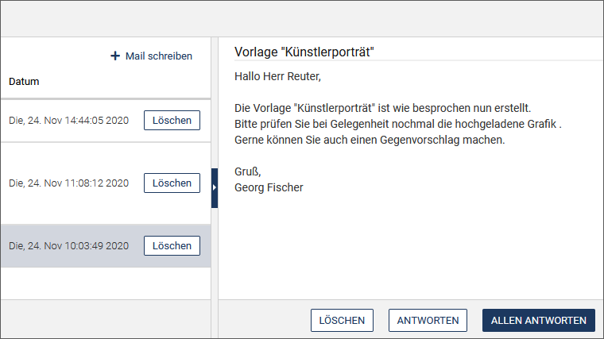

*imperia* verfügt über zwei Möglichkeiten, Mails an interne oder externe Empfänger zu versenden.

___
##Interne Mails empfangen und versenden

Auf das *imperia*-interne Mailsystem können Sie bequem über das Symbol <i class="fa fa-envelope-o"></i> in der Kopfzeile zugreifen. Hier wird auch die Anzahl der ungelesenen Nachrichten eingeblendet.

Mit Hilfe des internen Mailsystems können Sie Mails an andere *imperia*-Benutzer innerhalb Ihres Systems verschicken und Mails von anderen *imperia*-Benutzern empfangen.

!!! note "Hinweis"
	Es handelt sich hierbei um keinen E-Mail-Client, mit dem Sie Mails an externe Adressen (`adressat@domain.com`) versenden können oder externe Mail abrufen können.

###Mail lesen

* Rufen Sie Ihre Mails über über das Symbol <i class="fa fa-envelope-o"></i> in der Kopfzeile auf.
* Auch über <i class="fa fa-user"></i> ***Benutzerkonto -&gt; <i class="fa fa-envelope-o"></i> Nachrichten*** haben Sie Zugriff auf Ihre Mails.

Das Postfach zeigt alle Mails in Tabellenform. Zu jeder Mail werden Betreff, Absender und Datum angezeigt. 
Ungelesene Mails haben vorne ein Pfeilsymbol.

* Klicken Sie auf eine Mail im Eingangsbereich links.

*Der Inhalt der Mail wird nun im rechten Bereich angezeigt.*

### Gelesene Mails sichbar machen

* Wenn Sie sichtbar machen möchten, dass Sie eine oder mehrere Mails bereits gelesen haben, aktivieren Sie die Checkboxen vor den betreffenden Mails und wählen Sie die Option **Als gelesen markieren**.
*Die Liste wird aktualisiert und bei den bereits gelesenen Mails verschwindet das Pfeil-Symbol vor dem Titel.*

### Mail beantworten

* Sie können direkt auf eine Mail antworten, indem Sie unter dem Mail-Inhalt auf **Antworten** klicken. Wählen Sie **Allen antworten**, wenn Sie Ihre Antwort an alle Empfänger der Mail schicken möchten.

* Wenn Sie die vorhergehende Nachricht in Ihren Antworttext integrieren möchten, um beispielsweise direkt auf einzelne Passagen zu reagieren, klicken Sie auf **Inline-Antwort** neben dem Eingabefeld für die Nachricht.
* Geben Sie Ihren Nachrichtentext ein.
* Legen Sie fest, ob die vorhergehende Nachricht für die Antwort mit kopiert werden soll.
* Klicken Sie auf **Nachricht senden**.

###Neue Mail schreiben

* Klicken Sie in Ihrer Mailbox auf **Mail schreiben** über der Liste der eingegangenen Mails.

		
	
* Tragen Sie den Betreff und den Text der Nachricht ein.

	

* Wählen Sie die Empfänger aus:
	
	* Aktivieren Sie die Checkbox ***An alle Benutzer versenden***, wenn die Mail alle Benutzer außer Sie selbst erreichen soll.
	* Suchen Sie gegebenenfalls die Empfänger aus der Liste aller Benutzer in der Drop-Down-Box ***Benutzer*** aus. Wählen Sie die Benutzer einzeln aus oder schreiben Sie die gewünschten Namen direkt in das Textfeld.
	* Alternativ können Sie die Benutzer über ihre Gruppenzugehörigkeit benachrichtigen. Schreiben Sie den Gruppennamen in das Textfeld oder wählen Sie die gewünschte Gruppe aus der Drop-down-Box ***Gruppe*** aus.

* Versenden Sie die Nachricht über den Button **Nachricht senden**.

*Die Mail wird direkt versendet. Es erscheint eine kurze Bestätigungsmeldung.*

###Mail löschen

* Um eine E-Mail zu löschen, klicken Sie in der Mailbox am Ende der Zeile einer Nachricht auf **Löschen**.
* Möchten Sie mehrere Mails aus dem Eingangsbereich löschen, aktivieren Sie die Checkboxen vor den gewünschten  Mails und führen Sie anschießend **Löschen** unter der Liste aus.

###Benachrichtigung "Dokument zugewiesen"

Sobald Ihnen ein [Dokument zugewiesen](user.desktop.md#dokumente-zuweisen) wurde, werden Sie auch über das interne Mailsystem benachrichtigt: 

* Öffnen Sie die Mail, indem Sie sie anklicken.

*In der Nachricht ist ein Link auf die Vorschau des Dokuments enthalten. Zusätzlich enthält die Nachricht einen Link auf den Schreibtisch.*

* Klicken Sie auf den Link ***Zeig das Dokument auf dem Schreibtisch an***.

*Der Schreibtisch wird geöffnet. Auf ihm wird nur das Dokument angezeigt, das Ihnen zugewiesen wurde:*

___
##Externe Mails versenden

Sie können aus dem Workflow heraus eine E-Mail versenden. Diese kann sowohl an interne als auch an externe Empfänger gehen. Dafür gibt es das interaktive Plug-in [Mailversand](https://portal.pirobase-imperia.com/pb/imperia-cms-dokumentation/admin-de-11/admin.workflow-plugins/#mailversand-kostenpflichtiges-add-on). Mit diesem Workflow-Plugin  können Sie bei bestimmten Ereignissen im Workflow automatisierte E-Mails versenden. 

Dieses Mailversand-Plugin ist auch Grundlage für das Weiterleiten von internen Nachrichten an Ihre eigene private, externe E-Mail-Adresse.
 Diese Funktion ist im [Look and Feel](user.basics.md#look-and-feel-einrichten) zu finden.

