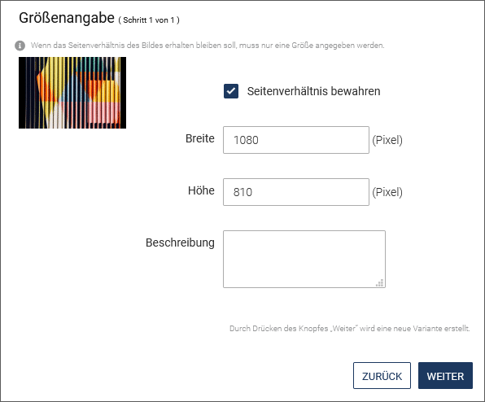

Im Media-Asset-Management (im Folgenden kurz **MAM**) werden Assets genau wie Dokumente verwaltet.

Im Media-Asset-Management werden unstrukturierte Asset-Daten mit strukturierten, von *imperia* verwertbaren Daten angereichert. Zusätzlich versioniert und archiviert *imperia* alle Assets, so dass Sie ältere Versionen jederzeit im Archiv wiederfinden und importieren können. Auch können Sie verfolgen, ob und wo ein Asset in Dokumenten Verwendung findet. 
Der Upload neuer Assets folgt einem definierten Workflow. 

Das MAM stellt also eine prozessorientierte Dokumenten-Management-Lösung dar.

!!! tip "Begriffsdefinition"
		Mit dem aus der Finanzwelt entlehnten Begriff *Asset* (engl. "Vermögenswert", "Anlage") fasst man beim Content Management beliebige digitale Inhalte, insbesondere Mediendateien wie Grafiken, Videos, Musikdateien und Texte zusammen.

___
## Aufbau und Funktionsweise des MAM

* Öffnen Sie das MAM über ***Menü -&gt; MAM***.

Im linken Bereich werden die "Asset-Rubriken" in einer Baumstruktur dargestellt, die Sie gleichzeitig als Navigation nutzen können:

* Klicken Sie auf den Rubriknamen, um den Inhalt der Rubrik im rechten Bereich anzuzeigen.
* Klicken Sie auf das Plussymbol, um eine Rubrik aufzuklappen und ihre untergeordneten Rubriken anzuzeigen. Um eine aufgeklappte Rubrik wieder einzuklappen, klicken Sie auf das Minussymbol.

Im rechten Bereich werden die Assets angezeigt. Dort befindet sich auch das Vorschaufenster mit weiteren Details, das Sie über den Pfeil auf der rechten Seite einblenden können.

!!! note "Hinweis"
		Vorgenommene Einstellungen werden individuell für jeden Benutzer gespeichert. Auch beim nächsten Aufruf sind die von Ihnen vorgenommenen Einstellungen noch erhalten.

___
## Arbeiten mit dem Rubrikenbaum

Assets werden in Verzeichnissen gespeichert, die den Rubriken der *imperia*-Dokumente entsprechen. Dabei werden die Rubriken auch in der gewohnten Baumstruktur abgebildet. Dort navigieren Sie wie gewohnt.

Sie können den Rubrikenbam durch einen Klick auf das Pfeilsymbol der Trennlinie aus- und wieder eingeblenden.

* Aktivieren Sie die Checkbox ***Einschließlich Unterrubriken*** unter dem Rubrikenbaum, wenn Sie die Unterordner auch angezeigt bekommen möchten.

Mit Hilfe des Kontextmenüs einer Rubrik können Sie die [Rubrikeigenschaften bearbeiten](user.docbrowser.md#rubrik-bearbeiten), neue [Unterrubriken erstellen](user.docbrowser.md#rubrik-anlegen) oder die [Rubrik löschen](user.docbrowser.md#rubrik-loeschen). Hier finden Sie auch die Optionen zum [Hochladen der Assets](user.mam.md#assets-hochladen).

* Die Option **Archiv** führt direkt in das Archiv der Rubrik, in dem Sie ein Asset auswählen und eine Vorgängerversion importieren können.
___
## Assets finden

Die Suche im Media-Asset-Management funktioniert analog zur Suche im Dokumenten-Browser: Um Assets zu finden, haben Sie die Wahl zwischen einer [Standardsuche](user.docbrowser.md#standardsuche), die mit Hilfe von Filtern weiter eingeschränkt werden kann, und einer [Erweiterten Suche](user.docbrowser.md#erweiterte-suche), mit der individuelle und komplexe Suchanfragen möglich sind.

___
## Mit Assets arbeiten

Die in einer Rubrik enthaltenen Assets sind in einer Tabelle aufgelistet. Informationen zu jedem Asset und mögliche Aktionen sind jeweils in Spalten hinterlegt.

* Wenn Sie eine Spalte in der Tabelle hinzufügen möchten, nutzen Sie die Option ***Ansicht*** und aktivieren Sie anschließend die Checkbox vor der gewünschten Spalte, um diese einzublenden.

	

* Ändern Sie optional die Anordnung einzelner Spalten innerhalb der Tabelle, indem Sie diese per *Drag & Drop* verschieben. Alternativ können Sie die Anordnung der Spalten und der in ihnen angebotenen Auswahlfelder unter ***Ansicht / Anpassen*** ändern. Nutzen Sie auch hier *Drag & Drop*, um die Spalten oder Felder an die gewünschte Position zu ziehen.

Sie haben die Möglichkeit, nach bestimmten Spalten wie zum Beispiel *Letzter Editor* oder *Erzeugungsdatum* zu sortieren. Beachten Sie, dass die Sortierfunktion nicht in allen Spalten verfügbar ist.

1. Klicken Sie auf die entsprechende Spaltenüberschrift. 
*Die Spalte wird in aufsteigender alphabetischer Ordnung sortiert*
2. Klicken Sie erneut auf die Überschrift, um die Spalte in absteigender Ordnung zu sortieren.

### Asset(s) hochladen

<comment: Shortcut "Ctrl. + u" noch gültig?  -- NEIN 09.10.17>

!!! note  "Hinweis"
		Um Assets hochladen zu dürfen, benötigen Sie die Schreibberechtigung für die Ziel-Rubrik im MAM.

Falls Ihr Zielsystem auf Windows® läuft, setzen Sie die Variable `"DISABLE_8BIT_FILENAMES" = "1"`. Lesen Sie dazu auch im [Admin-Handbuch](https://portal.pirobase-imperia.com/pb/imperia-cms-dokumentation/admin-de-11/admin.conf/#disable_8bit_filenames) weiter.

Sie haben verschiedene Möglichkeiten, Assets hochzuladen. Für alle Möglichkeiten gelten die folgenden Benennungskonventionen:

* Umlaute im Dateinamen werden von *imperia* beim Ablegen der Datei im Filesystem durch zwei Unterstriche "\__" ersetzt.
* Großbuchstaben werden in Kleinbuchstaben umgewandelt.
* Leerzeichen im Dateinamen werden durch einen einzelnen Unterstrich ersetzt. Im Namen, der im Media-Asset-Management erscheint, bleiben Leerzeichen jedoch erhalten. Beispiel: 
	`hüsker_dü_-_eiffel_tower_high.mp3` wird umgewandelt in  
	den Dateinamen `h__sker_d___-_eiffel_tower_high.mp3`. 
	Als Titel wird automatisch vorgeschlagen: `Hüsker Dü - Eiffel Tower High`. Der vorgeschlagene Titel kann anschließend modifiziert werden.
* Die Informationen zu Asset-Verzeichnissen und Assets erfassen Sie über variable Templates, die der *imperia*-Administrator einrichtet.

1. **Asset über den Dateimanager hochladen**

1. Klicken Sie links im MAM auf die gewünschte Asset-Rubrik, in der Sie das Asset hinzufügen möchten.
2. Klicken Sie im Kontextmenü der Rubrik auf ***Hochladen***.

	

3. Ziehen Sie per *Drag & Drop* eine Datei in die gestrichelte Dropzone. Wählen Sie alternativ über **Datei hochladen** im Dateimanager die gewünschte Datei aus.

	
	
	
4. Tragen Sie dort die gewünschten Metainformationen wie den Dateinamen ein. Beachten Sie die [Benennungskonvention](user.mam.md#assets-hochladen).
5. Klicken Sie auf **Weiter zu ...**, um zum nächsten Workflow-Schritt zu gelangen.  Ein Klick auf **Schließen** führt Sie auf den Schreibtisch, wo Sie das Asset weiterhin als Dokument im Workflow sehen.

2. **Mehrere Assets per *Drag&Drop* einfügen:**

1. Klicken Sie im MAM auf die gewünschte Asset-Rubrik, in der Sie Assets hinzufügen möchten.
2. Ziehen Sie die ausgewählten Assets aus ihrem Dateisystem in den Anzeigebreich der Listenansicht mit den Assets. 
*Dieser verwandelt sich in einen *Drag&Drop*-Bereich, in den Sie nun die Assets ziehen können, die Sie hochladen möchten.*  

3. Ändern Sie gegebenenfalls in den Eingabefeldern unter ***Dateiname*** die Namen der Dateien.
4. Falls bereits ein Asset mit dem selben Namen im MAM existiert, können Sie den Namen durch Anklicken der Checkbox überschreiben oder alternativ den Namen löschen, indem Sie  <i class="fa fa-close"></i> anklicken.
5. Klicken Sie auf **Hochladen**, um die Assets hinzuzufügen.  

*Das Asset erscheint nun in der Asset-Liste.*

!!! note "Hinweis"
	Das Asset-Upload-Template könnte auf Ihrem System abweichen. Die oben genannte Möglichkeit basiert auf dem Standard-*imperia*-Template. Sie können hierfür selbst eigene Templates erstellen. Mehr Informationen hierzu lesen Sie in der Syntax-Referenz für *imperia*-Templates im [Programmierhandbuch](https://portal.pirobase-imperia.com/pb/imperia-cms-dokumentation-private/programmer-en-11/programming.metafiles/#syntax-reference).

3. **Mehrfachupload**

Bei dieser Möglichkeit laden Sie mehrere Assets in einem Arbeitsgang in eine Asset-Rubrik hoch.

1. Wählen Sie im Kontextmenü der Rubrik ***Mehrfachupload***.
2. Geben Sie im Auswahlfeld ***Anzahl Uploads*** an, wie viele Assets Sie gleichzeitig in das Media-Asset-Management hochladen möchten.  *Entsprechend Ihrer Auswahl dupliziert imperia den Satz der Eingabefelder für den Upload eines Assets.*

	

3. Wählen Sie die Assets in Ihrem Dateisystem aus.
4. Klicken Sie auf **Speichern**, um den Mehrfachupload zu starten.

### Asset veröffentlichen

Im MAM haben Sie die Möglichkeit, Assets direkt und unabhängig von Dokumenten zu veröffentlichen. Lesen Sie hierzu auch im [Admin-Handbuch](https://portal.pirobase-imperia.com/pb/imperia-cms-dokumentation/admin-de-11/admin.mam/#unabhangige-freischaltung-von-assets-aktivieren) weiter. 
Das Asset wird dabei mit den entsprechenden Varianten für das Zielsystem veröffentlicht.

1. Aktivieren Sie die Checkbox in der Zeile des Assets. 
2. Führen Sie die Option ***Veröffentlichen*** in der Funktionsleiste unter der Asset-Tabelle aus.

	

*Das Asset wird direkt veröffentlicht. Eine neue Seite erscheint mit der Zusammenfassung der Veröffentlichung.*

### Asset-Eigenschaften ändern

Asset-Eigenschaften ändern Sie über die Metafelder, die sich in den Details des jeweiligen Assets befinden.

!!! note "Hinweis"
	       Der *imperia*-Administrator kann Metafelder zum Editieren freigeben oder sperren.

1. **Details öffnen**

* Führen Sie die Option **Metaviewer** im Kontextmenü des Assets aus.

Im Dialogfenster *Details* sehen Sie die Metainformationen des Assets:  

* Tragen Sie die gewünschten Werte in den Eingabefeldern ein oder verändern Sie bestehende Werte.
* Löschen Sie gegebenenfalls ein Metafeld, indem Sie auf ***Metafeld löschen*** im Dropdown-Menü hinter dem Metafeld klicken. Metafelder ohne diese Option können Sie nicht ändern oder löschen.
* Legen Sie neue Metafelder für das Asset an, indem Sie auf ***Neues Metafeld*** klicken. Tragen Sie in dem sich öffnenden Dialog in das Eingabefeld ***Metafeld*** den Namen ein und vergeben Sie den Wert. Klicken Sie anschließend auf **Erzeugen**, um das Metafeld hinzuzufügen.
* Sichern Sie Ihre Angaben, indem Sie auf **Speichern** klicken.

### Asset löschen

!!! note "Hinweis"
		Für das Löschen von Assets benötigen Sie die entsprechenden Schreibrechte.

* Öffnen Sie in der Zeile des zu löschende Asset in der Spalte ***Aktionen*** die Drop-Down-Liste mit den Handlungsoptionen für das Asset. Führen Sie die Option **Löschen** aus.

* Wählen Sie alternativ mehrere Assets aus, indem Sie die Checkboxen in den Zeilen der gewünschten Assets aktivieren und anschließend in der Funktionsleiste unter der Asset-Tabelle auf ***Löschen*** klicken.

	

* Nehmen Sie in dem sich öffnenden Dialogfenster weitere Einstellungen vor:  
	* Für Assets, die in Dokumenten referenziert sind, haben Sie die Möglichkeit, die Referenzen zu ignorieren - dies wird jedoch ausdrücklich nicht empfohlen.
	* Sie können Assets aus dem Workflow oder aus dem Archiv (unwiederruflich) löschen.

### Fokuspunkt setzen
<comment: https://jira.pirobase.de/jira/browse/ICMS-1356, https://jira.pirobase.de/jira/browse/ICMS-1360>

Die Funktion ***Fokuspunkt*** ist sehr hilfreich, wenn Sie ein und dasselbe Bild in mehreren Formaten benötigen, wie z. B. in 4:3, 16:9 oder 21:9.

Mittels dieser Funktion werden Bilder mit einem von Ihnen ausgewählten Bildbereich für alle verfügbaren Formate generiert. 

!!! note "Hinweis"
		Die Funktion *Fokuspunkt* ist in einer Spalte hinterlegt. Stellen Sie sicher, dass Sie die Spalte hinzugefügt haben.

* Öffnen Sie in der Zeile des Assets in der Spalte ***Aktionen*** die Drop-Down-Liste mit den Handlungsoptionen für das Asset. Führen Sie die Option **Fokuspunkt** aus.

	

* Setzen Sie im linken Bereich des Bearbeitungsfensters den Fokuspunkt, indem Sie im Bild darauf klicken.  *Im rechten Bereich des Fensters können Sie beobachten, wie sich die Positionierung des Fokuspunktes auf die verschiedene Bildvarianten auswirkt.*

* Klicken Sie auf **Speichern**, um die Einstellung für das Bild zu speichern und zurück zum MAM zu gelangen.

*Wenn Sie das Asset in ein Dokument einfügen, ist dieses mit dem fokussierten Abschnitt immer zu sehen.*

### Bilder bearbeiten

Zu jedem Grafik-Asset stehen Ihnen eine Vielzahl an Aktionen zur Bearbeitung und Anpassung des Assets zur Verfügung.

* Öffnen Sie in der Zeile des Assets in der Spalte ***Aktionen*** die Drop-Down-Liste mit den Handlungsoptionen für das Asset. Führen Sie die Option **Anpassen** aus. Falls diese Aktion nicht zur Verfügung steht, aktivieren Sie in der Menüleiste die Spalte **Benutzeraktion** im Menü ***Ansicht***.

* Wählen Sie die Variante des Assets, die verändert werden soll. Sie können beispielsweise zwischen dem Original und dem Thumbnail wählen.

* Wählen Sie die gewünschte Aktion aus.
* Je nach gewählter Aktion, führen Sie in dem entsprechenden Bearbeitungsfenster die gewünschten Änderungen durch.
* Um die Änderungen anzuwenden, klicken Sie **Weiter**.  *Die Änderungen werden direkt als neue Variante des Assets gespeichert*.
* Klicken Sie auf **Schließen**, um die Aktion zu beenden.
* Bestimmen Sie optional die neue Variante als Standard. Gehen Sie vor, wie im Abschnitt [Asset-Standardvariante bestimmen](user.mam.md#asset-standardvariante-bestimmen) beschrieben.

!!!note "Hinweis"
		Der Button **Zurück** auf der letzten Seite des Dialogfensters erzeugt eine neue Variante. Auch wenn eine Variante dieser Asset-Aktion bereits existiert, wird diese dennoch nochmals erstellt.

Im Folgenden werden alle Aktionen, die für Grafik-Assets zur Verfügung stehen, beschrieben. <comment: was bedeutet das Eingabefeld "Template-Tags der Variante"? erscheint bei jeder Asset-Aktion -- RAUSNEHMEN 09.10.17>

####Bildgröße bestimmen

1. Tragen Sie im Bearbeitungsfenster der Aktion ***Bild auf gewünschte Größe bringen*** die gewünschten Maße ein.
	
2. Klicken Sie auf **Weiter**, um sich das Ergebnis anzeigen zu lassen.
3. Nutzen Sie **Fertig**, um zurück zum MAM zu gelangen.

!!! note "Was passiert im Hintergrund?"
	* Das Seitenverhältnis der eingegebenen Maße wird ermittelt.
	* Das MAM wählt einen möglichst großen, zentrierten Ausschnitt aus dem Originalbild im selben Seitenverhältnis.
	* Mit dem gewählten Ausschnitt erzeugt das MAM eine auf die gewünschten Maße skalierte Variante des Original-Assets.

####Bild beschriften

1. Tragen Sie im Bearbeitungsfenster der Aktion ***Bild beschriften*** die gewünschten Informationen ein. 

	

	* ***X-Position, Y-Position***: Tragen Sie jeweils einen Zahlenwert ein, um den Abstand der linken und der oberen Kante des Textes von der linken und der oberen Kante des Bildes in Pixeln zu bestimmen.
	* ***Text-Größe***: Geben Sie einen Zahlenwert ein, der die Größe der Schrift in Pixeln bestimmt.
	* ***Textfarbe***: Geben Sie einen hexadezimalen Farbwert zur Bestimmung der Textfabe an.

		!!! note "Hinweis"
				Notieren Sie die Farbangabe unbedingt mit vorangestellter Raute (`#`).

2. Gehen Sie anschließend vor, wie unter [Bilder bearbeiten](user.mam.md#bilder-bearbeiten) beschrieben.

####Bild konvertieren
Mit dieser Funktion können Sie das Bild in die Formate `jpeg`, `gif`, `png`, `tiff` und `bmp` konvertieren.

!!! note "Hinweis"
		Die Formate `tiff` und `bmp` sind nicht empfehlenswert für Webanwendungen, da nicht alle Browser sie anzeigen können.

####Bild zurechtschneiden

1. Ziehen Sie mit gedrückter linker Maustaste ein Viereck auf, um den Bildausschnitt zu bestimmen.  An den vier Ecken sowie in der Mitte jeder Kante des Auswahlrechtecks befinden sich Anfasser, mit denen sich die Größe des Ausschnitts durch Anklicken und Ziehen nachträglich ändern lässt.
2. Geben Sie alternativ die gewünschten Dimensionen manuell ein. Nutzen Sie die Eingabefelder ***Breite, Höhe, X*** und ***Y*** unter dem Bild. ***X*** und ***Y*** bestimmen die Distanz zur linken und oberen Ecke des Bildes.

!!! note "Hinweis"
		Wenn Sie die Aktion ***Bild zurechtschneiden*** über den Link ***Anpassen*** im MAM aufrufen, hat der initialisierte Bildausschnitt dasselbe Bildformat wie das Bild im Template.

####Bildgröße verändern

Mit dieser Aktion legen Sie eine skalierte Variante des Assets an. 

* Geben Sie die gewünschten Werte für ***Breite*** und ***Höhe*** ein.

*imperia* generiert eine Variante mit den von Ihnen eingegebenen Maßen.  
 Wenn Sie also beide Seitenlängen eintragen und das Ergebnis im Seitenverhältnis vom Original abweicht, erhalten Sie eine verzerrte Variante.
Tragen Sie hingegen nur eine Seitenlänge ein, berechnet *imperia* die Länge der anderen Kante automatisch im richtigen Seitenverhältnis.

!!! tip "Tipp"
		Sollten Sie eine Variante mit vorgegebener Höhe und Breite benötigen, sind in der Regel die Aktionen **[Bild zurechtschneiden](user.mam.md#bild-zurechtschneiden)** oder **[Bildgröße bestimmen](user.mam.md#bildgroe-bestimmen)** die bessere Wahl.

####Bildsättigung ändern

Sie haben die Möglichkeit, den Sättigungsgrad des Bildes zu bestimmen.

* Geben Sie in das Eingabefeld ***Sättigung** den gewünschten Wert ein oder nutzen Sie alternativ die Pfeiltasten des Eingabefelds.

!!! note "Hinweis"
	* Bei Werten von 0 bis 99 ist der Sättigungsgrad geringer als beim Original.
	* Werte über 100 generieren eine Variante mit höherer Farbsättigung.
	* Sie können also eine Schwarzweiß-Variante einer Farbaufnahme anlegen oder auch bei einem Bild mit blassen Farben diese etwas kräftiger machen.

####Gammakorrektur mit Farbkurven
Diese Asset-Aktion erlaubt Ihnen eine Gammakorrektur durchzuführen.

1. Wählen Sie im Drop-down-Menü oberhalb des Kurvendiagramms den Kanal (***Rot, Grün, Blau*** und ***Alpha***), den Sie anpassen möchten.
2. Verwenden Sie den Mauszeiger, um einen Punkt auf dem Kurvendiagramm zu erstellen und an die gewünschte Position zu ziehen.
3. Sie können eine zuvor getätigte Anpassung mit **Zurücksetzen** rückgängig machen. Das Zurücksetzen betrifft nur die Kurve, die Sie gerade bearbeiten.
4. Wenn Sie bereits eine Datei mit einer voreingestellte Kurve mithilfe von Photoshop oder Gimp erstellt haben, können Sie diese Datei per *Drag&Drop* in das Graphen-Fenster einfügen.  Ihre Änderungen werden im Thumbnail auf der linken Seite angezeigt
5. Klicken Sie auf das Thumbnail, wenn Sie sich die Variante in Originalgröße anzeigen lassen wollen.  *Es öffnet sich ein Fenster mit der Bildvariante. Ein Klick auf das Bild schließt es wieder.*
6. Klicken Sie auf **Weiter**.  
*Die Variante wird erstellt.*

####In monochromes Bild konvertieren

Die Aktion ***Nach monochrom konvertieren*** erlaubt Ihnen, ein farbiges Bild in ein monochromes Bild umzuwandeln.

1. Nutzen Sie den ***Rot, Grün*** oder ***Blau*** Kanal-Schieber um das Bild anzupassen.  *Das Ergebnis wird in dem Thumbnail auf der linken Seite angezeigt.*
2.Klicken Sie auf das Thumbnail, wenn Sie sich die Variante in Originalgröße anzeigen lassen wollen.  *Es öffnet sich ein Fenster mit der Bildvariante. Ein Klick auf das Bild schließt es wieder.*
3. Klicken Sie auf **Weiter**.  
*Die Variante wird erstellt.*

####Passend zuschneiden mit Rand
Mit dieser Aktion erzeugen Sie eine Variante, die auf eine bestimmte Größe zugeschnitten wird, wobei die entstehenden Ränder mit einer vorgegebenen Farbe gefüllt werden.  

1. Tragen Sie in die Eingafelder ***Breite*** und ***Höhe*** die gewünschte Größe ein. 
2. Klicken Sie auf **Weiter**.  
3. Wählen Sie die gewünschten Einstellungen für den Hintergrund aus.
4. Klicken Sie auf **Weiter**.  
5. Wenn Sie mit dem Ergebns einverstanden sind, klicken Sie auf **Fertig**
	
	
*Die Variante wird erstellt.*

####Seitenverhältnis beim Skalieren bewahren
Mit dieser Aktion erzeugen Sie eine in der Größe veränderte Variante, bei der das Bild sein Seitenverhältnis beibehält. Hier kann ebenfalls eine Hintergrundfarbe gesetzt werden.

1. Tragen Sie in die Eingafelder ***Breite*** und ***Höhe*** die gewünschte Größe ein.
2. Geben Sie die Hintergrundfarbe oder den Wert `trans` ein.

*Wird als Hintergrundfarbe "transparent" (`trans`) gewählt, wird die Variante mit schwarzem Hintergrund dargestellt.*

####Thumbnail erzeugen
Mit dieser Asset-Aktion können Sie ein neues Vorschaubild für das Asset generieren. Dabei werden die Standardmaße von Asset-Thumbnails genommen.

####Variante hochladen
Nutzen Sie diese Asset-Aktion, um eine neue Variante des Bildes hochzuladen.

* Klicken Sie auf **Durchsuchen** und wählen Sie in Ihrem Dateiensystem die gewünschte Datei aus.
* Geben Sie für die Variante eine ***Beschreibung*** in das gleichnamige Feld ein.

### Asset-Standardvariante bestimmen

Mit den oben genannten Asset-Aktionen legen Sie unterschiedliche Varianten eines Assets an. Eine dieser Varianten ist die Standard-Variante, die Sie beim Import in ein Dokument durch Doppelklick auf das betreffende Symbol automatisch auswählen. In der Regel ist dies die unmodifizierte Version des Assets.

1. Führen Sie im Kontextmenü des Assets die Option ***Varianten anzeigen*** aus.
	
	
	
2. Klicken Sie in dem sich öffnenden Dialog in der Spalte ***Standard-Einstellung*** vor die gewünschte Variante, um diese als neuen Standard zu bestimmen.

	

3. Lassen Sie sich durch Anklicken in der Spalte ***Details*** die einzelnen Varianten in einem neuen Fenster anzeigen; es öffnet sich jeweils ein Pop-up-Fenster. 
4. Lesen Sie in der Spalte ***Plug-Ins***, mit welcher Aktion die betreffende Variante erzeugt wurde:

	| Plug-in Informationen  im Dialogfenster | Asset-Aktion|
	|---------------|-----------------------------------|
	| Annotate      | Textanmerkung                     |
	| Crop          | Bild zurechtschneiden             |
	| FitToSize     | Bild auf gewünschte Größe bringen |
	| Resize        | Bildgröße verändern               |
	| Saturation    | Sättigung                         |
	| Thumbnail     | Thumbnail erzeugen                |

5. Geben Sie optional für die jeweilige Variante eine ***Beschreibung*** in der gleichnamigen Spalte ein und sichern Sie diese mi Klick auf das Speichern-Symbol.
6. Sie können Varianten löschen, indem Sie auf **x** hinter der Variante klicken. 
7. Schließen Sie das Dialogfenster. 

**imperia* speichert die neue Einstellung automatisch.*
___
## QR-Codes im MAM generieren

!!! note "Hinweis"
	Der QR-Code Generator ist ein optionales Feature, dass separat lizenziert werden muss. Ihre Kontaktperson im *imperia*-Vertrieb stellt Ihnen gerne weitergehende Informationen zur Verfügung.

!!! warning "Voraussetzung"
		Sie brauchen eine Asset-fähige Rubrik mit einen bestimmten Workflow, die das QR-Code Plug-in enthält, um QR-Codes im MAM generieren und speichern zu können. Kontaktieren Sie im Zweifelsfall Ihren Systemadministrator.

1. Markieren Sie im MAM die Rubrik, in der die QR-Codes verwaltet werden:  

2. Klicken Sie unter ***Datei*** auf die Option <i class="fa fa-upload"></i> ***Hochladen***  
  
*Sie werden dann durch den entsprechenden Workflow geführt, der für die Generierung von QR-Codes hinterlegt wurde.*

3. Tragen Sie in das Eingabefeld ***Text*** die Webseite ein, auf die verlinkt werden soll, (z.B. `www.pirobase-imperia.de`) oder die zu kodierende Datei oder einen Text. Dies ist ein Pflichtfeld und muss entsprechend ausgefüllt werden.
4. Ändern Sie gegebenenfalls das Bildformat (`png`, `jpeg`, `ASCII`).
5. Passen Sie unter ***Weitere Optionen*** die Darstellung des QR-Codes an:
	* Wählen Sie unter ***Niveau Fehlerkorrektur*** die gewünschte Fehlerkorrektur-Genauigkeit aus der Drop-down Liste aus. Verfügbare Werte sind `L`, `M`, `Q` und `H` ( niedrige bis hohe Genauigkeit).

		!!! note "Hinweis"
		           Für den Fall, dass Sie den Öl-Filter verwenden, um den QR-Code stilisierter aussehen zu lassen, stellen Sie sicher, dass die Fehlerkorrektur einen höheren Wert hat.

	* Definieren Sie die ***Farbe*** des generierten QR-Codes (\#hexadezimal als #RRGGBB).
	* Wählen Sie den ***Radius*** des Ölfarbenfilters. Mögliche Werte liegen im Bereich von `0` (Voreinstellung) bis `2`.

		!!! note "Hinweis"
		           Höhere Werte können den QR-Code verfälschen und für QR-Code Scanner unlesbar machen. Es wird empfohlen kleinere Werte zu nutzen, kombiniert mit einem hohen Fehlerkorrekturlevel.

	* Legen Sie unter ***Randgröße*** einen Seitenrand für den generierten QR-Code fest. Der Wertebereich liegt zwischen `0` und `255`.

	* Definieren Sie mit dem ***Skalierungsfaktor*** eine Skalierung für den generierten QR-Code. Der Wertebereich liegt zwischen `1` und `255`.

6. Klicken Sie auf **Speichern & Weiter**.
7. Geben Sie den Dateinamen inklusive der Dateierweiterung ein, z.B. `Imperia.de.png`.
8. Klicken Sie auf **Speichern**.

*Im MAM ist nun der QR-Code als Asset verfügbar.*  

