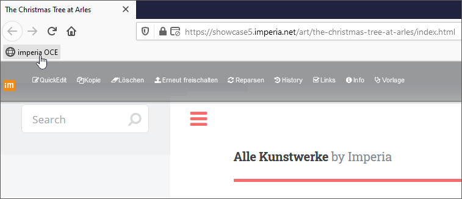

Mit One-Click-Edit (OCE) können Sie beim Surfen auf den Web- oder Intranetseiten die dazugehörigen *imperia*-Dokumente direkt über den Browser bearbeiten, löschen oder erneut veröffentlichen.

Es gibt eine Vielzahl von Funktionen, die durch die One-Click-Edit-Erweiterung in Form einer Toolbar zur Verfügung gestellt werden, siehe dazu den Abschnitt [OCE-Funktionen](user.oneclickedit.md#oce-funktionen).  Bei allen Funktionen sorgt *imperia* im Hintergrund dafür, dass die definierten Workflows, Freigabemechanismen und Zugriffsrechte eingehalten werden.

Zur Nutzung von One-Click-Edit muss lediglich eine Browser-Erweiterung installiert werden, die direkt im [Firefox Browser](user.oneclickedit.md#oce-im-firefox), [Microsoft Edge](user.oneclickedit.md#oce-im-microsoft-edge) bzw. [IE Browser (Altversion)](user.oneclickedit.md#oce-im-internet-explorer) oder [Chrome Browser](user.oneclickedit.md#oce-im-chrome) installiert oder als [Bookmarklet](user.oneclickedit.md#oce-bookmarklet) hinzugefügt werden kann.

**Erläuterung der Hintergrundprozesse**: 

Wurde das Template entsprechend programmiert, enthält jede mit *imperia* erzeugte Webseite eine eindeutige ID, die aus einer eindeutigen System-ID der *imperia*-Installation und der Dokumenten-ID gebildet wird. Die Browser-Erweiterung prüft nun, ob die in der Webseite gespeicherte System-ID mit der ID des *imperia*-Systems, an dem Sie angemeldet sind, übereinstimmt. Wird eine Übereinstimmung gefunden, aktiviert die One-Click-Edit-Toolbar die Funktionen, die Sie für das der angezeigten Webseite zugrunde liegende *imperia*-Dokument ausführen können.

*imperia* erkennt, ob Sie bereits angemeldet sind und bietet bei entsprechender Konfiguration automatisch die Login-Maske an. Danach, oder wenn Sie bereits angemeldet sind, stehen Ihnen in der Toolbar – abhängig von Ihren Rechten im *imperia*-System – die gegebenen Funktionen zur Verfügung.

### OCE-Funktionen 

Die OCE-Toolbar wird bei den Installationen der Browser-Erweiterungen für IE oder Firefox standardmäßig automatisch abgebildet. Das [Bookmarklet](user.oneclickedit.md#oce-bookmarklet) muss durch Betätigen des Buttons aktiviert werden.

Die OCE-Toolbar verfügt über die wichtigsten redaktionellen Funktionen.  Ihre aktuelle Systemsprache von *imperia* bestimmt sowohl die Sprache der OCE-Toolbar als auch die der Meldungen.

Im Folgenden werden alle Standardfunktionen einer One-Click-Edit-Toolbar beschrieben. 

!!! note "Hinweis"
		Da von der Systemadministration konfiguriert werden kann, welche Funktionen in der Toolbar verwendet werden bzw. eigene Funktionen konfiguriert werden können, stehen Ihnen möglicherweise nur eine begrenzte Anzahl oder eine andere Auswahl der Funktionen zur Verfügung, die hier hier nicht erklärt werden.  Wenden Sie sich im Zweifel an Ihren Systemadministrator.

Ausgangspunkt ist der -Button auf der rechten Seite Ihrer Browserleiste: Der Button enthält alle Funktionen in Form eines Menüs. Haben Sie die OCE-Leiste ausgeblendet (d.h. *deaktiviert*, siehe [Konfiguration](user.oneclickedit.md#oce-im-firefox)), können Sie die Funktionen über das Menü weiterhin nutzen:

* **Zum Dashboard**:  Diese Funktion bringt Sie zum Dashboard Ihres aktuellen *imperia*-Entwicklungssystems.
* **QuickEdit/Editieren**: Nutzen Sie diese Funktion, um das zur angezeigten Seite gehörende Dokument direkt im Edit-Schritt des Workflows auf dem Entwicklungssystem zu öffnen.
* **Alle Gruppen annehmen**: Mit dieser Funktion können Sie alle Gruppen, die Ihnen zur Verfügung stehen, übernehmen. Wenn Sie bereits alle Ihre Gruppen angenommen haben, ist die Funktion deaktiviert.
* **Kopie**: Erzeugen Sie hiermit auf dem Entwicklungssystem ein Duplikat des zu der aktuell angezeigten Seite gehörenden Dokuments. Dieses ist fast identisch mit der gerade angezeigten Seite. Unterschiedlich sind zum Beispiel das Erstellungs- und Änderungsdatum und die Benutzer-ID des bearbeitenden Benutzers.
* **Löschen**: Nutzen Sie diese Funktion, um das zu der gerade besuchten Seite gehörende *imperia*-Dokument komplett zu löschen. Alle eventuellen Seitenkopien und alle verlinkten Objekte werden von allen Zielsystemen und aus dem Archiv des Entwicklungssystems entfernt.
	
	!!! warning "Wichtig"
			Dieser Vorgang kann nicht rückgängig gemacht werden.	

* **Erneut freischalten**: Diese Funktion parst das zu der gerade angezeigten Seite gehörende Dokument mit dem entsprechenden Template neu, so dass Änderungen des Templates in das Dokument übernommen werden. Zusätzlich wird das geänderte Dokument automatisch auf alle Zielsysteme veröffentlicht, wenn es vorher bereits veröffentlicht war. Im anderen Fall wird es der Veröffentlichungsliste hinzugefügt.

* **Reparsen**: Diese Funktion parst das zu der gerade angezeigten Seite gehörende Dokument mit dem entsprechenden Template neu, sodass Änderungen des Templates in das Dokument übernommen werden. Im Gegensatz zur Funktion *Erneut freischalten* wird das Dokument nicht automatisch auf allen Zielsystemen veröffentlicht.

* **History**: Diese Funktion zeigt die Historie des zu der gerade angezeigten Seite gehörenden Dokuments an.

* **Links**: Mit Hilfe dieser Funktion können Sie alle internen und externen Links des zu der gerade angezeigten Seite gehörenden Dokuments überprüfen.

* **Info**: Diese Funktion zeigt eine Reihe von Informationen über das Dokument, das zu der gerade angezeigten Seite gehört.

* **Vorlage**: Nutzen Sie diese Option, um eine neue Vorlage zu erzeugen.

* **Neues Dokument erzeugen**: Nutzen Sie diese Funktion, um ein neues Dokument in der gleichen Kategorie zu erstellen.

* **Live-Löschen**: Mit dieser Funktion entfernen Sie das zur gerade besuchten Seite gehörende Dokument von allen Ziel- und Entwicklungssystemen. Es bleibt jedoch im Archiv des Entwicklungssystems erhalten.

* **Meta-Informationen**: Verwenden Sie diese Funktion, um die Meta-Informationen eines Dokumentes anzuzeigen.

* **Validieren**: Mit Hilfe dieses Buttons können Sie den HTML-Code des zu der gerade angezeigten Seite gehörenden Dokuments über einen Dienst des W3-Consortiums prüfen.

	!!! note "Hinweis"
			Für diese Funktion benötigen Sie Zugang zum Internet. 

### OCE-Bookmarklet

Die OCE-Toolbar kann in Form eines OCE-Bookmarklet im Browser genutzt werden. *Eine kurze Einführung zu "Bookmarklets" erhalten Sie [hier](`http://de.wikipedia.org/wiki/Bookmarklet`); Stand der Quellenangabe: November 2020*. 

1. **Bookmarklet hinzufügen**

1. Öffnen Sie ***Menü > Benutzerkonto > Profil***.  Dort finden Sie neben den Browser-Installationen auch das Bookmarklet.
2. Damit Sie das Bookmarklet nutzen können, müssen Sie es in der Lesezeichenleiste Ihres Browsers positionieren. Gehen Sie in Abhängigkeit von Ihrem Browser wie folgt vor:

	* Nutzen Sie *Drag&Drop* und ziehen Sie das Bookmarklet in die Lesezeichenleiste Ihres Browsers.

	*oder*

	1. Klicken Sie mit der rechten Maustaste auf den Button **Bookmarklet**. Es erscheint ein Untermenü.
	2. Wählen Sie dort den Menüpunkt ***Lesezeichen zu diesem Link hinzufügen***.	
	3. Setzen Sie den Namen des Lesezeichens, z.B. "*imperia* OCE". Dies ist auch nachträglich in der Browser-Symbolleiste möglich.
	4. Stellen Sie sicher, dass als Speicherordner die ***Lesezeichen-Symbolleiste*** ausgewählt ist (Standardeinstellung), bevor Sie auf **Speichern** klicken.

In der folgenden Tabelle wird gezeigt, welche Browser die oben genannten Methoden unterstützen:

| Browser               | Drag&Drop   | Rechtsklick | Funktion |
|-----------------------|-------------|-------------|----------|
| IE 9–11               | ja          | ja          | ja       |
| IE 8–7                | nein        | ja          | ja       |
| Chrome 13+            | ja          | nein        | ja       |
| Chromium 18+          | ja          | nein        | ja       |
| Firefox 3.6-56+ 	    | ja          | ja          | ja       |
| Mac Safari 9-11+	    | ja	      | ja	        | ja       |

2. **Bookmarklet nutzen**

Wenn Sie nun über Ihren Webauftritt navigieren, können Sie zu jedem Zeitpunkt auf Ihr zuvor angelegtes Bookmarklet klicken und eine  OCE-Leiste wird als Overlay eingeblendet: 

* Klick Sie erneut auf das Bookmarklet oder auf das ***Schließen***-Symbol auf rechten Seite der Leiste, um die OCE-Toolbar wieder auszublenden.
* Klicken Sie auf den auf der linken Seite befindlichen -Button, um zum Dashboard des aktuellen *imperia*-Systems zu gelangen.

!!! note "Hinweis"
		Falls Sie nicht in *imperia* angemeldet sind, erscheint die Login-Seite, vorausgesetzt Sie besitzen die entsprechenden Rechte.

### OCE im Microsoft Edge

1. Öffnen Sie ***Menü > Benutzerkonto > Profil***.

2. Klicken Sie neben *OCE für Microsoft Edge* auf den Button **Edge-Store öffnen**.

3. Führen Sie im Edge-Store die Option **Abrufen** aus und bestätigen Sie die Sicherheitsabfrage.

*Die OCE-Toolbar ist für den Microsoft Edge aktiviert.*

* Wenn Sie im imperia-System auf den Button  klicken, erscheint eine Liste mit den registrierten imperia-Systemen. Der graue Balken zeigt das aktuelle System an. Dort können Sie ebenfalls die OCE-Toolbar aktivieren oder deaktivieren, indem Sie am Ende der Zeile des gewünschten Systems den Schalter nutzen.

### OCE im Internet Explorer (Altversion)

1. Öffnen Sie ***Menü > Benutzerkonto > Profil***.

2. Klicken Sie neben **OCE für Internet Explorer (Altversion)** auf den Button **Zum IE hinzufügen**.

3. Speichern Sie die Datei.

*Die OCE-Toolbar ist für den Internet Explorer aktiviert.*

!!! note "Hinweis"
		Ist der DOCTYPE in der Seite nicht gesetzt, so ist die fehlerfreie Darstellung der OCE-Toolbar nicht möglich. Insbesondere der IE fällt dann zurück in den Quirks-Modus und verhält sich nicht wie erwartet. <comment: auch für das bookmarklet/firefox gültig?>

**Konfiguration der OCE-Erweiterung im IE**

* Öffnen Sie den Dialog für die Konfiguration der One-Click-Edit-Toolbar, indem Sie auf den Button  klicken. Beispiel:

In der Tabelle stehen alle Entwicklungssysteme, an die Sie angemeldet sind oder waren. Folgende Funktionen können aufgerufen werden:

* **Go**: Klicken Sie auf diese Funktion, um das ausgewählte System zu öffnen.
* **Ignore** (Ignorieren): Aktivieren Sie diese Checkbox, wenn Sie Seiten, die mit diesem System erstellt wurden, von der Toolbar nicht berücksichtigt werden sollen.
* **Remove** (Entfernen): Nutzen Sie diese Funktion um das System aus der Tabelle zu löschen.
* **Auto Login**: Aktivieren Sie diese Checkbox, damit sich automatisch eine Login-Maske für das Entwicklungssystem öffnet, wenn Sie eine entsprechende Seite im Internet besuchen.

### OCE im Firefox

!!!note "Hinweis"
		Da Mozilla Firefox seit dem 14. Nov. 2017 ausschließlich Add-ons erlaubt, die auf der API WebExtensions basieren, wird das vorherige Firefox-OCE auf XUL-Basis aus dem Produkt entfernt und durch ein äquivalentes OCE auf der neuen Technologie ersetzt, welche seit Firefox 48 zum Einsatz kommt. <comment aus https://de.wikipedia.org/wiki/Browser_Extensions -- verlinken?>

		Beachten Sie auch, dass zur Darstellung der Icons in der Toolbar ein Internetzugriff vorausgesetzt wird.

		
	
1. **Veraltete Firefox OCE deaktivieren**

Entfernen bzw. deaktivieren Sie optional die veraltete Firefox OCE-Erweiterung:

1. Wählen Sie in den Einstellungen des Firefox die Option ***Add-ons***. 

	
	
	*Unter *Erweiterungen* werden alle installierten Add-ons aufgelistet, unter anderem auch das *imperia*-OneClickEdit-Add-on*.
	
2. Um das Add-on endültig zu entfernen, klicken Sie auf den Button **Entfernen**. Sie können das Add-on auch vorübergehend deaktivieren, indem Sie den Schalter neben dem Add-on ausschalten.	

*Das Add-on ist jetzt nicht mehr aktiv bzw. wurde aus Ihrem Browser entfernt*.

	
2. **Neue Firefox OCE installieren**

Die neue OCE-Erweiterung können Sie wie gewohnt installieren:

1. Öffnen Sie ***Menü > Benutzerkonto > Profil***.
2. Laden Sie die entsprechende Erweiterung für Firefox herunter, indem Sie auf **Herunterladen** klicken.
3. Speichern Sie die Erweiterung.

3. **OCE-Toolbar nutzen**

Die OCE-Toolbar erscheint am oberen Rand der Webseite:

Auf der linken Seite finden Sie den Link, der Sie ***zum Dashboard*** führt, sofern Sie eingeloggt sind.
  Wenn Sie ausgeloggt sind, führt Sie der Link zur Login-Seite des zugeordneten *imperia* CMS:

** Konfiguration der OCE-Erweiterung in Firefox**

In der rechten Ecke Ihres Browser finden Sie nun den Button .

Falls Sie nicht berechtigt sind, das Dokument zu bearbeiten, d.h. die OCE-Toolbar zu nutzen, ist der Button ausgegraut.
 
Wenn Sie eingeloggt und berechtigt sind (in diesem Fall ist der Button anklickbar), öffnet dieser Button ein Pop-up mit verschiedenen Informationen, in Abhängigkeit davon, ob Sie sich auf einer *imperia*-Seite oder im Redaktionssystem befinden:

* **imperia-Seite**

	Wenn eine *imperia*-Seite im Browser dargestellt wird und Sie auf den Button  klicken, erscheint eine Liste mit den verfügbaren OCE-Funktionen: 
	
	

Mit Hilfe der Option *Einstellungen* am Ende der Liste können Sie die OCE-Toolbar aktivieren oder deaktivieren, siehe hierfür auch den folgenden Abschnitt.

* **Redaktionssystem**

	Wenn Sie im *imperia*-System auf den Button  klicken, erscheint eine Liste mit den registrierten *imperia*-Systemen. Der graue Balken zeigt das aktuelle System an.  

	Dort können Sie ebenfalls die OCE-Toolbar aktivieren oder deaktivieren, indem Sie am Ende der Zeile des gewünschten Systems den Schalter nutzen.

### OCE im Chrome

Laden Sie die OCE-Toolbar für Chrome herunter:

1. Öffnen Sie [diese Seite](`https://chrome.google.com/webstore/detail/oneclickedit/dmmmenpaibmekalnkbabhfehconfbnaf`).
2. Klicken Sie auf den Button **Hinzufügen**, um die OCE-Toolbar als Erweiterung des Chromes hinzuzufügen.

*Sie können die OCE-Toolbar mit ihren [OCE-Funktionen](user.oneclickedit.md#oce-funktionen) sofort nutzen.* Die OCE-Toolbar wird wie für den Firefox [Firefox](user.oneclickedit.md#oce-im-firefox) konfiguriert.

### OCE im Firefox für Android-Tablets

Sie können das Firefox OCE auch auf Ihrem Android-Tablet nutzen!  Laden Sie es bequem über den Google Play (Chrome Store) herunter.

Beachten Sie, dass die OCE-Funktionen erst ab Firefox 57 dargestellt werden.

