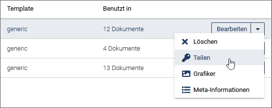

*imperia* CMS bietet Ihnen die Möglichkeit, auf Basis von *imperia*-[Templates](user.basics.md#templates) Dokumentvorlagen zu erstellen. Vorlagen kann man sich wie ein mit Modulen und Inhalten vorbelegtes imperia Dokument vorstellen. Dabei können zu jedem Template beliebig viele Vorlagen erstellt werden. 

Vorlagen eignen sich besonders für Newsartikel, Stellenanzeigen oder Projektbeschreibungen. Wenn Sie regelmäßig Seiten erstellen, die denselben Seitentyp haben, also von der Struktur ähnlich aufgebaut sind, dann lohnt es sich dafür eine oder mehrere Vorlagen zu erstellen.

Vorlagen werden mit Hilfe des [One-Click-Edit (OCE)](user.oneclickedit.md) erstellt und können für eine oder mehrere Rubriken vorgeschlagen werden. Darüber hinaus ist es möglich, eine Dokumentvorlage zu erzwingen, sodass die Vorlage ohne Auswahlmöglichkeit gesetzt wird.

___
## Feature aktivieren

Um das Feature zu aktivieren, müssen folgende Schritte durchgeführt werden:

1. Den Workflow-Schritt *Vorlagen* hinzufügen
2. Die OCE-Aktion *Vorlage* aktivieren
3. Ein OCE-Update durchführen (optional), um den vollen Funktionsumfang zu erhalten.

### Den Workflow-Schritt *Vorlagen* hinzufügen

1. Öffnen Sie den Workflow-Editor mit dem Menü ***Workflow*** und führen Sie für den gewünschten Workflow die Option **Bearbeiten** aus.
2. Fügen Sie das Workflow-Plugin ***Vorlagen*** unmittelbar vor dem zentralen Bearbeiten-Schritt ein.
3. Speichern Sie Ihre Änderungen.

### Die OCE-Aktion *Vorlage* aktivieren

1. Öffnen Sie die OCE-Konfiguration im Menü unter ***System > One-Click-Edit***.
2. Aktivieren Sie die Checkbox ***Vorlage***.

### OCE-Update durchführen

Grundsätzlich funktioniert das Feature in allen Browsern auch ohne ein Update des OCE.

Es ist jedoch ein Update erforderlich, um bei der Erstellung einer Vorlage automatisch ein Screenshot der Seite anfertigen zu können.

Ein Update des OCE ist daher empfohlen, da die automatische Erstellung eines Screenshots die Gebrauchstauglichkeit entscheidend verbessert.

!!!note "Hinweis" 
	Die Funktion "Screenshot automatisch erstellen" steht systembedingt derzeit nur im Firefox und Chrome zur Verfügung.

___
## Vorlage erstellen

!!! note "Hinweis"
		Bevor Sie Vorlagen für Dokumente nutzen können, müssen Sie Ihren Browser um One-Click-Edit erweitern. In der OCE-Toolbar wird Ihnen anschließend die Option **Vorlage** angeboten.
		
		

1. Navigieren Sie zu der Seite, die als Basis für Ihre Dokumentvorlage dienen soll.

	

2. Führen Sie in der OCE-Toolbar die Option **Vorlage** aus.		

	*Ein Screenshot wird von der Seite erstellt.*  
	*Der Screenshot skaliert die Seite in der Breite automatisch auf 300 Pixel.* 
	*Der Dialog zum Konfigurieren der Vorlage wird geöffnet.*
	
3. Gehen Sie weiter vor, wie unter [Vorlage bearbeiten](user.presets.md#vorlage-bearbeiten) beschrieben.	

___
## Vorlage bearbeiten

* Öffnen Sie über ***Struktur > Vorlagen*** die Liste der Dokumentvorlagen. 
	Je nach Berechtigung sehen Sie wahlweise nur Ihre eigenen Vorlagen, die mit Ihrer Gruppe geteilten Vorlagen, oder alle Systemvorlagen. 
	Für jede Vorlage wird ihr Name, ihre Beschreibung und das Template angezeigt, auf dem die Vorlage basiert. Darüber hinaus sehen Sie die Anzahl der Dokumente, die mit der Vorlage erstellt wurden.	
	
		

		
* Um die Eigenschaften der Vorlage anzupassen, klicken Sie in der Dropdown-Box auf die Option **Bearbeiten** für die gewünschte Vorlage.

	
	
	*Es öffnet sich rechts ein Benutzerformular, in dem Sie die Vorlage konfigurieren können:*
	
	
	
	
	
	
	
* Laden Sie gegebenenfalls einen neuen Screenshot der Seite für Ihre Dokumentvorlage hoch, indem Sie auf **Hochladen** klicken.
* Geben Sie im Eingabefeld ***Titel*** der Vorlage einen Namen.
* Tragen Sie unter ***Beschreibung*** eine Beschreibung der Vorlage ein.
* Nehmen Sie die ***Inhaltseinstellungen*** vor. Hierzu werden Ihnen drei Varianten angeboten:
	* ***Originalinhalt***: Wählen Sie diese Möglichkeit, wenn Sie den Originalinhalt des Ausgangsdokuments verwenden möchten.
	* ***Leere Struktur***: Bei Auswahl dieser Option wird der gesamte Inhalt (Texte und Medien) aus den Metainformationen gelöscht.
	* ***Musterinhalt***: Nutzen Sie diese Variante, wenn Sie den Textinhalt durch einen Standardtext ("Lorem ipsum") und die Bilder durch Standardbilder ersetzen möchten.
* Wählen Sie unter ***In Rubriken vorschlagen*** die Rubriken aus, in denen die Vorlage beim Erstellen eines Dokuments angeboten werden soll.
* Wenn Sie über die entprechenden Rechte verfügen, können Sie die Vorlage mit anderen Benutzern teilen. Aktivieren Sie hierzu einen der folgenden Radiobuttons:
	
	* ***jeder***: Alle können die Vorlage nutzen.
	* ***bestimmte Gruppen***: Nur Mitglieder ausgewählter Gruppen können die Vorlage nutzen.
	Tragen Sie in diesem Fall die Gruppen in das Eingabefeld ein, mit denen die Vorlage geteilt werden soll oder wählen Sie sie aus der Dropdown-Liste des Eingabefelds aus.
	* ***nur Sie***: Nur Sie selbst können die Vorlage nutzen.
	
*Das Template, auf dem die Dokumentvorlage basiert, und die Vorlagen-ID werden schreibgeschützt ausgelesen.*
	
* Klicken Sie auf **Speichern**, um Ihre Einstellungen zu sichern

*Sie gelangen zur Übersicht der Dokumentvorlagen.*

___
## Vorlage teilen

Wenn Ihre Berechtigungen dies erlauben, können Sie Lese- und Schreibrechte an Gruppen vergeben und die Vorlage auf diese Weise mit anderen Benutzern teilen. Nutzen Sie hierzu die Option **Teilen** in der Dropdown-Box hinter der Vorlage.

	
*Es öffnet sich rechts ein Benutzerformular für die Rechteeinstellungen:*
	

	
* Legen Sie unter ***Anzeigerechte*** fest, wer diese Vorlage anzeigen darf.
* Definieren Sie unter ***Schreibrechte***, wer die Vorlage bearbeiten darf.
* Sichern Sie Ihre Einstellungen mit **Speichern**.	

___
## Vorlage löschen
* Öffnen Sie die Liste der Dokumentvorlagen wie unter [Vorlage bearbeiten ](#vorlage-bearbeiten) beschrieben.
* Klicken Sie auf die Option **Löschen** in der Dropdown-Box hinter der Vorlage.

	

* Bestätigen Sie die erscheinende Sicherheitsabfrage.

*Die Dokumentvorlage ist gelöscht.*

___
## Meta-Informationen festlegen

* Öffnen Sie die Liste der Dokumentvorlagen wie unter [Vorlage bearbeiten ](#vorlage-bearbeiten) beschrieben.
* Klicken Sie auf die Option **Meta-Informationen** in der Dropdown-Box hinter der Vorlage.
* Vergeben Sie Werte für die Metafelder, fügen Sie neue Metafelder hinzu oder löschen Sie nicht mehr benötigte Metafelder.

	
	
* Sichern Sie Ihre Einstellungen mit **Speichern**.
